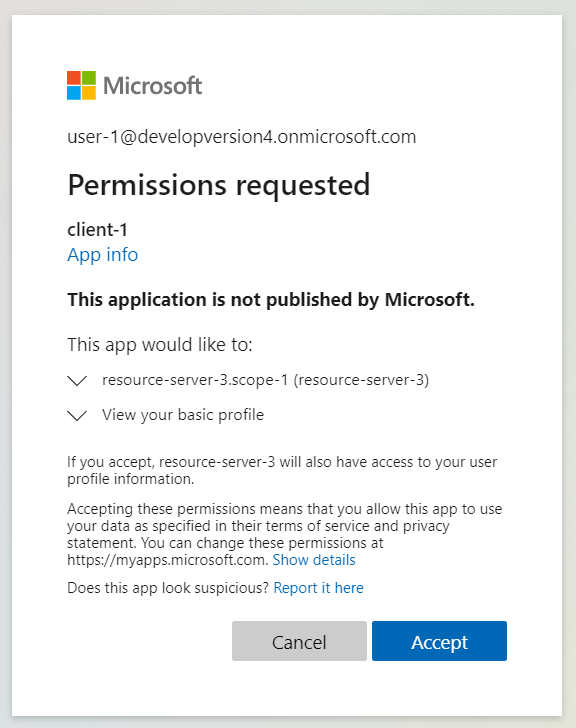
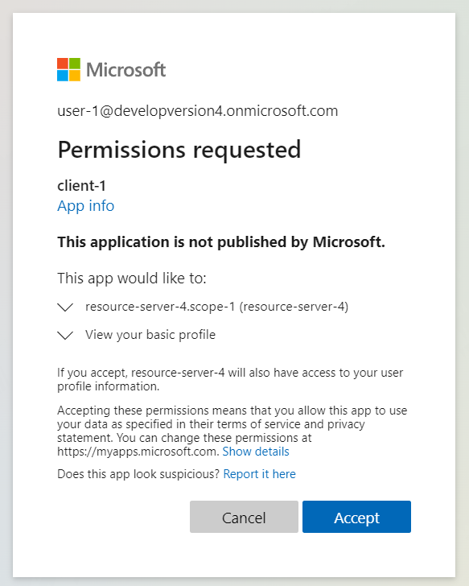
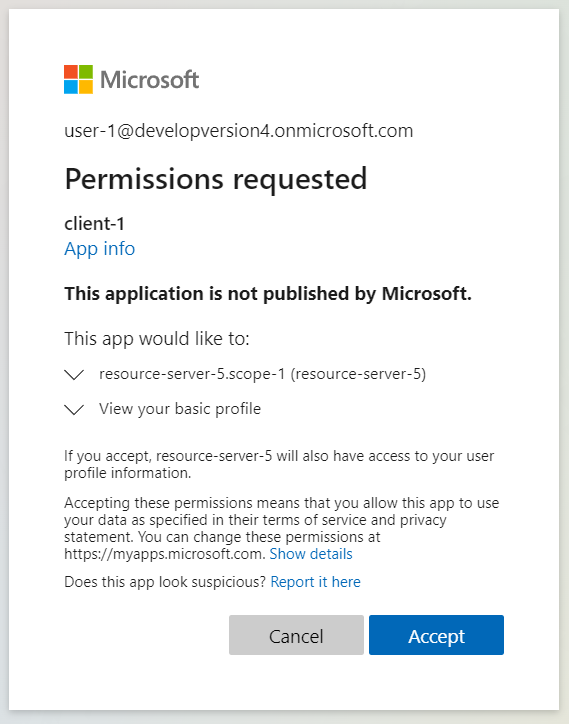

- [Preface](#preface)
    * [About](#about)
    * [Ask for help by GitHub issues](#ask-for-help-by-github-issues)
- [1. client](#1-client)
    * [1.1. Create sample project](#11-create-sample-project)
        + [1.1.1. pom.xml](#111-pomxml)
        + [1.1.2. Java class](#112-java-class)
            - [1.1.2.1. Create ClientApplication.java](#1121-create-clientapplicationjava)
            - [1.1.2.2. WebSecurityConfiguration.java](#1122-websecurityconfigurationjava)
            - [1.1.2.3. HomeController.java](#1123-homecontrollerjava)
        + [1.1.3. Create application.yml.](#113-create-applicationyml)
    * [1.2. Create required resources in Azure.](#12-create-required-resources-in-azure)
        + [1.2.1. Get an Azure Active Directory tenant](#121-get-an-azure-active-directory-tenant)
        + [1.2.2. Register an application](#122-register-an-application)
        + [1.2.3. Add a client secret](#123-add-a-client-secret)
        + [1.2.4. Add a redirect URI](#124-add-a-redirect-uri)
        + [1.2.5. Get user account.](#125-get-user-account)
    * [1.3. Run the application](#13-run-the-application)
    * [1.4. Homework](#14-homework)
- [2. client-get-user-information](#2-client-get-user-information)
    * [2.1. Create sample project](#21-create-sample-project)
        + [2.1.1. pom.xml](#211-pomxml)
        + [2.1.2. Java class](#212-java-class)
            - [2.1.2.1 UserInformationController.java](#2121-userinformationcontrollerjava)
        + [2.1.3. application.yml](#213-applicationyml)
    * [2.2. Create required resources in Azure.](#22-create-required-resources-in-azure)
    * [2.3. Run the application](#23-run-the-application)
    * [2.4. Homework](#24-homework)
- [3. resource-server](#3-resource-server)
    * [3.1. Create sample project](#31-create-sample-project)
        + [3.1.1. pom.xml](#311-pomxml)
        + [3.1.2. Java class](#312-java-class)
            - [3.1.2.1. ResourceServerApplication.java](#3121-resourceserverapplicationjava)
            - [3.1.2.2. HomeController.java](#3122-homecontrollerjava)
            - [3.1.2.3. WebSecurityConfiguration.java](#3123-websecurityconfigurationjava)
        + [3.1.3. Create application.yml](#313-create-applicationyml)
    * [3.2. Create required resources in Azure.](#32-create-required-resources-in-azure)
    * [3.3. Run the application](#33-run-the-application)
    * [3.4. Homework](#34-homework)
- [4. client-access-resource-server](#4-client-access-resource-server)
    * [4.1. Create sample project](#41-create-sample-project)
        + [4.1.1. pom.xml](#411-pomxml)
        + [4.1.2. Java class](#412-java-class)
            - [4.1.2.1. WebClientConfigure.java](#4121-webclientconfigurejava)
            - [4.1.2.2. ResourceServer1Controller.java](#4122-resourceserver1controllerjava)
        + [4.1.3. application.yml](#413-applicationyml)
    * [4.2. Create required resources in Azure.](#42-create-required-resources-in-azure)
        + [4.2.1. Register an application](#421-register-an-application)
        + [4.2.2. Set accessTokenAcceptedVersion to 2](#422-set-accesstokenacceptedversion-to-2)
        + [4.2.3. Expose an API](#423-expose-an-api)
        + [4.2.4. Add permissions for client-1 to access resource-server-1](#424-add-permissions-for-client-1-to-access-resource-server-1)
    * [4.3. Run the application](#43-run-the-application)
    * [4.4. Homework](#44-homework)
- [5. resource-server-validate-audience](#5-resource-server-validate-audience)
    * [5.1. Create sample project](#51-create-sample-project)
        + [5.1.1. pom.xml](#511-pomxml)
        + [5.1.2. Java class](#512-java-class)
            - [ApplicationConfiguration.java](#applicationconfigurationjava)
        + [5.1.3. application.yml](#513-applicationyml)
    * [5.2. Create required resources in Azure](#52-create-required-resources-in-azure)
    * [5.3. Run the application](#53-run-the-application)
    * [5.4. Homework](#54-homework)
- [6. resource-server-check-permission-by-scp](#6-resource-server-check-permission-by-scp)
    * [6.1. Create sample project](#61-create-sample-project)
        + [6.1.1. pom.xml](#611-pomxml)
        + [6.1.2. Java class](#612-java-class)
            - [6.1.2.1 Update WebSecurityConfiguration.java](#6121-update-websecurityconfigurationjava)
            - [6.1.2.2. CheckPermissionByScopeController](#6122-checkpermissionbyscopecontroller)
        + [6.1.3. application.yml](#613-applicationyml)
    * [6.2. Create required resources in Azure](#62-create-required-resources-in-azure)
        + [6.2.1. Expose an API](#621-expose-an-api)
    * [6.3. Run the application](#63-run-the-application)
    * [6.4. Homework](#64-homework)
- [7. client-access-resource-server-check-permission-by-scp](#7-client-access-resource-server-check-permission-by-scp)
    * [7.1. Create sample project](#71-create-sample-project)
        + [7.1.1. pom.xml](#711-pomxml)
        + [7.1.2. Java class](#712-java-class)
            - [7.1.2.1. ResourceServer1Controller.java](#7121-resourceserver1controllerjava)
        + [7.1.3. application.yml](#713-applicationyml)
    * [7.2. Create required resources in Azure](#72-create-required-resources-in-azure)
        + [7.2.1. Add permissions for client-1 to access resource-server-1](#721-add-permissions-for-client-1-to-access-resource-server-1)
    * [7.3. Run the application](#73-run-the-application)
    * [7.4. Homework](#74-homework)
- [8. client-access-resource-server-check-permission-by-scp-in-client-side](#8-client-access-resource-server-check-permission-by-scp-in-client-side)
    * [8.1. Create sample project](#81-create-sample-project)
        + [8.1.1. pom.xml](#811-pomxml)
        + [8.1.2. Java class](#812-java-class)
            - [8.1.2.1. WebSecurityConfiguration.java](#8121-websecurityconfigurationjava)
            - [8.1.2.2. ResourceServer1CheckPermissionByScopeController.java](#8122-resourceserver1checkpermissionbyscopecontrollerjava)
        + [8.1.3. application.yml](#813-applicationyml)
    * [8.2. Create required resources in Azure](#82-create-required-resources-in-azure)
    * [8.3. Run the application](#83-run-the-application)
    * [8.4. Homework](#84-homework)
- [9. resource-server-check-permission-by-role](#9-resource-server-check-permission-by-role)
    * [9.1. Create sample project](#91-create-sample-project)
        + [9.1.1. pom.xml](#911-pomxml)
        + [9.1.2. Java class](#912-java-class)
            - [9.1.2.1. JwtGrantedAuthoritiesConverter.java](#9121-jwtgrantedauthoritiesconverterjava)
            - [9.1.2.2. WebSecurityConfiguration.java](#9122-websecurityconfigurationjava)
            - [9.1.2.3. CheckPermissionByRoleController.java](#9123-checkpermissionbyrolecontrollerjava)
        + [9.1.3. application.yml](#913-applicationyml)
    * [9.2. Create required resources in Azure](#92-create-required-resources-in-azure)
        + [9.2.1. Create resource-server-1-role-1 and resource-server-1-role-2.](#921-create-resource-server-1-role-1-and-resource-server-1-role-2)
        + [9.2.1. Assign user-1 to resource-server-1-role-1](#921-assign-user-1-to-resource-server-1-role-1)
    * [9.3. Run the application](#93-run-the-application)
    * [9.4. Homework](#94-homework)
- [10. client-access-resource-server-check-permission-by-role](#10-client-access-resource-server-check-permission-by-role)
    * [10.1. Create sample project](#101-create-sample-project)
        + [10.1.1. pom.xml](#1011-pomxml)
        + [10.1.2. Java class](#1012-java-class)
            - [10.1.2.1. ResourceServer1Controller.java](#10121-resourceserver1controllerjava)
        + [10.1.3. application.yml](#1013-applicationyml)
    * [10.2. Create required resources in Azure](#102-create-required-resources-in-azure)
    * [10.3. Run the application](#103-run-the-application)
    * [10.4. Homework](#104-homework)
- [11. client-not-support-scopes-from-multiple-resources-in-one-client-registration](#11-client-not-support-scopes-from-multiple-resources-in-one-client-registration)
    * [11.1. Create sample project](#111-create-sample-project)
        + [11.1.1. pom.xml](#1111-pomxml)
        + [11.1.2. Java class](#1112-java-class)
        + [11.1.3. application.yml](#1113-applicationyml)
    * [11.2. Create required resources in Azure](#112-create-required-resources-in-azure)
        + [11.2.1. Register an application](#1121-register-an-application)
        + [11.2.2. Set accessTokenAcceptedVersion to 2](#1122-set-accesstokenacceptedversion-to-2)
        + [11.2.3. Expose an API](#1123-expose-an-api)
        + [11.2.4. Add permissions for client-1 to access resource-server-2](#1124-add-permissions-for-client-1-to-access-resource-server-2)
    * [11.3. Run the application](#113-run-the-application)
    * [11.4. Homework](#114-homework)
- [12. client-supports-scopes-from-multiple-resources-by-multiple-client-registrations](#12-client-supports-scopes-from-multiple-resources-by-multiple-client-registrations)
    * [12.1. Create sample project](#121-create-sample-project)
        + [12.1.1. pom.xml](#1211-pomxml)
        + [12.1.2. Java class](#1212-java-class)
            - [12.1.2.2. ResourceServer2Controller.java](#12122-resourceserver2controllerjava)
        + [12.1.3. application.yml](#1213-applicationyml)
    * [12.2. Create required resources in Azure](#122-create-required-resources-in-azure)
    * [12.3. Run the application](#123-run-the-application)
    * [12.4. Homework](#124-homework)
- [13. resource-server-2](#13-resource-server-2)
    * [13.1. Create sample project](#131-create-sample-project)
        + [13.1.1. pom.xml](#1311-pomxml)
        + [13.1.2. Java class](#1312-java-class)
        + [13.1.3. application.yml](#1313-applicationyml)
    * [13.2. Create required resources in Azure](#132-create-required-resources-in-azure)
        + [13.2.1. Create resource-server-2-role-1 and resource-server-2-role-2.](#1321-create-resource-server-2-role-1-and-resource-server-2-role-2)
        + [13.2.1. Assign user-1 to resource-server-2-role-1](#1321-assign-user-1-to-resource-server-2-role-1)
    * [13.3. Run the application](#133-run-the-application)
    * [13.4. Homework](#134-homework)
- [14. client-consent-when-request-for-specific-api](#14-client-consent-when-request-for-specific-api)
    * [14.1. Create sample project](#141-create-sample-project)
        + [14.1.1. pom.xml](#1411-pomxml)
        + [14.1.2. Java class](#1412-java-class)
            - [ResourceServer3Controller.java](#resourceserver3controllerjava)
        + [14.1.3. application.yml](#1413-applicationyml)
    * [14.2. Create required resources in Azure](#142-create-required-resources-in-azure)
        + [14.2.1. Register an application](#1421-register-an-application)
        + [14.2.2. Set accessTokenAcceptedVersion to 2](#1422-set-accesstokenacceptedversion-to-2)
        + [14.2.3. Expose an API](#1423-expose-an-api)
        + [14.2.4. Add permissions for client-1 to access resource-server-3](#1424-add-permissions-for-client-1-to-access-resource-server-3)
    * [14.3. Run the application](#143-run-the-application)
    * [14.4. Homework](#144-homework)
- [15. client-consent-all-scopes-in-one-api](#15-client-consent-all-scopes-in-one-api)
    * [15.1. Create sample project](#151-create-sample-project)
        + [15.1.1. pom.xml](#1511-pomxml)
        + [15.1.2. Java class](#1512-java-class)
            - [15.1.2.1. ResourceServerAllController.java](#15121-resourceserverallcontrollerjava)
        + [15.1.3. application.yml](#1513-applicationyml)
    * [15.2. Create required resources in Azure](#152-create-required-resources-in-azure)
        + [15.2.1. Register an application](#1521-register-an-application)
        + [15.2.2. Set accessTokenAcceptedVersion to 2](#1522-set-accesstokenacceptedversion-to-2)
        + [15.2.3. Expose an API](#1523-expose-an-api)
        + [15.2.4. Register an application](#1524-register-an-application)
        + [15.2.5. Set accessTokenAcceptedVersion to 2](#1525-set-accesstokenacceptedversion-to-2)
        + [15.2.6. Expose an API](#1526-expose-an-api)
    * [15.3. Run the application](#153-run-the-application)
    * [15.4. Homework](#154-homework)
- [16. resource-server-support-on-behalf-of-flow](#16-resource-server-support-on-behalf-of-flow)
    * [16.1. Create sample project](#161-create-sample-project)
        + [16.1.1. pom.xml](#1611-pomxml)
        + [16.1.2. Java class](#1612-java-class)
            - [16.1.2.1. ApplicationConfiguration.java](#16121-applicationconfigurationjava)
            - [16.1.2.1. OnBehalfOfController.java](#16121-onbehalfofcontrollerjava)
        + [16.1.3. application.yml](#1613-applicationyml)
    * [16.2. Create required resources in Azure](#162-create-required-resources-in-azure)
        + [16.2.1. Add a client secret](#1621-add-a-client-secret)
    * [16.3. Run the application](#163-run-the-application)
    * [16.4. Homework](#164-homework)


# Preface

## About

Go through these samples one by one, you will learn how to protect your web service by [OAuth 2.0 Authorization Framework], and use [Azure Active Directory] as an authorization server. We will leverage [Spring Security] to achieve this.

## Ask for help by GitHub issues

If you have any question, please [create an issue].

# 1. client

This section will demonstrate how to use Azure Active Directory user account to log in a web service. You can choose one of the following options to get the sample project.

- Option 1: Use [01-client] project directly.
- Option 2: Follow steps in [1.1. Create sample project](#11-create-sample-project) to create the sample project.

## 1.1. Create sample project

### 1.1.1. pom.xml
Create a pom.xml.
```xml
<?xml version="1.0" encoding="UTF-8"?>
<project xmlns:xsi="http://www.w3.org/2001/XMLSchema-instance"
         xmlns="http://maven.apache.org/POM/4.0.0"
         xsi:schemaLocation="http://maven.apache.org/POM/4.0.0 http://maven.apache.org/xsd/maven-4.0.0.xsd">
  <modelVersion>4.0.0</modelVersion>

  <parent>
    <groupId>org.springframework.boot</groupId>
    <artifactId>spring-boot-starter-parent</artifactId>
    <version>2.5.4
    </version> <!-- {x-version-update;org.springframework.boot:spring-boot-starter-parent;external_dependency} -->
    <relativePath/> <!-- lookup parent from repository -->
  </parent>

  <groupId>com.azure.spring.sample.active.directory</groupId>
  <artifactId>01-client</artifactId>
  <version>1.0.0</version>
  <packaging>jar</packaging>

  <dependencies>
    <dependency>
      <groupId>org.springframework.boot</groupId>
      <artifactId>spring-boot-starter-web</artifactId>
    </dependency>
    <dependency>
      <groupId>org.springframework.boot</groupId>
      <artifactId>spring-boot-starter-oauth2-client</artifactId>
    </dependency>
  </dependencies>

</project>
```

### 1.1.2. Java class

#### 1.1.2.1. Create ClientApplication.java
```java
package com.azure.sample.active.directory;

import org.springframework.boot.SpringApplication;
import org.springframework.boot.autoconfigure.SpringBootApplication;

@SpringBootApplication
public class ClientApplication {

    public static void main(String[] args) {
        SpringApplication.run(ClientApplication.class, args);
    }
}
```

#### 1.1.2.2. WebSecurityConfiguration.java
```java
package com.azure.sample.active.directory.configuration;

import org.springframework.security.config.annotation.web.builders.HttpSecurity;
import org.springframework.security.config.annotation.web.configuration.EnableWebSecurity;
import org.springframework.security.config.annotation.web.configuration.WebSecurityConfigurationrAdapter;

@EnableWebSecurity
public class WebSecurityConfiguration extends WebSecurityConfigurationrAdapter {

    @Override
    protected void configure(HttpSecurity http) throws Exception {
        // @formatter:off
        http.authorizeRequests()
                .anyRequest().authenticated()
                .and()
            .oauth2Login()
                .and();
        // @formatter:on
    }
}
```

#### 1.1.2.3. HomeController.java
```java
package com.azure.sample.active.directory.controller;

import org.springframework.web.bind.annotation.GetMapping;
import org.springframework.web.bind.annotation.RestController;

@RestController
public class HomeController {

    @GetMapping("/")
    public String home() {
        return "Hello, this is OAuth2 client application.";
    }
}
```

### 1.1.3. Create application.yml.
```yml
# Please read "/azure-active-directory/README.md" to fill the placeholders in this file: "<tenant-id>", "<client-1-client-id>", "<client-1-client-secret>".
server:
  port: 8080
spring:
  security:
    oauth2:
      client:
        provider: # Refs: https://docs.spring.io/spring-security/site/docs/current/reference/html5/#oauth2login-common-oauth2-provider
          azure-active-directory:
            issuer-uri: https://login.microsoftonline.com/<tenant-id>/v2.0 # Refs: https://docs.spring.io/spring-security/site/docs/current/reference/html5/#webflux-oauth2-login-openid-provider-configuration
        registration:
          client-1:
            provider: azure-active-directory
            client-id: <client-1-client-id>
            client-secret: <client-1-client-secret>
            scope: openid, profile # Refs: https://docs.microsoft.com/azure/active-directory/develop/v2-permissions-and-consent#openid-connect-scopes
            redirect-uri: http://localhost:8080/login/oauth2/code/
```
For more information about these configuration items, please refer to [Spring Security doc about CommonOAuth2Provider].

Next step, we need to fill these placeholders in `application.yml`: `<tenant-id>`, `client-id`, `<client-1-client-secret>`.

## 1.2. Create required resources in Azure.
After sample project created, we need some resources in Azure. And get some properties and replace the placeholder in `application.yml`.

### 1.2.1. Get an Azure Active Directory tenant
Read [MS docs about getting an Azure AD tenant], get an Azure Active Directory tenant. Get the tenant-id and replace the placeholder(`<tenant-id>`) in `application.yml`.

### 1.2.2. Register an application
Read [MS docs about registering an application], register an application named `client-1`. Here application is an OAuth2 client. Get the client-id and replace the placeholder(`<client-1-client-id>`) in `application.yml`.

### 1.2.3. Add a client secret
Read [MS docs about adding a client secret], add a client secret. Get the client-secret and replace the placeholder(`<client-1-client-secret>`) in `application.yml`.

### 1.2.4. Add a redirect URI
Read [MS docs about adding a redirect URI], add redirect URI: `http://localhost:8080/login/oauth2/code/`.

### 1.2.5. Get user account.
If you already have user account in this tenant, you can skip this step. Otherwise, read [MS docs about adding users], create an account: `user-1@<tenant-name>.com`.

## 1.3. Run the application
- Run [01-client]. If you don't know how to run Spring Boot application, please refer to [Spring docs about running application].
- Open browser(for example: [Edge]), close all [InPrivate window], and open a new [InPrivate window]. Use the new opened [InPrivate window] to access `http://localhost:8080/`, the web page will redirect to Azure Active Directory login page. Input username and password of `user-1@<tenant-name>.com`, then you can log in successfully and see "Hello, this is OAuth2 client application." in the web page.

## 1.4. Homework
1. Read [rfc6749] to learn OAuth 2.0 authorization framework
2. Investigate why we need use [InPrivate window].
3. Read [MS docs about Microsoft identity platform and OAuth 2.0 authorization code flow].

# 2. client-get-user-information
This section will demonstrate how to use get user information. You can choose one of the following options to get the sample project.
- Option 1: Use [02-client-get-user-information] project directly.
- Option 2: Follow steps in [2.1. Create sample project](#11-create-sample-project) to create the sample project.

## 2.1. Create sample project
This project is build on top of [01-client]. The following steps will change [01-client] into [02-client-get-user-information].

### 2.1.1. pom.xml
Add the following dependency in pom.xml:
```xml
    <dependency>
      <groupId>com.fasterxml.jackson.datatype</groupId>
      <artifactId>jackson-datatype-jsr310</artifactId>
    </dependency>
```

### 2.1.2. Java class

#### 2.1.2.1 UserInformationController.java
```java
package com.azure.sample.active.directory.controller;

import com.fasterxml.jackson.core.JsonProcessingException;
import com.fasterxml.jackson.databind.ObjectMapper;
import com.fasterxml.jackson.datatype.jsr310.JavaTimeModule;
import org.springframework.http.MediaType;
import org.springframework.security.core.context.SecurityContextHolder;
import org.springframework.web.bind.annotation.GetMapping;
import org.springframework.web.bind.annotation.RestController;

@RestController
public class UserInformationController {

    ObjectMapper objectMapper;

    public UserInformationController() {
        objectMapper = new ObjectMapper();
        objectMapper.registerModule(new JavaTimeModule());
    }

    @GetMapping(
        path = "/user-information",
        produces = MediaType.APPLICATION_JSON_VALUE)
    public String userInformation() throws JsonProcessingException {
        return objectMapper.writeValueAsString(SecurityContextHolder.getContext().getAuthentication());
    }
}
```

### 2.1.3. application.yml
Add the following configuration:
```yaml
spring:
  security:
    oauth2:
      client:
        provider:
          azure-active-directory:
            user-name-attribute: name
```

## 2.2. Create required resources in Azure.
No need to create new Azure resources.

## 2.3. Run the application
- Run [02-client-get-user-information].
- Open browser(for example: [Edge]), close all [InPrivate window], and open a new [InPrivate window]. Use the new opened [InPrivate window] to access `http://localhost:8080/user-information`. After log in, you can see a json response which will display the user information.

## 2.4. Homework
1. Investigate what is the property (`spring.security.oauth2.client.provider.azure-active-directory.user-name-attribute`) is used for.

# 3. resource-server
This section will demonstrate how to use Azure Active Directory to protect a resource-server. You can choose one of the following options to get the sample project.
 - Option 1: Use [03-resource-server] directly.
 - Follow the steps in [3.1. Create sample project](#31-create-sample-project) to create the sample project.

## 3.1. Create sample project

### 3.1.1. pom.xml
Create a pom.xml.
```xml
<?xml version="1.0" encoding="UTF-8"?>
<project xmlns:xsi="http://www.w3.org/2001/XMLSchema-instance"
         xmlns="http://maven.apache.org/POM/4.0.0"
         xsi:schemaLocation="http://maven.apache.org/POM/4.0.0 http://maven.apache.org/xsd/maven-4.0.0.xsd">
  <modelVersion>4.0.0</modelVersion>

  <parent>
    <groupId>org.springframework.boot</groupId>
    <artifactId>spring-boot-starter-parent</artifactId>
    <version>2.5.4</version> <!-- {x-version-update;org.springframework.boot:spring-boot-starter-parent;external_dependency} -->
    <relativePath/> <!-- lookup parent from repository -->
  </parent>

  <groupId>com.azure.spring.sample.active.directory</groupId>
  <artifactId>03-resource-server</artifactId>
  <version>1.0.0</version>
  <packaging>jar</packaging>

  <dependencies>
    <dependency>
      <groupId>org.springframework.boot</groupId>
      <artifactId>spring-boot-starter-web</artifactId>
    </dependency>
    <dependency>
      <groupId>org.springframework.boot</groupId>
      <artifactId>spring-boot-starter-oauth2-resource-server</artifactId>
    </dependency>
  </dependencies>

</project>
```

### 3.1.2. Java class

#### 3.1.2.1. ResourceServerApplication.java
```java
package com.azure.sample.active.directory.resource.server;

import org.springframework.boot.SpringApplication;
import org.springframework.boot.autoconfigure.SpringBootApplication;

@SpringBootApplication
public class ResourceServerApplication {

    public static void main(String[] args) {
        SpringApplication.run(ResourceServerApplication.class, args);
    }
}
```

#### 3.1.2.2. HomeController.java
```java
package com.azure.sample.active.directory.resource.server.controller;

import org.springframework.web.bind.annotation.GetMapping;
import org.springframework.web.bind.annotation.RestController;

@RestController
public class HomeController {

    @GetMapping("/")
    public String home() {
        return "Hello, this is resource-server-1.";
    }
}
```

#### 3.1.2.3. WebSecurityConfiguration.java
```java
package com.azure.sample.active.directory.resource.server.configuration;

import org.springframework.security.config.annotation.web.builders.HttpSecurity;
import org.springframework.security.config.annotation.web.configuration.EnableWebSecurity;
import org.springframework.security.config.annotation.web.configuration.WebSecurityConfigurerAdapter;

@EnableWebSecurity
public class WebSecurityConfiguration extends WebSecurityConfigurationrAdapter {

    @Override
    protected void configure(HttpSecurity http) throws Exception {
        // @formatter:off
        http.authorizeRequests()
                .anyRequest().authenticated()
                .and()
            .oauth2ResourceServer()
                .jwt()
                .and();
        // @formatter:on
    }
}
```

### 3.1.3. Create application.yml
```yaml
# Please read "/azure-active-directory/README.md" to fill the placeholders in this file: "<tenant-id>".
server:
  port: 8081
spring:
  security:
    oauth2:
      resourceserver:
        jwt:
          jwk-set-uri: https://login.microsoftonline.com/<tenant-id>/discovery/v2.0/keys
          issuer-uri: https://login.microsoftonline.com/<tenant-id>/v2.0
```

## 3.2. Create required resources in Azure.
No need to create new Azure resources.

## 3.3. Run the application
- Run [03-resource-server].
- Open browser(for example: [Edge]), close all [InPrivate window], and open a new [InPrivate window]. Use the new opened [InPrivate window] to access `http://localhost:8081`. It should return 401. Because now we do not have authority to access this resource-server. In the next section, we will use OAuth2 client to access this resource-server.

## 3.4. Homework

1. Read the [rfc6749#section-1.1], learn the roles in the OAuth 2.0 authorization framework.
2. Read the [rfc6749#section-1.2], learn the abstract protocol flow.
3. Learn what are the 2 properties used for:
   - spring.security.oauth2.resourceserver.jwt.jwk-set-uri
   - spring.security.oauth2.resourceserver.jwt.issuer-uri

# 4. client-access-resource-server
This section will demonstrate how to access resource server in client application. You can choose one of the following options to get the sample project.

- Option 1: Use [04-client-access-resource-server] project directly.
- Option 2: Follow steps in [4.1. Create sample project](#41-create-sample-project) to create the sample project.

## 4.1. Create sample project
This project is build on top of [02-client-get-user-information]. The following steps will change [02-client-get-user-information] into [04-client-access-resource-server].

### 4.1.1. pom.xml
Add the following dependency in pom.xml:
```xml
    <dependency>
      <groupId>org.springframework.boot</groupId>
      <artifactId>spring-boot-starter-webflux</artifactId>
    </dependency>
```

### 4.1.2. Java class

#### 4.1.2.1. WebClientConfigure.java
```java
package com.azure.sample.active.directory.configuration;

import org.springframework.context.annotation.Bean;
import org.springframework.context.annotation.Configuration;
import org.springframework.security.oauth2.client.OAuth2AuthorizedClientManager;
import org.springframework.security.oauth2.client.registration.ClientRegistrationRepository;
import org.springframework.security.oauth2.client.web.OAuth2AuthorizedClientRepository;
import org.springframework.security.oauth2.client.web.reactive.function.client.ServletOAuth2AuthorizedClientExchangeFilterFunction;
import org.springframework.web.reactive.function.client.WebClient;


@Configuration
public class WebClientConfigure {

    @Bean
    public static WebClient webClient(ClientRegistrationRepository clientRegistrationRepository,
                                      OAuth2AuthorizedClientRepository authorizedClientRepository) {
        ServletOAuth2AuthorizedClientExchangeFilterFunction function =
            new ServletOAuth2AuthorizedClientExchangeFilterFunction(clientRegistrationRepository,
                authorizedClientRepository);
        return WebClient.builder()
                        .apply(function.oauth2Configuration())
                        .build();
    }
}
```

#### 4.1.2.2. ResourceServer1Controller.java
```java
package com.azure.sample.active.directory.controller;

import org.springframework.beans.factory.annotation.Autowired;
import org.springframework.security.oauth2.client.OAuth2AuthorizedClient;
import org.springframework.security.oauth2.client.annotation.RegisteredOAuth2AuthorizedClient;
import org.springframework.web.bind.annotation.GetMapping;
import org.springframework.web.bind.annotation.RestController;
import org.springframework.web.reactive.function.client.WebClient;

import static org.springframework.security.oauth2.client.web.reactive.function.client.ServletOAuth2AuthorizedClientExchangeFilterFunction.oauth2AuthorizedClient;

@RestController
public class ResourceServer1Controller {

    private final WebClient webClient;

    public ResourceServer1Controller(WebClient webClient) {
        this.webClient = webClient;
    }

    @GetMapping("/client/resource-server-1/hello")
    public String resourceServer1(@RegisteredOAuth2AuthorizedClient("client-1") OAuth2AuthorizedClient client1) {
        return webClient
            .get()
            .uri("http://localhost:8081/")
            .attributes(oauth2AuthorizedClient(client1))
            .retrieve()
            .bodyToMono(String.class)
            .block();
    }
}
```

### 4.1.3. application.yml
Update the following configuration:
```yaml
spring:
  security:
    oauth2:
      client:
        registration:
          client-1:
            scope: openid, profile, api://<resource-server-1-client-id>/resource-server-1.scope-1, # Refs: https://docs.microsoft.com/azure/active-directory/develop/v2-permissions-and-consent#openid-connect-scopes
```

## 4.2. Create required resources in Azure.

### 4.2.1. Register an application
Read [MS docs about registering an application], register an application named `resource-server-1`. Get the client-id and replace the placeholder(`<resource-server-1-client-id>`) in `application.yml`.

### 4.2.2. Set accessTokenAcceptedVersion to 2
Read [MS docs about Application manifest], set `accessTokenAcceptedVersion` to `2`.

### 4.2.3. Expose an API
Read [MS docs about exposing an api], expose a scope named `resource-server-1.scope-1`, choose `Admins and users` for `Who can consent` option.

### 4.2.4. Add permissions for client-1 to access resource-server-1
Read [MS docs about configuring a client application to access a web API], add permissions for client-1 to access `resource-server-1.scope-1`.

## 4.3. Run the application
- Run [03-resource-server].
- Run [04-client-access-resource-server].
- Open browser(for example: [Edge]), close all [InPrivate window], and open a new [InPrivate window]. Use the new opened [InPrivate window] to access `http://localhost:8080/client/resource-server-1/hello`. After log in, it should return `Hello, this is resource-server-1.`, which means client-1 access resource-server-1 successfully.

## 4.4. Homework
1. Read the [MS docs about OAuth 2.0 and OpenID Connect protocols on the Microsoft identity platform], learn the relationship of OAuth2 and OpenId Connect.
2. Read the [MS docs about Microsoft identity platform and OAuth 2.0 authorization code flow], learn the authorization code flow.
3. Read the [MS docs about Microsoft identity platform access tokens], learn the access token.
4. Read the [MS docs about offline_access token], learn what `offline_access` scope is used for. And use current project to investigate the impact of adding `offline_access`.
5. Investigate why we need to set `accessTokenAcceptedVersion` to `2`.
6. (Optional) Read the source code of these classes:
  - AbstractAuthenticationProcessingFilter
    - OAuth2LoginAuthenticationFilter
    - OpenIDAuthenticationFilter
  - AuthenticationProvider
    - OAuth2AuthorizationCodeAuthenticationProvider
    - OidcAuthorizationCodeAuthenticationProvider
  - OAuth2AuthorizedClientProvider
    - AuthorizationCodeOAuth2AuthorizedClientProvider 
    - RefreshTokenOAuth2AuthorizedClientProvider
    - DelegatingOAuth2AuthorizedClientProvider
  - ClientRegistrationRepository
  - OAuth2AuthorizedClientRepository

# 5. resource-server-validate-audience

In [03-resource-server], when the resource server received a http request it will do these things:
1. Check if there is an JWT in http header, if there is no JWT, return 401.
2. Validate the signature of the JWT, if the signature is wrong, return 401.
3. Validate whether the `iss` is equal to the issuer-uri configured in `application.yml`.
4. Validate the JWT's time, if current time is not between `nbf` and `exp`, return 4.0.
5. Allow http request.

We found current steps doesn't contain validating the `aud` claim, which means if an access_token is used to access `resource-server-1` can also be used to access to other resource-servers. And from [03-resource-server]'s `application.yml`, it does not have any information to identify that the resource-server is `resource-server-1`.

The [rfc6749#section-7] says that `The resource server MUST validate the
access token and ensure that it has not expired and that its scope
covers the requested resource.`, it does not enforce resource server to validate audience. So the feature of validating audience is not included by default in [Spring Security OAuth2 Resource Server].

The [MS docs about payload claim in access token] says that `Your API must validate this value and reject the token if the value doesn't match.`. So we should add logic of validating `aud` claim by ourselves.

This section will demonstrate how to validate audience in resource server. You can choose one of the following options to get the sample project.

- Option 1: Use [05-resource-server-validate-audience] project directly.
- Option 2: Follow steps in [5.1. Create sample project](#51-create-sample-project) to create the sample project.

## 5.1. Create sample project
This project is build on top of [03-resource-server]. The following steps will change [03-resource-server] into [05-resource-server-validate-audience].

### 5.1.1. pom.xml
No need to update pom.xml.

### 5.1.2. Java class

#### ApplicationConfiguration.java
```java
package com.azure.sample.active.directory.resource.server.configuration;

import org.springframework.beans.factory.annotation.Value;
import org.springframework.boot.autoconfigure.security.oauth2.resource.OAuth2ResourceServerProperties;
import org.springframework.context.annotation.Bean;
import org.springframework.context.annotation.Configuration;
import org.springframework.security.oauth2.core.DelegatingOAuth2TokenValidator;
import org.springframework.security.oauth2.core.OAuth2TokenValidator;
import org.springframework.security.oauth2.jwt.Jwt;
import org.springframework.security.oauth2.jwt.JwtClaimNames;
import org.springframework.security.oauth2.jwt.JwtClaimValidator;
import org.springframework.security.oauth2.jwt.JwtDecoder;
import org.springframework.security.oauth2.jwt.JwtIssuerValidator;
import org.springframework.security.oauth2.jwt.JwtTimestampValidator;
import org.springframework.security.oauth2.jwt.NimbusJwtDecoder;
import org.springframework.util.StringUtils;

import java.util.ArrayList;
import java.util.List;
import java.util.function.Predicate;

@Configuration
public class ApplicationConfiguration {

    private final OAuth2ResourceServerProperties.Jwt properties;

    public ApplicationConfiguration(OAuth2ResourceServerProperties properties) {
        this.properties = properties.getJwt();
    }

    @Value("${spring.security.oauth2.resourceserver.jwt.audience}")
    String audience;

    @Bean
    JwtDecoder jwtDecoder() {
        NimbusJwtDecoder nimbusJwtDecoder = NimbusJwtDecoder.withJwkSetUri(properties.getJwkSetUri()).build();
        nimbusJwtDecoder.setJwtValidator(jwtValidator());
        return nimbusJwtDecoder;
    }

    private OAuth2TokenValidator<Jwt> jwtValidator() {
        List<OAuth2TokenValidator<Jwt>> validators = new ArrayList<>();
        String issuerUri = properties.getIssuerUri();
        if (StringUtils.hasText(issuerUri)) {
            validators.add(new JwtIssuerValidator(issuerUri));
        }
        if (StringUtils.hasText(audience)) {
            validators.add(new JwtClaimValidator<>(JwtClaimNames.AUD, audiencePredicate(audience)));
        }
        validators.add(new JwtTimestampValidator());
        return new DelegatingOAuth2TokenValidator<>(validators);
    }

    Predicate<Object> audiencePredicate(String audience) {
        return aud -> {
            if (aud == null) {
                return false;
            } else if (aud instanceof String) {
                return aud.equals(audience);
            } else if (aud instanceof List) {
                return ((List<?>) aud).contains(audience);
            } else {
                return false;
            }
        };
    }

}
```

### 5.1.3. application.yml
Add the following configuration in `application.yml`:
```yaml
spring:
  security:
    oauth2:
      resourceserver:
        jwt:
          audience: <resource-server-1-client-id>
```
Replace the placeholder with actual value.

## 5.2. Create required resources in Azure
No need to create new Azure resources.

## 5.3. Run the application
- Run [05-resource-server-validate-audience].
- Run [04-client-access-resource-server]. 
- Open browser(for example: [Edge]), close all [InPrivate window], and open a new [InPrivate window]. Use the new opened [InPrivate window] to access `http://localhost:8080/client/resource-server-1/hello`. After log in, it should return `Hello, this is resource-server-1.`, which means client-1 access resource-server-1 successfully.

## 5.4. Homework
1. In [05-resource-server-validate-audience]'s `application.yml`, set audience to a wrong value, run the application again, check what will happen.
2. In [05-resource-server-validate-audience]'s `application.yml`, set issuer-uri to a wrong value, run the application again, check what will happen.

# 6. resource-server-check-permission-by-scp
This section will demonstrate how to check permissions in a resource server. You can get more information from [MS doc about permissions and consent in the Microsoft identity platform]. You can choose one of the following options to get the sample project.

 - Option 1: Use [06-resource-server-check-permission-by-scp] project directly.
 - Option 2: Follow steps in [6.1. Create sample project](#61-create-sample-project) to create the sample project.

## 6.1. Create sample project
This project is build on top of [05-resource-server-validate-audience], the following steps will change [05-resource-server-validate-audience] into [06-resource-server-check-permission-by-scp].

### 6.1.1. pom.xml
No need to update pom.xml.

### 6.1.2. Java class

#### 6.1.2.1 Update WebSecurityConfiguration.java
Add `@EnableGlobalMethodSecurity(prePostEnabled = true)` in WebSecurityConfiguration.java.
```java
package com.azure.sample.active.directory.resource.server.configuration;

import org.springframework.security.config.annotation.method.configuration.EnableGlobalMethodSecurity;
import org.springframework.security.config.annotation.web.builders.HttpSecurity;
import org.springframework.security.config.annotation.web.configuration.EnableWebSecurity;
import org.springframework.security.config.annotation.web.configuration.WebSecurityConfigurerAdapter;

@EnableWebSecurity
@EnableGlobalMethodSecurity(prePostEnabled = true)
public class WebSecurityConfiguration extends WebSecurityConfigurerAdapter {

    @Override
    protected void configure(HttpSecurity http) throws Exception {
        // @formatter:off
        http.authorizeRequests()
                .anyRequest().authenticated()
                .and()
            .oauth2ResourceServer()
                .jwt()
                .and();
        // @formatter:on
    }
}
```

#### 6.1.2.2. CheckPermissionByScopeController
```java
package com.azure.sample.active.directory.resource.server.controller;

import org.springframework.security.access.prepost.PreAuthorize;
import org.springframework.web.bind.annotation.GetMapping;
import org.springframework.web.bind.annotation.RestController;

@RestController
public class CheckPermissionByScopeController {

    @GetMapping("/scope/resource-server-1-scope-1")
    @PreAuthorize("hasAuthority('SCOPE_resource-server-1.scope-1')")
    public String resourceServer1Scope1() {
        return "Hi, this is resource-server-1. You can access my endpoint: /scope/resource-server-1-scope-1";
    }

    @GetMapping("/scope/resource-server-1-scope-2")
    @PreAuthorize("hasAuthority('SCOPE_resource-server-1.scope-2')")
    public String resourceServer1Scope2() {
        return "Hi, this is resource-server-1. You can access my endpoint: /scope/resource-server-1-scope-2";
    }
}
```

### 6.1.3. application.yml
No need to add no items in `application.yml`. Just replace placeholders with actual value.

## 6.2. Create required resources in Azure

### 6.2.1. Expose an API
Read [MS docs about exposing an api], Add a scope named `resource-server-1.scope-2`, choose `Admins and users` for `Who can consent` option.

## 6.3. Run the application
- Run [06-resource-server-check-permission-by-scp].
- Open browser(for example: [Edge]), close all [InPrivate window], and open a new [InPrivate window]. Use the new opened [InPrivate window] to access `http://localhost:8081/scope/resource-server-1-scope-1` and `http://localhost:8081/scope/resource-server-1-scope-2`. It should return 401. Because now we do not have authority to access this resource-server. In the next section, we will use OAuth2 client to access this resource-server.

## 6.4. Homework
Read the source code of `@EnableGlobalMethodSecurity` and `@PreAuthorize`.

# 7. client-access-resource-server-check-permission-by-scp
This section will demonstrate access [06-resource-server-check-permission-by-scp] in client application. You can choose one of the following options to get the sample project.

- Option 1: Use [07-client-access-resource-server-check-permission-by-scp] project directly.
- Option 2: Follow steps in [7.1. Create sample project](#71-create-sample-project) to create the sample project.

## 7.1. Create sample project
This project is build on top of [04-client-access-resource-server], the following steps will change [04-client-access-resource-server] into [07-client-access-resource-server-check-permission-by-scp].

### 7.1.1. pom.xml
No need to update pom.xml.

### 7.1.2. Java class

#### 7.1.2.1. ResourceServer1Controller.java
```java
package com.azure.sample.active.directory.controller;

import org.springframework.beans.factory.annotation.Autowired;
import org.springframework.security.oauth2.client.OAuth2AuthorizedClient;
import org.springframework.security.oauth2.client.annotation.RegisteredOAuth2AuthorizedClient;
import org.springframework.web.bind.annotation.GetMapping;
import org.springframework.web.bind.annotation.RestController;
import org.springframework.web.reactive.function.client.WebClient;

import static org.springframework.security.oauth2.client.web.reactive.function.client.ServletOAuth2AuthorizedClientExchangeFilterFunction.oauth2AuthorizedClient;

@RestController
public class ResourceServer1Controller {

    private final WebClient webClient;

    public ResourceServer1Controller(WebClient webClient) {
        this.webClient = webClient;
    }

    @GetMapping("/client/resource-server-1/hello")
    public String resourceServer1(@RegisteredOAuth2AuthorizedClient("client-1") OAuth2AuthorizedClient client1) {
        return webClient
            .get()
            .uri("http://localhost:8081/")
            .attributes(oauth2AuthorizedClient(client1))
            .retrieve()
            .bodyToMono(String.class)
            .block();
    }

    @GetMapping("/client/resource-server-1/scope/resource-server-1-scope-1")
    public String resourceServer1Scope1(@RegisteredOAuth2AuthorizedClient("client-1") OAuth2AuthorizedClient client1) {
        return webClient
            .get()
            .uri("http://localhost:8081/scope/resource-server-1-scope-1")
            .attributes(oauth2AuthorizedClient(client1))
            .retrieve()
            .bodyToMono(String.class)
            .block();
    }

    @GetMapping("/client/resource-server-1/scope/resource-server-1-scope-2")
    public String resourceServer1Scope2(@RegisteredOAuth2AuthorizedClient("client-1") OAuth2AuthorizedClient client1) {
        return webClient
            .get()
            .uri("http://localhost:8081/scope/resource-server-1-scope-2")
            .attributes(oauth2AuthorizedClient(client1))
            .retrieve()
            .bodyToMono(String.class)
            .block();
    }
}
```

### 7.1.3. application.yml
No need to add no items in `application.yml`. Just replace placeholders with actual value.

## 7.2. Create required resources in Azure

### 7.2.1. Add permissions for client-1 to access resource-server-1
Read [MS docs about configuring a client application to access a web API], add permissions for client-1 to access resource-server-1.scope-2.

## 7.3. Run the application
- Run [06-resource-server-check-permission-by-scp].
- Run [07-client-access-resource-server-check-permission-by-scp].
- Open browser(for example: [Edge]), close all [InPrivate window], and open a new [InPrivate window]. Use the new opened [InPrivate window] to access `http://localhost:8080/client/resource-server-1/scope/resource-server-1-scope-1`. After log in, it should return `Hi, this is resource-server-1. You can access my endpoint: /scope/resource-server-1-scope-1`, which means client-1 can access resource-server-1's `/scope/resource-server-1-scope-1` endpoint.
- Open browser(for example: [Edge]), close all [InPrivate window], and open a new [InPrivate window]. Use the new opened [InPrivate window] to access `http://localhost:8080/client/resource-server-1/scope/resource-server-1-scope-2`. After log in, it should return `500` error, which means client-1 can not access resource-server-1's `/scope/resource-server-1-scope-2` endpoint. 

In `application.yml`, `spring.security.oauth2.registration.client-1.scope` only contains `api://<resource-server-1-client-id>/resource-server-1.scope-1`, not contains `api://<resource-server-1-client-id>/resource-server-1.scope-2`, so in access token, the `scp` claim only contains `api://<resource-server-1-client-id>/resource-server-1.scope-1`.

## 7.4. Homework
 - Read the code of `ServletOAuth2AuthorizedClientExchangeFilterFunction`, investigate how does it add access token when send http request to resource server.

# 8. client-access-resource-server-check-permission-by-scp-in-client-side
In [07-client-access-resource-server-check-permission-by-scp], we check the permission by scp in resource server. Can we check the permission in client side? The answer is yes. This section will demonstrate how to achieve this. You can choose one of the following options to get the sample project.

- Option 1: Use [08-client-access-resource-server-check-permission-by-scp-in-client-side] project directly.
- Option 2: Follow steps in [8.1. Create sample project](#81-create-sample-project) to create the sample project.

## 8.1. Create sample project
This project is build on top of [07-client-access-resource-server-check-permission-by-scp], the following steps will change [07-client-access-resource-server-check-permission-by-scp] into [08-client-access-resource-server-check-permission-by-scp-in-client-side].

### 8.1.1. pom.xml
No need to update pom.xml.

### 8.1.2. Java class

#### 8.1.2.1. WebSecurityConfiguration.java
Add `@EnableGlobalMethodSecurity(prePostEnabled = true)` in WebSecurityConfiguration.java.
```java
package com.azure.sample.active.directory.configuration;

import org.springframework.security.config.annotation.method.configuration.EnableGlobalMethodSecurity;
import org.springframework.security.config.annotation.web.builders.HttpSecurity;
import org.springframework.security.config.annotation.web.configuration.EnableWebSecurity;
import org.springframework.security.config.annotation.web.configuration.WebSecurityConfigurerAdapter;

@EnableWebSecurity
@EnableGlobalMethodSecurity(prePostEnabled = true)
public class WebSecurityConfiguration extends WebSecurityConfigurerAdapter {

    @Override
    protected void configure(HttpSecurity http) throws Exception {
        // @formatter:off
        http.authorizeRequests()
                .anyRequest().authenticated()
                .and()
            .oauth2Login()
                .and();
        // @formatter:on
    }
}
```

#### 8.1.2.2. ResourceServer1CheckPermissionByScopeController.java
Create new java class: ResourceServer1CheckPermissionByScopeController.java. Replace placeholders with actual value.
```java
package com.azure.sample.active.directory.controller;

import org.springframework.security.access.prepost.PreAuthorize;
import org.springframework.security.oauth2.client.OAuth2AuthorizedClient;
import org.springframework.security.oauth2.client.annotation.RegisteredOAuth2AuthorizedClient;
import org.springframework.web.bind.annotation.GetMapping;
import org.springframework.web.bind.annotation.RestController;
import org.springframework.web.reactive.function.client.WebClient;

import static org.springframework.security.oauth2.client.web.reactive.function.client.ServletOAuth2AuthorizedClientExchangeFilterFunction.oauth2AuthorizedClient;

@RestController
public class ResourceServer1CheckPermissionByScopeController {

    private final WebClient webClient;

    public ResourceServer1CheckPermissionByScopeController(WebClient webClient) {
        this.webClient = webClient;
    }

    @GetMapping("/check-permission/client/resource-server-1/scope/resource-server-1-scope-1")
    @PreAuthorize("hasAuthority('SCOPE_api://<resource-server-1-client-id>/resource-server-1.scope-1')")
    public String resourceServer1Scope1(@RegisteredOAuth2AuthorizedClient("client-1") OAuth2AuthorizedClient client1) {
        return webClient
            .get()
            .uri("http://localhost:8081/scope/resource-server-1-scope-1")
            .attributes(oauth2AuthorizedClient(client1))
            .retrieve()
            .bodyToMono(String.class)
            .block();
    }

    @GetMapping("/check-permission/client/resource-server-1/scope/resource-server-1-scope-2")
    @PreAuthorize("hasAuthority('SCOPE_api://<resource-server-1-client-id>/resource-server-1.scope-2')")
    public String resourceServer1Scope2(@RegisteredOAuth2AuthorizedClient("client-1") OAuth2AuthorizedClient client1) {
        return webClient
            .get()
            .uri("http://localhost:8081/scope/resource-server-1-scope-2")
            .attributes(oauth2AuthorizedClient(client1))
            .retrieve()
            .bodyToMono(String.class)
            .block();
    }
}
```

### 8.1.3. application.yml
No need to add no items in `application.yml`. Just replace placeholders with actual value.

## 8.2. Create required resources in Azure
No need to create new Azure resources.

## 8.3. Run the application
- Run [06-resource-server-check-permission-by-scp].
- Run [08-client-access-resource-server-check-permission-by-scp-in-client-side].
- Open browser(for example: [Edge]), close all [InPrivate window], and open a new [InPrivate window]. Use the new opened [InPrivate window] to access `http://localhost:8080/check-permission/client/resource-server-1/scope/resource-server-1-scope-1`. After log in, it should return `Hi, this is resource-server-1. You can access my endpoint: /scope/resource-server-1-scope-1`, which means we have authority access `ResourceServer1CheckPermissionByScopeController#resourceServer1Scope1`. And client-1 can access resource-server-1's `/scope/resource-server-1-scope-1` endpoint.
- Open browser(for example: [Edge]), close all [InPrivate window], and open a new [InPrivate window]. Use the new opened [InPrivate window] to access `http://localhost:8080/check-permission/client/resource-server-1/scope/resource-server-1-scope-2`. After log in, it should return `403` error, which means we do not have authority access `ResourceServer1CheckPermissionByScopeController#resourceServer1Scope2`.

In `application.yml`, `spring.security.oauth2.registration.client-1.scope` only contains `api://<resource-server-1-client-id>/resource-server-1.scope-1`, not contains `api://<resource-server-1-client-id>/resource-server-1.scope-2`, so in access token, the `scp` claim only contains `api://<resource-server-1-client-id>/resource-server-1.scope-1`.

## 8.4. Homework
 - Read the source code of `OidcUserService`, learn the progress of building `SimpleGrantedAuthority` from `scp` claim in access token.

# 9. resource-server-check-permission-by-role
In [06-resource-server-check-permission-by-scp], we check the permission by scp in resource server. This section will demonstrate how to check permission by roles in resource server.  You can choose one of the following options to get the sample project.

- Option 1: Use [09-resource-server-check-permission-by-role] project directly.
- Option 2: Follow steps in [9.1. Create sample project](#91-create-sample-project) to create the sample project.

## 9.1. Create sample project
This project is build on top of [06-resource-server-check-permission-by-scp], the following steps will change [06-resource-server-check-permission-by-scp] into [09-resource-server-check-permission-by-role].

### 9.1.1. pom.xml
No need to update pom.xml.

### 9.1.2. Java class

#### 9.1.2.1. JwtGrantedAuthoritiesConverter.java
Create Java class: JwtGrantedAuthoritiesConverter.java:
```java
package com.azure.sample.active.directory.resource.server.configuration;

import org.apache.commons.logging.Log;
import org.apache.commons.logging.LogFactory;
import org.springframework.core.convert.converter.Converter;
import org.springframework.core.log.LogMessage;
import org.springframework.security.core.GrantedAuthority;
import org.springframework.security.core.authority.SimpleGrantedAuthority;
import org.springframework.security.oauth2.jwt.Jwt;
import org.springframework.util.StringUtils;

import java.util.Arrays;
import java.util.Collection;
import java.util.Collections;
import java.util.HashSet;
import java.util.Map;
import java.util.stream.Collectors;

public class JwtGrantedAuthoritiesConverter implements Converter<Jwt, Collection<GrantedAuthority>> {

    private final Log logger = LogFactory.getLog(getClass());
    private final Map<String, String> claimToAuthorityPrefixMap;

    public JwtGrantedAuthoritiesConverter(Map<String, String> claimToAuthorityPrefixMap) {
        this.claimToAuthorityPrefixMap = Collections.unmodifiableMap(claimToAuthorityPrefixMap);
    }

    @Override
    public Collection<GrantedAuthority> convert(Jwt jwt) {
        return getAuthorityStrings(jwt, this.claimToAuthorityPrefixMap);
    }

    private Collection<GrantedAuthority> getAuthorityStrings(Jwt jwt, Map<String, String> claimToAuthorityPrefixMap) {
        Collection<String> authorityStrings = new HashSet<>();
        for (String claim : claimToAuthorityPrefixMap.keySet()) {
            String authorityPrefix = claimToAuthorityPrefixMap.get(claim);
            getClaimValues(jwt, claim).stream()
                                      .map(claimValue -> authorityPrefix + claimValue)
                                      .forEach(authorityStrings::add);
        }
        return authorityStrings.stream()
                               .map(SimpleGrantedAuthority::new)
                               .collect(Collectors.toSet());
    }

    private Collection<String> getClaimValues(Jwt jwt, String claimName) {
        if (claimName == null) {
            this.logger.trace("Returning no authorities since could not find any claims that might contain scopes");
            return Collections.emptyList();
        }
        if (this.logger.isTraceEnabled()) {
            this.logger.trace(LogMessage.format("Looking for scopes in claim %s", claimName));
        }
        Object claimValue = jwt.getClaim(claimName);
        if (claimValue instanceof String) {
            if (StringUtils.hasText((String) claimValue)) {
                return Arrays.asList(((String) claimValue).split(" "));
            }
            return Collections.emptyList();
        }
        if (claimValue instanceof Collection) {
            return castToCollection(claimValue);
        }
        return Collections.emptyList();
    }

    @SuppressWarnings("unchecked")
    private Collection<String> castToCollection(Object object) {
        return (Collection<String>) object;
    }
}
```

#### 9.1.2.2. WebSecurityConfiguration.java
Update WebSecurityConfiguration.java:
```java
package com.azure.sample.active.directory.resource.server.configuration;

import org.springframework.core.convert.converter.Converter;
import org.springframework.security.config.annotation.method.configuration.EnableGlobalMethodSecurity;
import org.springframework.security.config.annotation.web.builders.HttpSecurity;
import org.springframework.security.config.annotation.web.configuration.EnableWebSecurity;
import org.springframework.security.config.annotation.web.configuration.WebSecurityConfigurerAdapter;
import org.springframework.security.core.GrantedAuthority;
import org.springframework.security.oauth2.jwt.Jwt;
import org.springframework.security.oauth2.server.resource.authentication.DelegatingJwtGrantedAuthoritiesConverter;
import org.springframework.security.oauth2.server.resource.authentication.JwtAuthenticationConverter;
import org.springframework.security.oauth2.server.resource.authentication.JwtGrantedAuthoritiesConverter;

import java.util.Collection;

@EnableWebSecurity
@EnableGlobalMethodSecurity(prePostEnabled = true)
public class WebSecurityConfiguration extends WebSecurityConfigurerAdapter {

    @Override
    protected void configure(HttpSecurity http) throws Exception {
        // @formatter:off
        http.authorizeRequests()
            .anyRequest().authenticated()
            .and()
            .oauth2ResourceServer()
            .jwt()
            .jwtAuthenticationConverter(jwtAuthenticationConverter())
            .and()
            .and();
        // @formatter:on
    }

    private JwtAuthenticationConverter jwtAuthenticationConverter() {
        JwtAuthenticationConverter converter = new JwtAuthenticationConverter();
        converter.setJwtGrantedAuthoritiesConverter(jwtGrantedAuthoritiesConverter());
        return converter;
    }

    private Converter<Jwt, Collection<GrantedAuthority>> jwtGrantedAuthoritiesConverter() {
        JwtGrantedAuthoritiesConverter scp = new JwtGrantedAuthoritiesConverter();
        JwtGrantedAuthoritiesConverter roles = new JwtGrantedAuthoritiesConverter();
        roles.setAuthoritiesClaimName("roles");
        roles.setAuthorityPrefix("ROLE_");
        return new DelegatingJwtGrantedAuthoritiesConverter(scp, roles);
    }
}
```

#### 9.1.2.3. CheckPermissionByRoleController.java
Create CheckPermissionByRoleController.java:
```java
package com.azure.sample.active.directory.resource.server.controller;

import org.springframework.security.access.prepost.PreAuthorize;
import org.springframework.web.bind.annotation.GetMapping;
import org.springframework.web.bind.annotation.RestController;

@RestController
public class CheckPermissionByRoleController {

    @GetMapping("/role/resource-server-1-role-1")
    @PreAuthorize("hasAuthority('ROLE_resource-server-1.role-1')")
    public String resourceServer1Role1() {
        return "Hi, this is resource-server-1. You can access my endpoint: /role/resource-server-1-role-1";
    }

    @GetMapping("/role/resource-server-1-role-2")
    @PreAuthorize("hasAuthority('ROLE_resource-server-1.role-2')")
    public String resourceServer1Role2() {
        return "Hi, this is resource-server-1. You can access my endpoint: /role/resource-server-1-role-2";
    }
}
```

### 9.1.3. application.yml
No need to add no items in `application.yml`. Just replace placeholders with actual value.

## 9.2. Create required resources in Azure

### 9.2.1. Create resource-server-1-role-1 and resource-server-1-role-2.
Read [MS docs about declaring roles for an application], create 2 roles for resource-server-1: `resource-server-1-role-1` and `resource-server-1-role-1`.

### 9.2.1. Assign user-1 to resource-server-1-role-1
Read [MS docs about assigning users and groups to roles], assign user-1 to `resource-server-1-role-1`.

## 9.3. Run the application
- Run [09-resource-server-check-permission-by-role].
- Open browser(for example: [Edge]), close all [InPrivate window], and open a new [InPrivate window]. Use the new opened [InPrivate window] to access `http://localhost:8081/role/resource-server-1-role-1` and `http://localhost:8081/role/resource-server-1-role-2`. It should return 401. Because now we do not have authority to access this resource-server. In the next section, we will use OAuth2 client to access this resource-server.

## 9.4. Homework
 - Read the source code of `JwtAuthenticationConverter.java`. Investigate what is `JwtAuthenticationConverter#setPrincipalClaimName` used for.

# 10. client-access-resource-server-check-permission-by-role
This section will demonstrate access [09-resource-server-check-permission-by-role] in client application. You can choose one of the following options to get the sample project.

- Option 1: Use [10-client-access-resource-server-check-permission-by-role] project directly.
- Option 2: Follow steps in [10.1. Create sample project](#101-create-sample-project) to create the sample project.

## 10.1. Create sample project
This project is build on top of [08-client-access-resource-server-check-permission-by-scp-in-client-side], the following steps will change [08-client-access-resource-server-check-permission-by-scp-in-client-side] into [10-client-access-resource-server-check-permission-by-role].

### 10.1.1. pom.xml
No need to update pom.xml.

### 10.1.2. Java class

#### 10.1.2.1. ResourceServer1Controller.java
```java
package com.azure.sample.active.directory.controller;

import org.springframework.beans.factory.annotation.Autowired;
import org.springframework.security.oauth2.client.OAuth2AuthorizedClient;
import org.springframework.security.oauth2.client.annotation.RegisteredOAuth2AuthorizedClient;
import org.springframework.web.bind.annotation.GetMapping;
import org.springframework.web.bind.annotation.RestController;
import org.springframework.web.reactive.function.client.WebClient;

import static org.springframework.security.oauth2.client.web.reactive.function.client.ServletOAuth2AuthorizedClientExchangeFilterFunction.oauth2AuthorizedClient;

@RestController
public class ResourceServer1Controller {

    private final WebClient webClient;

    public ResourceServer1Controller(WebClient webClient) {
        this.webClient = webClient;
    }

    @GetMapping("/client/resource-server-1/hello")
    public String resourceServer1(@RegisteredOAuth2AuthorizedClient("client-1") OAuth2AuthorizedClient client1) {
        return webClient
            .get()
            .uri("http://localhost:8081/")
            .attributes(oauth2AuthorizedClient(client1))
            .retrieve()
            .bodyToMono(String.class)
            .block();
    }

    @GetMapping("/client/resource-server-1/scope/resource-server-1-scope-1")
    public String resourceServer1Scope1(@RegisteredOAuth2AuthorizedClient("client-1") OAuth2AuthorizedClient client1) {
        return webClient
            .get()
            .uri("http://localhost:8081/scope/resource-server-1-scope-1")
            .attributes(oauth2AuthorizedClient(client1))
            .retrieve()
            .bodyToMono(String.class)
            .block();
    }

    @GetMapping("/client/resource-server-1/scope/resource-server-1-scope-2")
    public String resourceServer1Scope2(@RegisteredOAuth2AuthorizedClient("client-1") OAuth2AuthorizedClient client1) {
        return webClient
            .get()
            .uri("http://localhost:8081/scope/resource-server-1-scope-2")
            .attributes(oauth2AuthorizedClient(client1))
            .retrieve()
            .bodyToMono(String.class)
            .block();
    }

    @GetMapping("/client/resource-server-1/role/resource-server-1-role-1")
    public String resourceServer1Role1(@RegisteredOAuth2AuthorizedClient("client-1") OAuth2AuthorizedClient client1) {
        return webClient
            .get()
            .uri("http://localhost:8081/role/resource-server-1-role-1")
            .attributes(oauth2AuthorizedClient(client1))
            .retrieve()
            .bodyToMono(String.class)
            .block();
    }

    @GetMapping("/client/resource-server-1/role/resource-server-1-role-2")
    public String resourceServer1Role2(@RegisteredOAuth2AuthorizedClient("client-1") OAuth2AuthorizedClient client1) {
        return webClient
            .get()
            .uri("http://localhost:8081/role/resource-server-1-role-2")
            .attributes(oauth2AuthorizedClient(client1))
            .retrieve()
            .bodyToMono(String.class)
            .block();
    }
}
```

### 10.1.3. application.yml
No need to add no items in `application.yml`. Just replace placeholders with actual value.

## 10.2. Create required resources in Azure
No need to create new Azure resources.

## 10.3. Run the application
- Run [09-resource-server-check-permission-by-role].
- Run [10-client-access-resource-server-check-permission-by-role].
- Open browser(for example: [Edge]), close all [InPrivate window], and open a new [InPrivate window]. Use the new opened [InPrivate window] to access `http://localhost:8080/client/resource-server-1/role/resource-server-1-role-1`. After log in, it should return `Hi, this is resource-server-1. You can access my endpoint: /role/resource-server-1-role-1`, which means client-1 can access resource-server-1's `/role/resource-server-1-role-1` endpoint.
- Open browser(for example: [Edge]), close all [InPrivate window], and open a new [InPrivate window]. Use the new opened [InPrivate window] to access `http://localhost:8080/client/resource-server-1/role/resource-server-1-role-2`. After log in, it should return `500` error, which means client-1 can not access resource-server-1's `/role/resource-server-1-role-2` endpoint.

We only assigned user-1 to resource-server-1-scope-1, not assign user-1 to resource-server-1-scope-2, so in access token, the `roles` claim only contains `resource-server-1-scope-1`.

## 10.4. Homework
- Investigate whether it's possible to check the `role` claim in client application instead of resource server application, just like we check `scp` claim in client application in [08-client-access-resource-server-check-permission-by-scp-in-client-side].
- Read [MS docs about claims based authorization], check other claims in resource server, like `tid`, `wids`, `groups`, etc.

# 11. client-not-support-scopes-from-multiple-resources-in-one-client-registration
In previous samples, `spring.security.oauth2.registration.client-1.scope` configured scopes all from same resource. What if these scopes from multiple resources? This section will demonstrate this scenario.You can choose one of the following options to get the sample project.

- Option 1: Use [11-client-not-support-scopes-from-multiple-resources-in-one-client-registration] project directly.
- Option 2: Follow steps in [11.1. Create sample project](#111-create-sample-project) to create the sample project.

## 11.1. Create sample project
This project is build on top of [10-client-access-resource-server-check-permission-by-role], the following steps will change [10-client-access-resource-server-check-permission-by-role] into [11-client-not-support-scopes-from-multiple-resources-in-one-client-registration].

### 11.1.1. pom.xml
No need to update pom.xml.

### 11.1.2. Java class
No need to create new Java classes.

### 11.1.3. application.yml
Add new item for `spring.security.oauth2.registration.client-1.scope`:
```yaml
# Please read "/azure-active-directory/README.md" to fill the placeholders in this file:
# "<tenant-id>", "<client-1-client-id>", "<client-1-client-secret>", "<resource-server-1-client-id>",
# "<resource-server-1-client-id>".
server:
  port: 8080
spring:
  security:
    oauth2:
      client:
        provider: # Refs: https://docs.spring.io/spring-security/site/docs/current/reference/html5/#oauth2login-common-oauth2-provider
          azure-active-directory:
            issuer-uri: https://login.microsoftonline.com/<tenant-id>/v2.0 # Refs: https://docs.spring.io/spring-security/site/docs/current/reference/html5/#webflux-oauth2-login-openid-provider-configuration
            user-name-attribute: name
        registration:
          client-1:
            provider: azure-active-directory
            client-id: <client-1-client-id>
            client-secret: <client-1-client-secret>
            scope: openid, profile, api://<resource-server-1-client-id>/resource-server-1.scope-1, api://<resource-server-2-client-id>/resource-server-2.scope-1 # Refs: https://docs.microsoft.com/azure/active-directory/develop/v2-permissions-and-consent#openid-connect-scopes
            redirect-uri: http://localhost:8080/login/oauth2/code/
```

## 11.2. Create required resources in Azure

### 11.2.1. Register an application
Read [MS docs about registering an application], register an application named `resource-server-2`. Get the client-id and replace the placeholder(`<resource-server-2-client-id>`) in `application.yml`.

### 11.2.2. Set accessTokenAcceptedVersion to 2
Read [MS docs about Application manifest], set `accessTokenAcceptedVersion` to `2`.

### 11.2.3. Expose an API
Read [MS docs about exposing an api], expose 2 scopes named `resource-server-2.scope-1` and `resource-server-2.scope-2`, choose `Admins and users` for `Who can consent` option.

### 11.2.4. Add permissions for client-1 to access resource-server-2
Read [MS docs about configuring a client application to access a web API], add permissions for client-1 to access `resource-server-2.scope-1` and `resource-server-2.scope-2`.

## 11.3. Run the application
- Run [11-client-not-support-scopes-from-multiple-resources-in-one-client-registration].
- Open browser(for example: [Edge]), close all [InPrivate window], and open a new [InPrivate window]. Use the new opened [InPrivate window] to access `http://localhost:8080/`, the web page will redirect to Azure Active Directory login page. Input username and password of `user-1@<tenant-name>.com`, then you can get the error response: `[invalid_request] AADSTS28003: Provided value for the input parameter scope cannot be empty when requesting an access token using the provided authorization code. Please specify a valid scope. Trace ID: <UUID> Correlation ID: <UUID> Timestamp: <Timestamp>`.

Here is the root reason:
 - In [Azure Active Directory OAuth2 auth code grant]:
   - When request for an authorization code, `scope` is required and can cover multiple resources.
   - When request for an access token, `scope` is optional. But when authorization code contains permissions from multiple resources, `scope` is required and the scopes must all be from a single source. Scopes must all from a single source because Azure Active Directory's access token can only have one audience. Please refer to [azure-docs#82875] to get more information.

Next section will introduce how to solve this problem.

## 11.4. Homework
 - Read the source of `DefaultAuthorizationCodeTokenResponseClient.java`. Investigate where it can be used and when will it be executed.

# 12. client-supports-scopes-from-multiple-resources-by-multiple-client-registrations
This section will solve the problem introduced in previous section by configuring multiple client registration. You can choose one of the following options to get the sample project.

- Option 1: Use [12-client-support-scopes-from-multiple-resources-by-multiple-client-registrations] project directly.
- Option 2: Follow steps in [12.1. Create sample project](#121-create-sample-project) to create the sample project.

## 12.1. Create sample project
This project is build on top of [11-client-not-support-scopes-from-multiple-resources-in-one-client-registration], the following steps will change [11-client-not-support-scopes-from-multiple-resources-in-one-client-registration] into [12-client-support-scopes-from-multiple-resources-by-multiple-client-registrations].

### 12.1.1. pom.xml
No need to update pom.xml.

### 12.1.2. Java class

#### 12.1.2.2. ResourceServer2Controller.java
Create ResourceServer2Controller.java
```java
package com.azure.sample.active.directory.controller;

import org.springframework.security.oauth2.client.OAuth2AuthorizedClient;
import org.springframework.security.oauth2.client.annotation.RegisteredOAuth2AuthorizedClient;
import org.springframework.web.bind.annotation.GetMapping;
import org.springframework.web.bind.annotation.RestController;
import org.springframework.web.reactive.function.client.WebClient;

import static org.springframework.security.oauth2.client.web.reactive.function.client.ServletOAuth2AuthorizedClientExchangeFilterFunction.oauth2AuthorizedClient;

@RestController
public class ResourceServer2Controller {

    private final WebClient webClient;

    public ResourceServer2Controller(WebClient webClient) {
        this.webClient = webClient;
    }

    @GetMapping("/client/resource-server-2/hello")
    public String resourceServer1(@RegisteredOAuth2AuthorizedClient("client-1-resource-server-2")
                                      OAuth2AuthorizedClient client1ResourceServer2) {
        return webClient
            .get()
            .uri("http://localhost:8082/")
            .attributes(oauth2AuthorizedClient(client1ResourceServer2))
            .retrieve()
            .bodyToMono(String.class)
            .block();
    }
}
```

### 12.1.3. application.yml
Add another client registration in `application.yml`:
```yaml
# Please read "/azure-active-directory/README.md" to fill the placeholders in this file:
# "<tenant-id>", "<client-1-client-id>", "<client-1-client-secret>", "<resource-server-1-client-id>",
# "<resource-server-2-client-id>".
server:
  port: 8080
spring:
  security:
    oauth2:
      client:
        provider: # Refs: https://docs.spring.io/spring-security/site/docs/current/reference/html5/#oauth2login-common-oauth2-provider
          azure-active-directory:
            issuer-uri: https://login.microsoftonline.com/<tenant-id>/v2.0 # Refs: https://docs.spring.io/spring-security/site/docs/current/reference/html5/#webflux-oauth2-login-openid-provider-configuration
            user-name-attribute: name
        registration:
          client-1:
            provider: azure-active-directory
            client-name: client-1
            client-id: <client-1-client-id>
            client-secret: <client-1-client-secret>
            scope: openid, profile, api://<resource-server-1-client-id>/resource-server-1.scope-1 # Refs: https://docs.microsoft.com/azure/active-directory/develop/v2-permissions-and-consent#openid-connect-scopes
            redirect-uri: http://localhost:8080/login/oauth2/code/
          client-1-resource-server-2:
            provider: azure-active-directory
            client-name: client-1-resource-server-2
            client-id: <client-1-client-id>
            client-secret: <client-1-client-secret>
            scope: openid, profile, api://<resource-server-2-client-id>/resource-server-2.scope-1 # Refs: https://docs.microsoft.com/azure/active-directory/develop/v2-permissions-and-consent#openid-connect-scopes
            redirect-uri: http://localhost:8080/login/oauth2/code/
```

## 12.2. Create required resources in Azure
No need to create new Azure resources.

## 12.3. Run the application
- Run [12-client-support-scopes-from-multiple-resources-by-multiple-client-registrations].
- Open browser(for example: [Edge]), close all [InPrivate window], and open a new [InPrivate window]. Use the new opened [InPrivate window] to access `http://localhost:8080/`, the web page will display the 2 client-registrations' names, click the first one: `client-1`, then it will redirect to Microsoft Identity login page. Input username and password, then it will return `Hello, this is client 1.`, which means we log in successfully.
- Open browser(for example: [Edge]), close all [InPrivate window], and open a new [InPrivate window]. Use the new opened [InPrivate window] to access `http://localhost:8080/`, the web page will display the 2 client-registrations' names, click the first one: `client-1-resource-server-2`, then it will redirect to Microsoft Identity login page. Input username and password, then it will return `Hello, this is client 1.`, which means we log in successfully.

## 12.4. Homework
 - `spring.security.oauth2.client.registration.client-1.client-name`. This property is new added in this section. Investigate why we need this property.

# 13. resource-server-2
This section will demonstrate how to access multiple resource servers in one client application. First, we should create a new resource server application. You can choose one of the following options to get another resource server application.

- Option 1: Use [13-resource-server-2] project directly.
- Option 2: Follow steps in [13.1. Create sample project](#131-create-sample-project) to create another resource server.

## 13.1. Create sample project
This project is build on top of [09-resource-server-check-permission-by-role], the following steps will change [09-resource-server-check-permission-by-role] into [13-resource-server-2].

### 13.1.1. pom.xml
No need to update pom.xml.

### 13.1.2. Java class
- Replace all `resource-server-1` into `resource-server-2`.

### 13.1.3. application.yml
- Replace all `resource-server-1` into `resource-server-2`.
- Change `server.port` to `8082`.

## 13.2. Create required resources in Azure
resource-server-2's client-id & client-secret & scopes have  already created in [11.2. Create required resources in Azure](#112-create-required-resources-in-azure). Here we just need to create roles and assign user to these roles.

### 13.2.1. Create resource-server-2-role-1 and resource-server-2-role-2.
Read [MS docs about declaring roles for an application], create 2 roles for resource-server-2: `resource-server-2-role-1` and `resource-server-2-role-1`.

### 13.2.1. Assign user-1 to resource-server-2-role-1
Read [MS docs about assigning users and groups to roles], assign user-1 to `resource-server-2-role-1`.

## 13.3. Run the application
- Run [09-resource-server-check-permission-by-role].
- Run [13-resource-server-2].
- Run [12-client-support-scopes-from-multiple-resources-by-multiple-client-registrations].
- Open browser(for example: [Edge]), close all [InPrivate window], and open a new [InPrivate window]. Use the new opened [InPrivate window] to access `http://localhost:8080/client/resource-server-1/hello`, the web page will display the 2 client-registrations' names, click the first one: `client-1`, then it will redirect to Microsoft Identity login page. Input username and password, then it will return `Hello, this is resource-server-1.`, which means we log in successfully, and client application can access resource-server-1 successfully.
- Access `http://localhost:8080/client/resource-server-2/hello`, then it will return `Hello, this is resource-server-2.`, which means we log in successfully, and client application can access resource-server-2 successfully.

## 13.4. Homework
- Single choice: When we access `http://localhost:8080/client/resource-server-2/hello` after access `http://localhost:8080/client/resource-server-1/hello`, how did [12-client-support-scopes-from-multiple-resources-by-multiple-client-registrations] get access token for resource-server-2?
    + A. It executes auth code flow again.
    + B. It uses the authorization code got when access `http://localhost:8080/client/resource-server-1/hello`
    + C. It uses `client-1`'s refresh token to get access token for `client-1-resource-server-2`

# 14. client-consent-when-request-for-specific-api
In `application.yml`, we can configure multiple client-registrations, not all these client-registrations need to be consented when user login. Some consent operation only needed when request for specific api. This section will demonstrate this feature. You can choose one of the following options to get the sample application.

- Option 1: Use [14-client-consent-when-request-for-specific-api] project directly.
- Option 2: Follow steps in [14.1. Create sample project](#141-create-sample-project) to create another resource server.

## 14.1. Create sample project
This project is build on top of [12-client-support-scopes-from-multiple-resources-by-multiple-client-registrations], the following steps will change [12-client-support-scopes-from-multiple-resources-by-multiple-client-registrations] into [14-client-consent-when-request-for-specific-api].

### 14.1.1. pom.xml
No need to update pom.xml.

### 14.1.2. Java class

#### ResourceServer3Controller.java
Create ResourceServer3Controller.java:
```java
package com.azure.sample.active.directory.controller;

import org.springframework.security.oauth2.client.OAuth2AuthorizedClient;
import org.springframework.security.oauth2.client.annotation.RegisteredOAuth2AuthorizedClient;
import org.springframework.web.bind.annotation.GetMapping;
import org.springframework.web.bind.annotation.RestController;

@RestController
public class ResourceServer3Controller {

    @GetMapping("/client/resource-server-3/hello")
    public String resourceServer1(@RegisteredOAuth2AuthorizedClient("client-1-resource-server-3")
                                      OAuth2AuthorizedClient client1ResourceServer3) {
        return "Hi, this is client 1. You can see this response means you already consented the permissions "
            + "configured for client registration: client-1-resource-server-3. Here are the scopes in "
            + "OAuth2AuthorizedClient: " + client1ResourceServer3.getAccessToken().getScopes();
    }
}
```

### 14.1.3. application.yml
Add `client-1-resource-server-3` related content in `application.yml`:
```yaml
# Please read "/azure-active-directory/README.md" to fill the placeholders in this file:
# "<tenant-id>", "<client-1-client-id>", "<client-1-client-secret>", "<resource-server-1-client-id>",
# "<resource-server-2-client-id>", "<resource-server-3-client-id>".
server:
  port: 8080
spring:
  security:
    oauth2:
      client:
        provider: # Refs: https://docs.spring.io/spring-security/site/docs/current/reference/html5/#oauth2login-common-oauth2-provider
          azure-active-directory:
            issuer-uri: https://login.microsoftonline.com/<tenant-id>/v2.0 # Refs: https://docs.spring.io/spring-security/site/docs/current/reference/html5/#webflux-oauth2-login-openid-provider-configuration
            user-name-attribute: name
        registration:
          client-1:
            provider: azure-active-directory
            client-name: client-1
            client-id: <client-1-client-id>
            client-secret: <client-1-client-secret>
            scope: openid, profile, api://<resource-server-1-client-id>/resource-server-1.scope-1 # Refs: https://docs.microsoft.com/azure/active-directory/develop/v2-permissions-and-consent#openid-connect-scopes
            redirect-uri: http://localhost:8080/login/oauth2/code/
          client-1-resource-server-2:
            provider: azure-active-directory
            client-name: client-1-resource-server-2
            client-id: <client-1-client-id>
            client-secret: <client-1-client-secret>
            scope: openid, profile, api://<resource-server-2-client-id>/resource-server-2.scope-1 # Refs: https://docs.microsoft.com/azure/active-directory/develop/v2-permissions-and-consent#openid-connect-scopes
            redirect-uri: http://localhost:8080/login/oauth2/code/
          client-1-resource-server-3:
            provider: azure-active-directory
            client-name: client-1-resource-server-3
            client-id: <client-1-client-id>
            client-secret: <client-1-client-secret>
            scope: openid, profile, api://<resource-server-3-client-id>/resource-server-3.scope-1 # Refs: https://docs.microsoft.com/azure/active-directory/develop/v2-permissions-and-consent#openid-connect-scopes
            redirect-uri: http://localhost:8080/login/oauth2/code/
```

## 14.2. Create required resources in Azure

### 14.2.1. Register an application
Read [MS docs about registering an application], register an application named `resource-server-3`. Get the client-id and replace the placeholder(`<resource-server-3-client-id>`) in `application.yml`.

### 14.2.2. Set accessTokenAcceptedVersion to 2
Read [MS docs about Application manifest], set `accessTokenAcceptedVersion` to `2`.

### 14.2.3. Expose an API
Read [MS docs about exposing an api], expose 2 scopes named `resource-server-3.scope-1` and `resource-server-3.scope-2`, choose `Admins and users` for `Who can consent` option.

### 14.2.4. Add permissions for client-1 to access resource-server-3
Read [MS docs about configuring a client application to access a web API], add permissions for client-1 to access `resource-server-3.scope-1` and `resource-server-3.scope-2`.

## 14.3. Run the application
- Run [14-client-consent-when-request-for-specific-api].
- Open browser(for example: [Edge]), close all [InPrivate window], and open a new [InPrivate window]. Use the new opened [InPrivate window] to access `http://localhost:8080/`, the web page will display the 3 client-registrations' names, click `client-1`, then it will redirect to Microsoft Identity login page. Input username and password, it will return `Hello, this is client 1.`, which means we log in successfully.
- Access`http://localhost:8080/user-information`, it will return user information , no consent required.
- Access`http://localhost:8080/client/resource-server-3/hello`, then it will appear consent page like this:

- Note: We configured both `resource-server-3.scope-1` and `resource-server-3.scope-2` to client-1 in Azure Portal in [14.2.4. Add permissions for client-1 to access resource-server-3](#1424-add-permissions-for-client-1-to-access-resource-server-3), but only configured `resource-server-3.scope-1` in `application.yml` in [14.1.3. application.yml](#1413-applicationyml). And in the consent page, it only has `resource-server-3.scope-1`, seems the scopes appeared in consent page is decided by the parameter of authorize http request, not by Azure Portal configuration.
- Click `Accept`, then it will return `Hi, this is client 1. You can see this response means you already consented the permissions configured for client registration: client-1-resource-server-3. Here are the scopes in OAuth2AuthorizedClient: [api://<resource-server-3-client-id>/resource-server-3.scope-1]`, which means required scopes have been consented.
- Close all [InPrivate window], and open a new [InPrivate window]. Use the new opened [InPrivate window] to access `http://localhost:8080/client/resource-server-3/hello`, log in again. This time, there is no consent page anymore. Seems consent only happens for the first time. Azure Active Directory can remember it if a user consent a scope to a client, and won't let that user consent again.

## 14.4. Homework
- In `application.yml`, change `resource-server-3.scope-1` to `resource-server-3.scope-2`, and run the application again. 
  + Check the consent page. Confirm that scopes appeared in consent page is decides by the parameters of authorize http request, not by Azure Portal configuration.

  + After consent, it will return `Hi, this is client 1. You can see this response means you already consented the permissions configured for client registration: client-1-resource-server-3. Here are the scopes in OAuth2AuthorizedClient: [api://<resource-server-3-client-id>/resource-server-3.scope-1, api://<resource-server-3-client-id>/resource-server-3.scope-2]`. In this time, we did not request `resource-server-3.scope-1` in the request, but in the returned access token's scope claim, it still contains `resource-server-3.scope-1`. Seems the Azure Active Directory remember that the user already consented the scopes, it will contain all consented scopes when request for an access token.
  + Login more than one time. Confirm that consent page appears only when the user consent the scope to client-1 for the first time.
- Like [14.2.3. Expose an API](#1423-expose-an-api), expose a new api named `resource-server-3.scope-3`, but **NOT** add permission to client-1 like [14.2.4. Add permissions for client-1 to access resource-server-3]. In `application.yml`, change `resource-server-3.scope-1` to `resource-server-3.scope-3`, and run the application again. The result should be like this:
  + Appear a consent page about `resource-server-3.scope-3`.
  + Login successfully, seems `Add permissions for client-1 to access resource-server-3` is not necessary. You can read [MS docs about consent types] and [MS doc about Microsoft identity platform (v2.0) and Azure Active Directory (v1.0) endpoints] to get more information.
  + The access token still contain `resource-server-3.scope-1` and `resource-server-3.scope-2` even though we did not request for the 2 scopes this time.

# 15. client-consent-all-scopes-in-one-api
[14. client-consent-when-request-for-specific-api](#14-client-consent-when-request-for-specific-api) demonstrated that some scope can be un consented until user access some specific api. Is it possible to consent all scopes from different resource server user log in? The answer is yes. This section will demonstrate how to achieve this. You can choose one of the following options to get the sample application.

- Option 1: Use [15-client-consent-all-scopes-in-one-api] project directly.
- Option 2: Follow steps in [15.1. Create sample project](#151-create-sample-project) to create another resource server.

## 15.1. Create sample project
This project is build on top of [14-client-consent-when-request-for-specific-api], the following steps will change [14-client-consent-when-request-for-specific-api] into [15-client-consent-all-scopes-in-one-api].

### 15.1.1. pom.xml
No need to update pom.xml.

### 15.1.2. Java class

#### 15.1.2.1. ResourceServerAllController.java
Create `ResourceServerAllController.java`:
```java
package com.azure.sample.active.directory.controller;

import org.springframework.security.oauth2.client.OAuth2AuthorizedClient;
import org.springframework.security.oauth2.client.annotation.RegisteredOAuth2AuthorizedClient;
import org.springframework.web.bind.annotation.GetMapping;
import org.springframework.web.bind.annotation.RestController;

@RestController
public class ResourceServerAllController {

    @GetMapping("/client/resource-server-all/hello")
    public String resourceServer1(
        @RegisteredOAuth2AuthorizedClient("client-1-resource-server-1") OAuth2AuthorizedClient client1ResourceServer1,
        @RegisteredOAuth2AuthorizedClient("client-1-resource-server-2") OAuth2AuthorizedClient client1ResourceServer2,
        @RegisteredOAuth2AuthorizedClient("client-1-resource-server-3") OAuth2AuthorizedClient client1ResourceServer3,
        @RegisteredOAuth2AuthorizedClient("client-1-resource-server-4") OAuth2AuthorizedClient client1ResourceServer4,
        @RegisteredOAuth2AuthorizedClient("client-1-resource-server-5") OAuth2AuthorizedClient client1ResourceServer5) {
        return "Hi, this is client 1. You can see this response means you already consented the permissions "
            + "configured for client registration. "
            + "Scopes in client1ResourceServer1: " + client1ResourceServer1.getAccessToken().getScopes()
            + "Scopes in client1ResourceServer2: " + client1ResourceServer2.getAccessToken().getScopes()
            + "Scopes in client1ResourceServer3: " + client1ResourceServer3.getAccessToken().getScopes()
            + "Scopes in client1ResourceServer4: " + client1ResourceServer4.getAccessToken().getScopes()
            + "Scopes in client1ResourceServer5: " + client1ResourceServer5.getAccessToken().getScopes();
    }
}
```

### 15.1.3. application.yml
Add 2 client registrations in `application.yml`:
```yaml
# Please read "/azure-active-directory/README.md" to fill the placeholders in this file:
# "<tenant-id>", "<client-1-client-id>", "<client-1-client-secret>", "<resource-server-1-client-id>",
# "<resource-server-2-client-id>", "<resource-server-3-client-id>", "<resource-server-4-client-id>",
# "<resource-server-4-client-id>".
server:
  port: 8080
spring:
  security:
    oauth2:
      client:
        provider: # Refs: https://docs.spring.io/spring-security/site/docs/current/reference/html5/#oauth2login-common-oauth2-provider
          azure-active-directory:
            issuer-uri: https://login.microsoftonline.com/<tenant-id>/v2.0 # Refs: https://docs.spring.io/spring-security/site/docs/current/reference/html5/#webflux-oauth2-login-openid-provider-configuration
            user-name-attribute: name
        registration:
          client-1:
            provider: azure-active-directory
            client-name: client-1
            client-id: <client-1-client-id>
            client-secret: <client-1-client-secret>
            scope: openid, profile, api://<resource-server-1-client-id>/resource-server-1.scope-1 # Refs: https://docs.microsoft.com/azure/active-directory/develop/v2-permissions-and-consent#openid-connect-scopes
            redirect-uri: http://localhost:8080/login/oauth2/code/
          client-1-resource-server-2:
            provider: azure-active-directory
            client-name: client-1-resource-server-2
            client-id: <client-1-client-id>
            client-secret: <client-1-client-secret>
            scope: openid, profile, api://<resource-server-2-client-id>/resource-server-2.scope-1 # Refs: https://docs.microsoft.com/azure/active-directory/develop/v2-permissions-and-consent#openid-connect-scopes
            redirect-uri: http://localhost:8080/login/oauth2/code/
          client-1-resource-server-3:
            provider: azure-active-directory
            client-name: client-1-resource-server-3
            client-id: <client-1-client-id>
            client-secret: <client-1-client-secret>
            scope: openid, profile, api://<resource-server-3-client-id>/resource-server-3.scope-1 # Refs: https://docs.microsoft.com/azure/active-directory/develop/v2-permissions-and-consent#openid-connect-scopes
            redirect-uri: http://localhost:8080/login/oauth2/code/
          client-1-resource-server-4:
            provider: azure-active-directory
            client-name: client-1-resource-server-4
            client-id: <client-1-client-id>
            client-secret: <client-1-client-secret>
            scope: openid, profile, api://<resource-server-4-client-id>/resource-server-4.scope-1 # Refs: https://docs.microsoft.com/azure/active-directory/develop/v2-permissions-and-consent#openid-connect-scopes
            redirect-uri: http://localhost:8080/login/oauth2/code/
          client-1-resource-server-5:
            provider: azure-active-directory
            client-name: client-1-resource-server-5
            client-id: <client-1-client-id>
            client-secret: <client-1-client-secret>
            scope: openid, profile, api://<resource-server-5-client-id>/resource-server-5.scope-1 # Refs: https://docs.microsoft.com/azure/active-directory/develop/v2-permissions-and-consent#openid-connect-scopes
            redirect-uri: http://localhost:8080/login/oauth2/code/
```

## 15.2. Create required resources in Azure

### 15.2.1. Register an application
Read [MS docs about registering an application], register an application named `resource-server-4`. Get the client-id and replace the placeholder(`<resource-server-4-client-id>`) in `application.yml`.

### 15.2.2. Set accessTokenAcceptedVersion to 2
Read [MS docs about Application manifest], set `accessTokenAcceptedVersion` to `2`.

### 15.2.3. Expose an API
Read [MS docs about exposing an api], expose 2 scopes named `resource-server-4.scope-1` and `resource-server-4.scope-2`, choose `Admins and users` for `Who can consent` option.

### 15.2.4. Register an application
Read [MS docs about registering an application], register an application named `resource-server-5`. Get the client-id and replace the placeholder(`<resource-server-5-client-id>`) in `application.yml`.

### 15.2.5. Set accessTokenAcceptedVersion to 2
Read [MS docs about Application manifest], set `accessTokenAcceptedVersion` to `2`.

### 15.2.6. Expose an API
Read [MS docs about exposing an api], expose 2 scopes named `resource-server-5.scope-1` and `resource-server-5.scope-2`, choose `Admins and users` for `Who can consent` option.

## 15.3. Run the application
- Run [15-client-consent-all-scopes-in-one-api].
- Open browser(for example: [Edge]), close all [InPrivate window], and open a new [InPrivate window]. Use the new opened [InPrivate window] to access `http://localhost:8080/client/resource-server-all/hello`, the web page will display the 5 client-registrations' names, click `client-1`, then it will redirect to Microsoft Identity login page. Input username and password, it will return consent page like this:

- Click `Accept`, then it will return consent page like this:

- Click `Accept`, then it will return `Hi, this is client 1. You can see this response means you already consented the permissions configured for client registration. Scopes in client1ResourceServer1: [api://<resource-server-1-client-id>/resource-server-1.scope-1]Scopes in client1ResourceServer2: [api://<resource-server-2-client-id>/resource-server-2.scope-1]Scopes in client1ResourceServer3: [api://<resource-server-3-client-id>/resource-server-3.scope-1, api://<resource-server-3-client-id>/resource-server-3.scope-3, api://<resource-server-3-client-id>/resource-server-3.scope-4]Scopes in client1ResourceServer4: [api://<resource-server-4-client-id>/resource-server-4.scope-1]Scopes in client1ResourceServer5: [api://<resource-server-5-client-id>/resource-server-5.scope-1]`. Note that all scopes consented from by the user from one resource-server to the client will be contained in the access token. Only the scopes that not been consented before will appear consent page.
- Access other endpoints, we found that no consent page will appear. Because the user consented all scopes when access `http://localhost:8080/client/resource-server-all/hello`.

## 15.4. Homework
- If we configured many clients like `client-1-resource-server-1`, `client-1-resource-server-2`, ... `client-1-resource-server-100`, when user log in for the first time, the user need to consent 100 times. It's not user-friendly. Please investigate how to solve this problem. Here are some suggestions:
  + Use incremental and dynamic user consent. Refer to [MS docs about incremental and dynamic user consent] and [14-client-consent-when-request-for-specific-api].
  + Use admin consent. Refer to [MS docs about admin consent].
  + Configure `pre-authorized client app (PCA)`. Refer to [MS docs about add a scope].
  + When request for authorization code, scopes from multiple resource. When request for access token, scopes from single resource. Refer to [spring-security#10452] to get more information.

# 16. resource-server-support-on-behalf-of-flow
This section will demonstrate how to support on-behalf-of flow in a resource server. Please read [MS docs about on_behalf_of flow] to get more information about on_behalf_of flow. You can choose one of the following options to get the sample application.

- Option 1: Use [16-resource-server-support-on-behalf-of-flow] project directly.
- Option 2: Follow steps in [16.1. Create sample project](#161-create-sample-project) to create another resource server.

## 16.1. Create sample project
This project is build on top of [13-resource-server-2], the following steps will change [13-resource-server-2] into [16-resource-server-support-on-behalf-of-flow].

### 16.1.1. pom.xml
Add a new dependency in pom.xml:
```xml
    <dependency>
      <groupId>org.springframework.boot</groupId>
      <artifactId>spring-boot-starter-oauth2-client</artifactId>
    </dependency>
```

### 16.1.2. Java class

#### 16.1.2.1. ApplicationConfiguration.java
Define a new bean in ApplicationConfiguration.java: authorizedClientManager.
```java
package com.azure.sample.active.directory.resource.server.configuration;

import org.springframework.beans.factory.annotation.Value;
import org.springframework.boot.autoconfigure.security.oauth2.resource.OAuth2ResourceServerProperties;
import org.springframework.context.annotation.Bean;
import org.springframework.context.annotation.Configuration;
import org.springframework.security.oauth2.client.JwtBearerOAuth2AuthorizedClientProvider;
import org.springframework.security.oauth2.client.OAuth2AuthorizedClientManager;
import org.springframework.security.oauth2.client.OAuth2AuthorizedClientProvider;
import org.springframework.security.oauth2.client.OAuth2AuthorizedClientProviderBuilder;
import org.springframework.security.oauth2.client.registration.ClientRegistrationRepository;
import org.springframework.security.oauth2.client.web.DefaultOAuth2AuthorizedClientManager;
import org.springframework.security.oauth2.client.web.OAuth2AuthorizedClientRepository;
import org.springframework.security.oauth2.core.DelegatingOAuth2TokenValidator;
import org.springframework.security.oauth2.core.OAuth2TokenValidator;
import org.springframework.security.oauth2.jwt.Jwt;
import org.springframework.security.oauth2.jwt.JwtClaimNames;
import org.springframework.security.oauth2.jwt.JwtClaimValidator;
import org.springframework.security.oauth2.jwt.JwtDecoder;
import org.springframework.security.oauth2.jwt.JwtIssuerValidator;
import org.springframework.security.oauth2.jwt.JwtTimestampValidator;
import org.springframework.security.oauth2.jwt.NimbusJwtDecoder;
import org.springframework.util.StringUtils;

import java.util.ArrayList;
import java.util.List;
import java.util.function.Predicate;

@Configuration
public class ApplicationConfiguration {

    private final OAuth2ResourceServerProperties.Jwt properties;

    public ApplicationConfiguration(OAuth2ResourceServerProperties properties) {
        this.properties = properties.getJwt();
    }

    @Value("${spring.security.oauth2.resourceserver.jwt.audience}")
    String audience;

    @Bean
    JwtDecoder jwtDecoder() {
        NimbusJwtDecoder nimbusJwtDecoder = NimbusJwtDecoder.withJwkSetUri(properties.getJwkSetUri()).build();
        nimbusJwtDecoder.setJwtValidator(jwtValidator());
        return nimbusJwtDecoder;
    }

    @Bean
    public OAuth2AuthorizedClientManager authorizedClientManager(
        ClientRegistrationRepository clientRegistrationRepository,
        OAuth2AuthorizedClientRepository authorizedClientRepository) {
        OAuth2AuthorizedClientProvider authorizedClientProvider =
            OAuth2AuthorizedClientProviderBuilder.builder()
                                                 .provider(new JwtBearerOAuth2AuthorizedClientProvider())
                                                 .build();
        DefaultOAuth2AuthorizedClientManager authorizedClientManager =
            new DefaultOAuth2AuthorizedClientManager(clientRegistrationRepository, authorizedClientRepository);
        authorizedClientManager.setAuthorizedClientProvider(authorizedClientProvider);
        return authorizedClientManager;
    }

    private OAuth2TokenValidator<Jwt> jwtValidator() {
        List<OAuth2TokenValidator<Jwt>> validators = new ArrayList<>();
        String issuerUri = properties.getIssuerUri();
        if (StringUtils.hasText(issuerUri)) {
            validators.add(new JwtIssuerValidator(issuerUri));
        }
        if (StringUtils.hasText(audience)) {
            validators.add(new JwtClaimValidator<>(JwtClaimNames.AUD, audiencePredicate(audience)));
        }
        validators.add(new JwtTimestampValidator());
        return new DelegatingOAuth2TokenValidator<>(validators);
    }

    Predicate<Object> audiencePredicate(String audience) {
        return aud -> {
            if (aud == null) {
                return false;
            } else if (aud instanceof String) {
                return aud.equals(audience);
            } else if (aud instanceof List) {
                return ((List<?>) aud).contains(audience);
            } else {
                return false;
            }
        };
    }

}
```

#### 16.1.2.1. OnBehalfOfController.java
Create a new file: OnBehalfOfController.java:
```java
package com.azure.sample.active.directory.resource.server.controller;

import org.springframework.beans.factory.annotation.Autowired;
import org.springframework.security.oauth2.client.OAuth2AuthorizeRequest;
import org.springframework.security.oauth2.client.OAuth2AuthorizedClient;
import org.springframework.security.oauth2.client.OAuth2AuthorizedClientManager;
import org.springframework.security.oauth2.server.resource.authentication.JwtAuthenticationToken;
import org.springframework.web.bind.annotation.GetMapping;

public class OnBehalfOfController {

    @Autowired
    private OAuth2AuthorizedClientManager authorizedClientManager;

    @GetMapping("/on-behalf-of/resource-server-3")
    public String resource(JwtAuthenticationToken jwtAuthentication) {
        OAuth2AuthorizeRequest authorizeRequest =
            OAuth2AuthorizeRequest.withClientRegistrationId("resource-server-2-resource-server-3")
                                  .principal(jwtAuthentication)
                                  .build();
        OAuth2AuthorizedClient authorizedClient = this.authorizedClientManager.authorize(authorizeRequest);
        return "Hi, this is resource-server-2. You can see this response means you already consented the permissions "
            + "configured for client registration. "
            + "Scopes in authorizedClient: " + authorizedClient.getAccessToken().getScopes();
    }
}
```

### 16.1.3. application.yml
Add contents about oauth2 provider and client registration:
```yaml
# Please read "/azure-active-directory/README.md" to fill the placeholders in this file:
# "<tenant-id>", "<resource-server-2-client-id>", "<resource-server-2-client-secret>".
server:
  port: 8082
spring:
  security:
    oauth2:
      client:
        provider:
          azure-active-directory:
            issuer-uri: https://login.microsoftonline.com/<tenant-id>/v2.0 # Refs: https://docs.spring.io/spring-security/site/docs/current/reference/html5/#webflux-oauth2-login-openid-provider-configuration
        registration:
          resource-server-2-resource-server-3:
            provider: azure-active-directory
            client-id: <resource-server-2-client-id>
            client-secret: <resource-server-2-client-secret>
            authorization-grant-type: urn:ietf:params:oauth:grant-type:jwt-bearer
            scope: api://<resource-server-3-client-id>/resource-server-3.scope-1
      resourceserver:
        jwt:
          jwk-set-uri: https://login.microsoftonline.com/<tenant-id>/discovery/v2.0/keys
          issuer-uri: https://login.microsoftonline.com/<tenant-id>/v2.0
          audience: <resource-server-2-client-id>
```

## 16.2. Create required resources in Azure

### 16.2.1. Add a client secret
Read [MS docs about adding a client secret], add a client secret for resource-server-2. Get the client-secret and replace the placeholder(`<resource-server-2-client-secret>`) in `application.yml`.

## 16.3. Run the application
- Run [03-resource-server].
- Open browser(for example: [Edge]), close all [InPrivate window], and open a new [InPrivate window]. Use the new opened [InPrivate window] to access `http://localhost:8082/on-behalf-of/resource-server-3`. It should return 401. Because now we do not have authority to access this resource-server. In the next section, we will use OAuth2 client to access this resource-server.

## 16.4. Homework
- Read [rfc7523].


[OAuth 2.0 Authorization Framework]: https://datatracker.ietf.org/doc/html/rfc6749
[create an issue]: https://github.com/Azure-Samples/azure-spring-boot-samples/issues/new
[Azure Active Directory]: https://azure.microsoft.com/services/active-directory/
[01-client]: ./01-client
[Spring Security]: https://spring.io/projects/spring-security
[Spring Security doc about CommonOAuth2Provider]: https://docs.spring.io/spring-security/site/docs/current/reference/html5/#oauth2login-common-oauth2-provider
[MS docs about getting an Azure AD tenant]: https://docs.microsoft.com/azure/active-directory/develop/quickstart-create-new-tenant
[MS docs about registering an application]: https://docs.microsoft.com/azure/active-directory/develop/quickstart-register-app
[MS docs about adding a redirect URI]: https://docs.microsoft.com/azure/active-directory/develop/quickstart-register-app#add-a-redirect-uri
[MS docs about adding a client secret]: https://docs.microsoft.com/azure/active-directory/develop/quickstart-register-app#add-a-client-secret
[MS docs about adding users]: https://docs.microsoft.com/azure/active-directory/fundamentals/add-users-azure-active-directory
[Spring docs about running application]: https://docs.spring.io/spring-boot/docs/current/reference/html/using.html#using.running-your-application
[rfc6749]: https://datatracker.ietf.org/doc/html/rfc6749
[Edge]: https://www.microsoft.com/edge?r=1
[InPrivate window]: https://support.microsoft.com/microsoft-edge/browse-inprivate-in-microsoft-edge-cd2c9a48-0bc4-b98e-5e46-ac40c84e27e2
[02-client-get-user-information]: ./02-client-get-user-information
[03-resource-server]: ./03-resource-server
[rfc6749#section-1.1]: https://datatracker.ietf.org/doc/html/rfc6749#section-1.1
[rfc6749#section-1.2]: https://datatracker.ietf.org/doc/html/rfc6749#section-1.2
[04-client-access-resource-server]: ./04-client-access-resource-server
[MS docs about exposing an api]: https://docs.microsoft.com/azure/active-directory/develop/quickstart-configure-app-expose-web-apis
[MS docs about configuring a client application to access a web API]: https://docs.microsoft.com/azure/active-directory/develop/quickstart-configure-app-access-web-apis
[MS docs about OAuth 2.0 and OpenID Connect protocols on the Microsoft identity platform]: https://docs.microsoft.com/azure/active-directory/develop/active-directory-v2-protocols
[MS docs about Microsoft identity platform and OAuth 2.0 authorization code flow]: https://docs.microsoft.com/azure/active-directory/develop/v2-oauth2-auth-code-flow
[MS docs about Microsoft identity platform access tokens]: https://docs.microsoft.com/azure/active-directory/develop/access-tokens
[MS docs about offline_access token]: https://docs.microsoft.com/azure/active-directory/develop/v2-permissions-and-consent#offline_access
[rfc6749#section-7]: https://datatracker.ietf.org/doc/html/rfc6749#section-7
[MS docs about payload claim in access token]: https://docs.microsoft.com/azure/active-directory/develop/access-tokens#payload-claims
[Spring Security OAuth2 Resource Server]: https://docs.spring.io/spring-security/site/docs/current/reference/html5/#oauth2resourceserver
[MS docs about Application manifest]: https://docs.microsoft.com/azure/active-directory/develop/reference-app-manifest#accesstokenacceptedversion-attribute
[05-resource-server-validate-audience]: ./05-resource-server-validate-audience
[MS doc about permissions and consent in the Microsoft identity platform]: https://docs.microsoft.com/azure/active-directory/develop/v2-permissions-and-consent
[06-resource-server-check-permission-by-scp]: ./06-resource-server-check-permission-by-scp
[07-client-access-resource-server-check-permission-by-scp]: ./07-client-access-resource-server-check-permission-by-scp
[08-client-access-resource-server-check-permission-by-scp-in-client-side]: ./08-client-access-resource-server-check-permission-by-scp-in-client-side
[09-resource-server-check-permission-by-role]: ./09-resource-server-check-permission-by-role
[10-client-access-resource-server-check-permission-by-role]: ./10-client-access-resource-server-check-permission-by-role
[MS docs about declaring roles for an application]: https://docs.microsoft.com/azure/active-directory/develop/howto-add-app-roles-in-azure-ad-apps#declare-roles-for-an-application
[MS docs about assigning users and groups to roles]: https://docs.microsoft.com/azure/active-directory/develop/howto-add-app-roles-in-azure-ad-apps#assign-users-and-groups-to-roles
[MS docs about claims based authorization]: https://docs.microsoft.com/azure/active-directory/develop/access-tokens#claims-based-authorization
[11-client-not-support-scopes-from-multiple-resources-in-one-client-registration]: ./11-client-not-support-scopes-from-multiple-resources-in-one-client-registration
[Azure Active Directory OAuth2 auth code grant]: https://docs.microsoft.com/azure/active-directory/develop/v2-oauth2-auth-code-flow
[azure-docs#82875]: https://github.com/MicrosoftDocs/azure-docs/issues/82875
[12-client-support-scopes-from-multiple-resources-by-multiple-client-registrations]: ./12-client-support-scopes-from-multiple-resources-by-multiple-client-registrations
[13-resource-server-2]: ./13-resource-server-2 
[14-client-consent-when-request-for-specific-api]: ./14-client-consent-when-request-for-specific-api
[MS docs about consent types]: https://docs.microsoft.com/azure/active-directory/develop/v2-permissions-and-consent#consent-types
[MS doc about Microsoft identity platform (v2.0) and Azure Active Directory (v1.0) endpoints]: https://docs.microsoft.com/azure/active-directory/azuread-dev/azure-ad-endpoint-comparison#incremental-and-dynamic-consent
[15-client-consent-all-scopes-in-one-api]: ./15-client-consent-all-scopes-in-one-api
[MS docs about incremental and dynamic user consent]: https://docs.microsoft.com/azure/active-directory/develop/v2-permissions-and-consent#incremental-and-dynamic-user-consent
[MS docs about admin consent]: https://docs.microsoft.com/azure/active-directory/develop/v2-permissions-and-consent#admin-consent
[MS docs about add a scope]: https://docs.microsoft.com/azure/active-directory/develop/quickstart-configure-app-expose-web-apis#add-a-scope
[spring-security#10452]: https://github.com/spring-projects/spring-security/issues/10452
[MS docs about on_behalf_of flow]: https://docs.microsoft.com/azure/active-directory/develop/v2-oauth2-on-behalf-of-flow
[16-resource-server-support-on-behalf-of-flow]: ./16-resource-server-support-on-behalf-of-flow
[rfc7523]: https://datatracker.ietf.org/doc/html/rfc7523