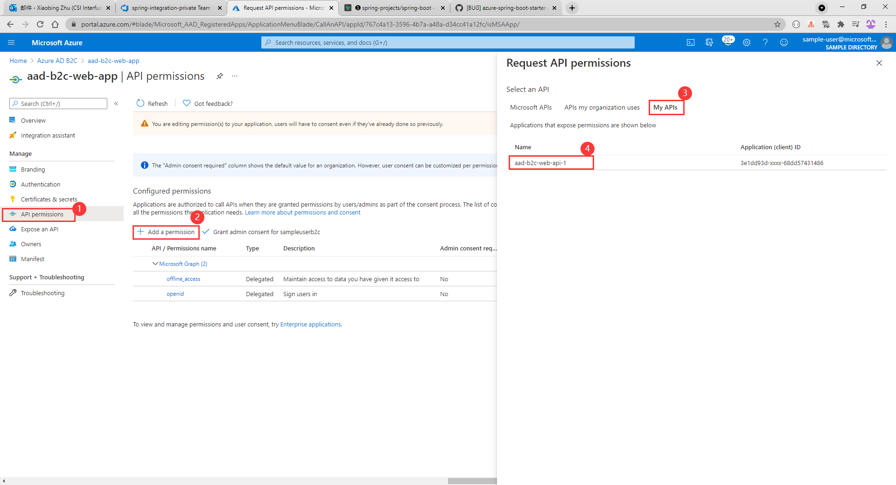
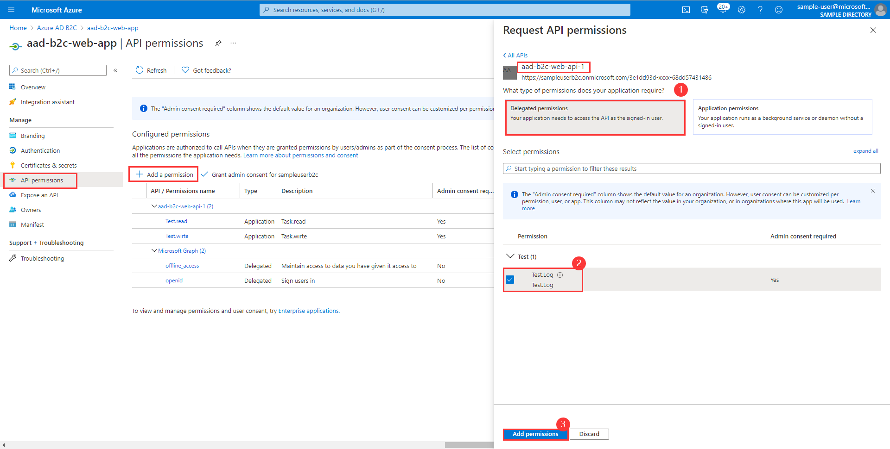
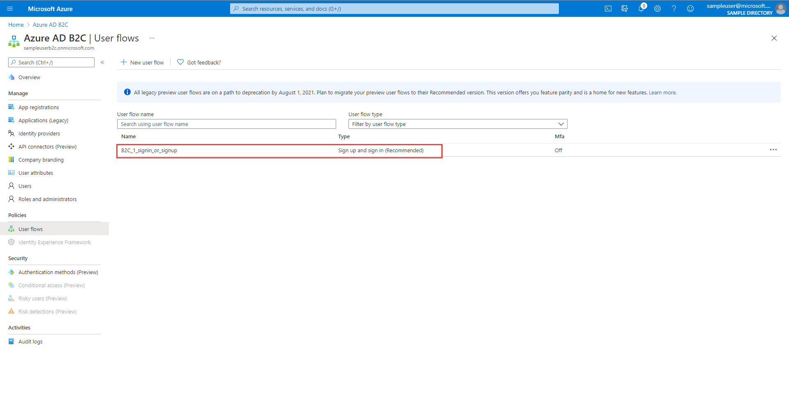

# Sample for Azure AD B2C Resource server Spring Boot client library for Java

## Key concepts
This example illustrates how to use Azure AD B2C and Spring Security to work together as resource server and verify tokens.

## Getting started

### Create and consent Application and Delegated permissions 

**NOTE**: Currently Azure AD B2C does not support client credentials, but you 
can get the accessToken of webapi through Azure Active Directory. 
If you don’t need to support this function, you only need a user flow to provide jwkSetUri.

1. On the **Azure AD B2C** Portal, select the application that requires roles to be added, select **Manifest**.
2. Find the `appRoles` configuration item, and add the following configuration, then click the **Save** button.
```json
  {
    "allowedMemberTypes": [
      "Application"
    ],
    "description": "Task.read",
    "displayName": "Task.read",
    "id": "d2bec026-b75f-418d-9493-8462f54f25d9",
    "isEnabled": true, 
    "value": "Test.read"
  },
  {
    "allowedMemberTypes": [
      "Application"
    ],
    "description": "Task.wirte",
    "displayName": "Task.wirte",
    "id": "1ab4eeda-d07e-4bce-8f77-b0a84c97c34f",
    "isEnabled": true,
    "value": "Test.wirte"
  }
```


3. Find the application permissions need to use.




4. Expose an api.


5. Add the delegated permissions.



6. Consent Application permissions.


7. In the end, configuration is as follows.
   


### Create User Flow
1. Add user flow on the portal.

   
2. Select a user flow type.


3. Setting Relevant Content.

   
4. Finally, configuration is as follows.

   
## Examples
### Configure the sample
#### application.yml

```yaml
# b2c jwkSetUri can be find from metadata document
spring:
  security:
    oauth2:
      resourceserver:
        jwt:
          jwkSetUri: ${your-base-uri} # Such as: https://<your-tenant-name>.b2clogin.com/<your-tenant-name>.onmicrosoft.com/<user-flow-name>/discovery/v2.0/keys
```

#### Support Spring security functions
Azure AD B2C can work well with spring security.

##### Support multiTenancy
Spring security supports [multiTenant][multiTenant], so we can configure it as in the sample to support multiple issuer tokens.
[Spring security multiTenant sample][Spring-Security-multiTenant-sample]

##### Support validate audience
Spring security support custom JwtDecoder beans. You can add logic for audience verification (or other custom verification rules) like the following code.
```java
    @Bean
    JwtDecoder jwtDecoder() {
        NimbusJwtDecoder jwtDecoder = NimbusJwtDecoder.withJwkSetUri("<your-jwkSetUri>").build();
        jwtDecoder.setJwtValidator(new DelegatingOAuth2TokenValidator<>(
                                                   new JwtClaimValidator(AUD, aud -> aud != null && ((ArrayList)aud).contains("contain-id")));
        return jwtDecoder;
    }
```

##### Support custom JwtAuthenticationConverter
Spring security support custom JwtAuthenticationConverter. The custom converter logic can be added using the following code:
```java
@EnableWebSecurity
@EnableGlobalMethodSecurity(prePostEnabled = true)
public class WebSecurityConfiguration extends WebSecurityConfigurerAdapter {

    @Override
    protected void configure(HttpSecurity http) throws Exception {
        http.authorizeRequests((requests) -> requests.anyRequest().authenticated())
                .oauth2ResourceServer()
                .jwt()
                .jwtAuthenticationConverter(jwtAuthenticationConverter());
    }

    private JwtAuthenticationConverter jwtAuthenticationConverter() {
        JwtGrantedAuthoritiesConverter jwtGrantedAuthoritiesConverter = new JwtGrantedAuthoritiesConverter();
        jwtGrantedAuthoritiesConverter.setAuthoritiesClaimName("roles");
        jwtGrantedAuthoritiesConverter.setAuthorityPrefix("ROLE_");
        JwtAuthenticationConverter jwtAuthenticationConverter = new JwtAuthenticationConverter();
        jwtAuthenticationConverter.setJwtGrantedAuthoritiesConverter(jwtGrantedAuthoritiesConverter);
        return jwtAuthenticationConverter;
    }
}
```

Spring security allow for multiple Jwt to GrantedAuthorizies converters.
We can add multiple JwtGrantedAuthoritiesConverter using the following code:
```java
    private JwtAuthenticationConverter jwtAuthenticationConverter() {
        DelegatingJwtGrantedAuthoritiesConverter composite =
                new DelegatingJwtGrantedAuthoritiesConverter(roles(), groups());
        JwtAuthenticationConverter jwtAuthenticationConverter = new JwtAuthenticationConverter();
        jwtAuthenticationConverter.setJwtGrantedAuthoritiesConverter(composite);
        return jwtAuthenticationConverter;
    }

    JwtGrantedAuthoritiesConverter roles() {
        JwtGrantedAuthoritiesConverter authorities = new JwtGrantedAuthoritiesConverter();
        authorities.setAuthorityPrefix("ROLE_");
        authorities.setAuthoritiesClaimName("roles");
        return authorities;
    }

    JwtGrantedAuthoritiesConverter groups() {
        JwtGrantedAuthoritiesConverter authorities = new JwtGrantedAuthoritiesConverter();
        authorities.setAuthorityPrefix("GROUP_");
        authorities.setAuthoritiesClaimName("groups");
        return authorities;
    }
```

### Run with Maven
```
cd azure-spring-boot-samples/aad/aad-b2c-with-spring-security/aad-b2c-resource-server
mvn spring-boot:run
```

### Access the Web API
We could use Postman to simulate a Web APP to send a request to a Web API.

```http request
GET /log HTTP/1.1
Authorization: Bearer eyJ0eXAiO ... 0X2tnSQLEANnSPHY0gKcgw
```

### FAQ
#### How do I delete or modify Application Permissions in Portal?
You can set `isEnabled` to `false` in the manifest's JSON configuration.Then delete or modify it.

## Next steps
## Contributing
<!-- LINKS -->
[Spring-Security-multiTenant-sample]: https://github.com/spring-projects/spring-security-samples/tree/5.5.x/servlet/spring-boot/java/oauth2/resource-server/multi-tenancy
[multiTenant]: https://docs.spring.io/spring-security/site/docs/current/reference/html5/#oauth2resourceserver-multitenancy