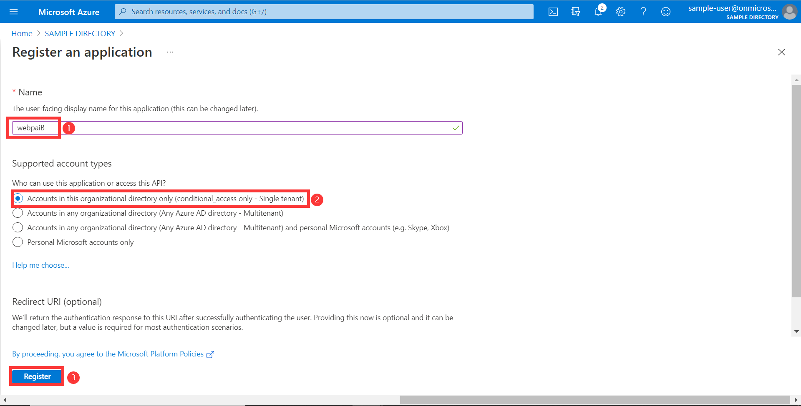

# Azure OAuth 2.0 Sample for Azure AD Spring Boot Starter Resource Server client library for Java

## Key concepts
This sample illustrates how to protect a Java web API by restricting access to its resources to authorized accounts(client application) only.

1. Obtain the access token from the HTTP request header.
2. Use [JwtDecoder](https://jwt.ms/) to parse the access token into `Jwt`.
3. Verify `aud`, `iss`, `nbf`, `exp` claims in access token.
4. Extract information from JWT in `AADOAuth2AuthenticatedPrincipal` object after a successful verification.
5. Save the `AADOAuth2AuthenticatedPrincipal` into SecurityContext.

### Protocol diagram


NOTE: In this sample, we will obtain the access token by posting a request manually.

## Getting started

### Prerequisites

1. Both a client app and a web API(this project provide) registered.
2. Expose the api scope for web API(webapiB this sample).
3. Grant permissions for the above scope to the client app.

### Configure Web API

1. In this section, you register your web APIs in App registrations in the Azure portal. Two web APIs are needed to finish this example: webapiA(client side), webapiB(resource server side).
2. Search for and select your tenant in **Azure Active Directory**. Create a new tenant, see [Set up a tenant](https://docs.microsoft.com/en-us/azure/active-directory/develop/quickstart-create-new-tenant). In this tenant, you have to create one new user, keep the username and password for later use.
3. Under **Manage** In the same tenant, select **App registrations** -> **New registration**.
4. The registered application name is filled into `webapiB`(For better distinguish between [Resource Server] and [Resource Server Obo], this application is named **webapiB**), select **Accounts in this organizational directory only**, click the **register** button.. Repeat this process with `webapiA`.
5. Under **webapiB** application, select **Expose an API** -> **Add a scope**, Use the default Application ID URI, click **Save and continue** button.
6. Wait the page refresh finished. Then set the **Scope name** to `WebApiB.ExampleScope`.
7. Finally, the api exposed in `webapiB`.
8. Under **webapiA** application, select **Certificates & secrets** -> **new client secret**, expires select **Never**, click the **add** button, remember to save the secret value for later use.
9. Expose an API by adding `appRoles` , See [Example: Application app role] for more information.

    ```json
    {
        "allowedMemberTypes": [
          "Application"
        ],
        "description": "WebApiB ClientCredential Example Scope",
        "displayName": "WebApiB ClientCredential Example Scope",
        "id": "d2bec026-b75f-418d-9493-8462f54f25d9",
        "isEnabled": true, 
        "value": "WebApiB.ClientCredential.ExampleScope"
    }
    ```
   
See [Expose scoped permission to web api] for more information about web api.

## Examples
### Configure application.yml

```yaml
#If we configure the azure.activedirectory.client-id or azure.activedirectory.app-id-uri, they will be used to check the audience validation.

azure:
  activedirectory:
    tenant-id: <tenant-id>
    client-id: <client-id> # optional
    app-id-uri: <app-id-uri> # optional
```

### Run with Maven
```shell
# Under sdk/spring project root directory
cd azure-spring-boot-samples/aad/azure-spring-boot-starter-active-directory/aad-resource-server
mvn spring-boot:run
```

### Access the Web API

1. Get the access token.

In the terminal, run the following script:
```shell
curl -X POST https://login.microsoftonline.com/{tenant-id}/oauth2/v2.0/token -H "Content-Type: application/x-www-form-urlencoded" -d "client_id={client-id-webapiA}&client_secret={client-secrent-webapiA}&scope={scope-of-webapiB}&username={username}&password={password}&grant_type=password"
```
NOTE: Refer [resource server password credentials] to get more information to get access token.

You should see log like the following:
```shell
{"token_type":"Bearer","scope":"api://328dxxxxx...84e549fc/WebApiB.ExampleScope","expires_in":4144,"ext_expires_in":4144,"access_token":"eyJ0eXAiO...iMssQ"}
```
2. Use [JwtDecoder online tool](https://jwt.ms/) to parse the access token into `Jwt`. The `aud` in access token should be the current application ID URI(webApiB).

3. Access the APIs from localhost. 

   1. Access "/webapiB" which is granted the permission.

      In the terminal, run the following script:
      ```shell
      curl http://localhost:8082/webapiB -H "Authorization: Bearer <access_token>"
      ```
      You should see the following response in the log:
      ```shell
      Response from webApiB.
      ```
   2. Access "/user" which is not granted the permission.
    
      In the terminal, run the following script:
      ```shell
      curl http://localhost:8082/user -H "Authorization: Bearer <access_token>" -I
      ```
      You should see the following response in the log:
        
      ```shell
      HTTP/1.1 403
      WWW-Authenticate: Bearer error="insufficient_scope", error_description="The request requires higher privileges than provided by the access token.", error_uri="https://tools.ietf.org/html/rfc6750#section-3.1"
      X-Content-Type-Options: nosniff
      X-XSS-Protection: 1; mode=block
      ...
      ```
## Troubleshooting

## Next steps
## Contributing
<!-- LINKS -->

[Expose scoped permission to web api]: https://docs.microsoft.com/azure/active-directory/develop/quickstart-configure-app-expose-web-apis
[Resource Server]: https://github.com/Azure-Samples/azure-spring-boot-samples/blob/main/aad/azure-spring-boot-starter-active-directory/aad-resource-server
[Resource Server Obo]: https://github.com/Azure-Samples/azure-spring-boot-samples/blob/main/aad/azure-spring-boot-starter-active-directory/aad-resource-server-obo
[resource server password credentials]: https://docs.microsoft.com/azure/active-directory/develop/v2-oauth-ropc
[Example: Application app role]: https://docs.microsoft.com/azure/active-directory/develop/howto-add-app-roles-in-azure-ad-apps#example-application-app-role