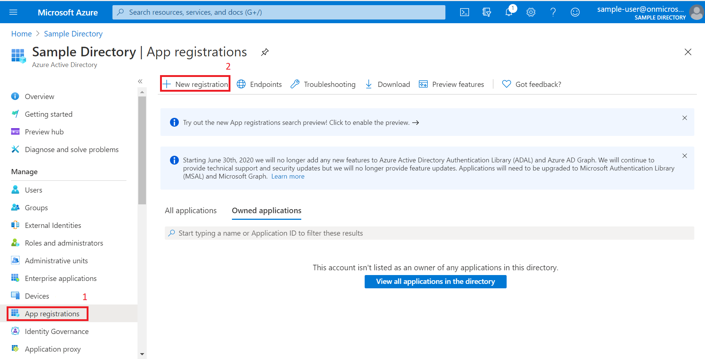
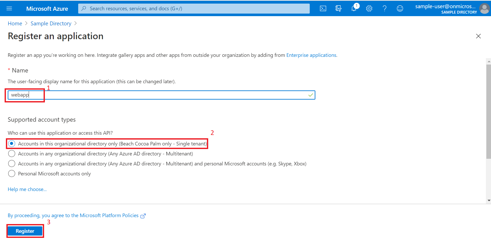
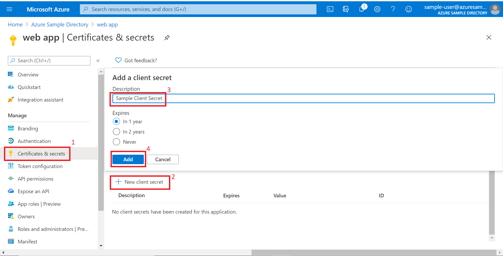
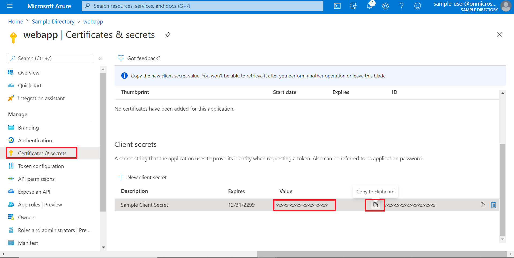
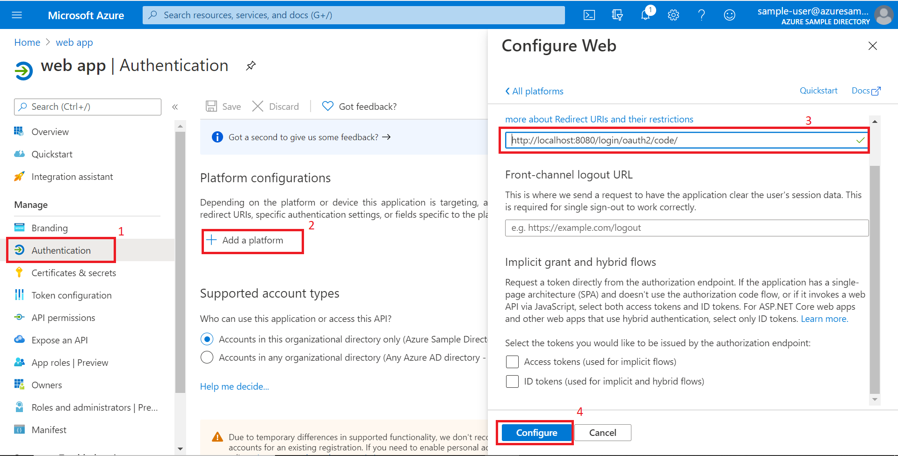
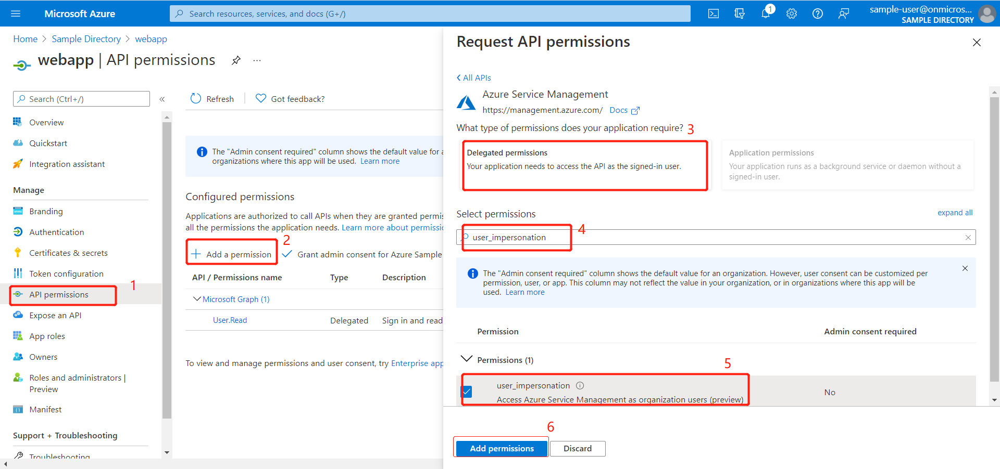
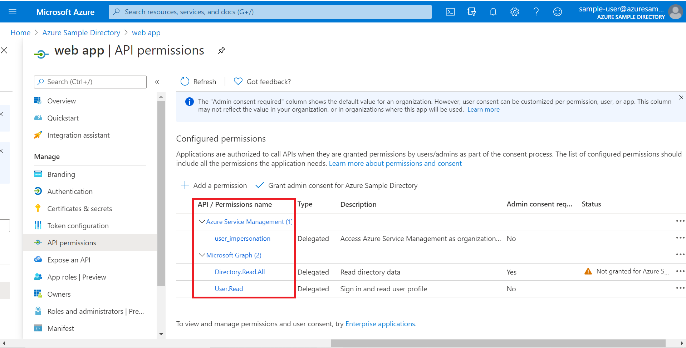
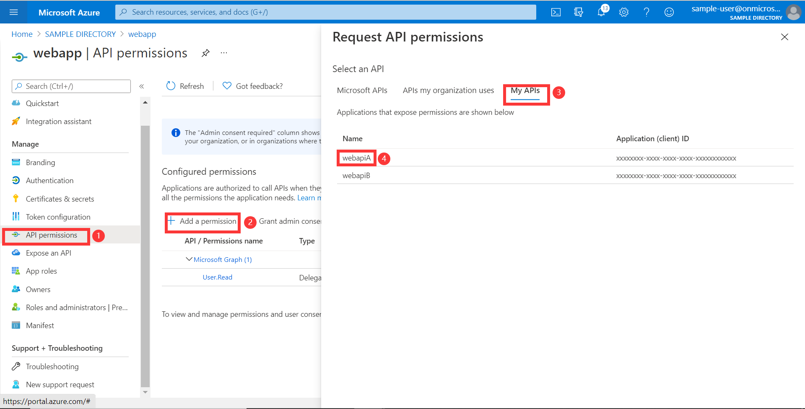
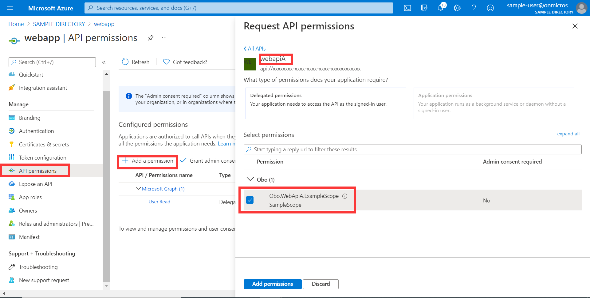
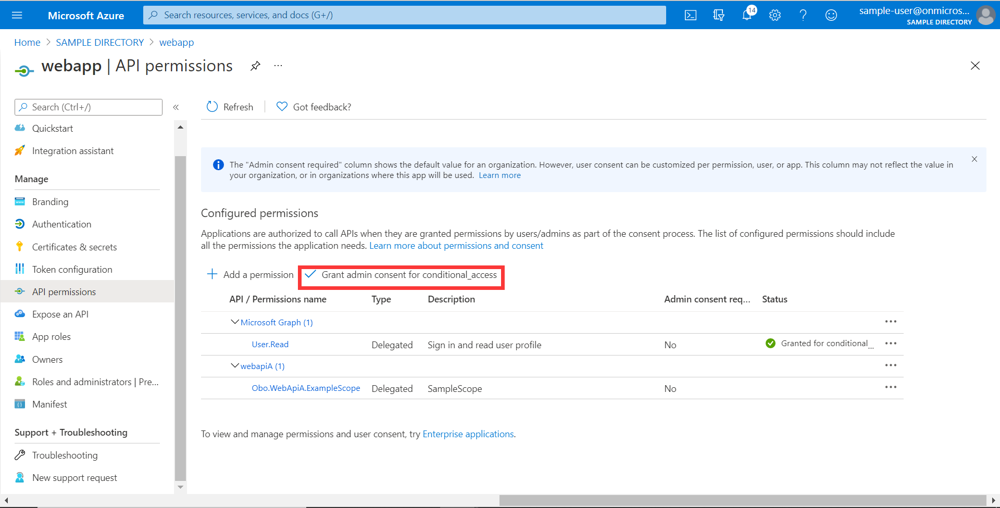

# OAuth 2.0 Sample for Azure AD Spring Boot Starter client library for Java

## Key concepts
This sample illustrates how to use `azure-spring-boot-starter-active-directory` package to work with OAuth 2.0 and OpenID Connect protocols on Auzre. This sample will use Microsoft Graph API to retrieve user information.

## Getting started


### Configure web app
1. Search for and select your tenant in **Azure Active Directory**.
1. Under Manage In the same tenant, select **App registrations** -> **New registration**.
1. The registered application name is filled into `webapp`, select **Accounts in this organizational directory only**, click the **register** button.
1. Under **webapp** application, select **Certificates & secrets** -> **new client secret**, click the **add** button.(Remember to save the secrets here and use them later.)
1. Under **webapp** application, select **Authentication** -> **Add a platform**, select **web** platform, redirect urls set to `http://localhost:8080/login/oauth2/code/`, click **configure** button.
1. Under **webapp** application, select **API permissions** -> **Add a permission**, select **Microsoft Graph**. Next, search `Directory.Read.All` via **select Permissions**, check the check box, click **add permissions** button.(`User.Read` is created automatically, we need to keep it.)
1. Similarly, add permission **user_impersonation** in **Azure Service Management**,
   

See [Register app], [Grant scoped permission] for more information about web app.

### Configure groups for sign in user
In order to try the authorization action with this sample with minimum effort, [configure the user and groups in Azure Active Directory], configure the user with `group1`.

## Advanced features

### Support access control by id token in web application 
If you want to use `id_token` for authorization, the `appRoles` feature of AAD is supported which is presented in id_token's `roles` claim. By following below configurations, `GrantedAuthority` can be generated from `roles` claim. 

Note:
 - The `roles` claim generated from `appRoles` is decorated with prefix `APPROLE_`.
 - When using `appRoles` as `roles` claim, please avoid configuring group attribute as `roles` at the same time. The latter will override the claim to contain group information instead of `appRoles`. Below configuration in manifest should be avoided:
    ```
    "optionalClaims": {
        "idtoken": [{
            "name": "groups",
            "additionalProperties": ["emit_as_roles"]
        }]
    }
    ```

Follow the guide to 
[add app roles in your application](https://docs.microsoft.com/azure/active-directory/develop/howto-add-app-roles-in-azure-ad-apps).
1. In this example you need to create following `appRoles` in your application's manifest:
    ```
      "appRoles": [
        {
          "allowedMemberTypes": [
            "User"
          ],
          "displayName": "Admin",
          "id": "2fa848d0-8054-4e11-8c73-7af5f1171001",
          "isEnabled": true,
          "description": "Full admin access",
          "value": "Admin"
         }
      ]
    ```
1. After you've created the roles go to your Enterprise Application in Azure Portal, select "Users and groups" and assign the new roles to your Users (assignment of roles to groups is not available in the free tier of AAD).

### Support access other resources server
This is an optional configuration. This guide is for accessing [Resource Server Obo].
If you want to use **webapp** to access other resource server (for example, access [Resource Server Obo] or [Resource Server] or custom resource server), you can refer to this guide.

1. First you need to complete [config for resource server obo] and make sure to expose the scope of `Obo.WebApiA.ExampleScope`.
1. Select **API permissions** > **Add a permission** > **My APIs**, select ***Web API A*** application name. 
1. **Delegated permissions** is selected by default， Select **Obo.WebApiA.ExampleScope** permission, select **Add permission** to complete the process.
1. Grant admin consent for ***Web API A*** permissions.
1. Enable webapiA client in `application.yml`.

## Examples
### Configure application.yml
```yaml
# WebapiA is an optional client, we can access obo resource servers or the other custom server.

azure:
  activedirectory:
    client-id: <client-id>
    client-secret: <client-secret>
    tenant-id: <tenant-id>
    user-group:
      allowed-group-names: <group1>,<group2>
      allowed-group-ids: <group1-id>,<group2-id>   # When 'all' is used, all group id can be obtained.
    post-logout-redirect-uri: http://localhost:8080
    authorization-clients:
      arm:
        on-demand: true
        scopes: https://management.core.windows.net/user_impersonation
      graph:
        scopes:
          - https://graph.microsoft.com/User.Read
          - https://graph.microsoft.com/Directory.Read.All
#      webapiA:
#        scopes:
#          - <Web-API-A-app-id-url>/Obo.WebApiA.ExampleScope
      
# enable-full-list is used to control whether to list all group ids, default is false

# It's suggested the logged in user should at least belong to one of the above groups
# If not, the logged in user will not be able to access any authorization controller rest APIs
```

### Run with Maven
```shell
cd azure-spring-boot-samples/aad/azure-spring-boot-starter-active-directory/aad-web-application
mvn spring-boot:run
```

### Check the authentication and authorization
1. Access http://localhost:8080
2. Login
3. Access `Group1 Message` link: success
4. Access `Group2 Message` link: fail with forbidden error message
5. Access `Graph Client` link: access token for `Microsoft Graph` will be acquired, and the content of customized **OAuth2AuthorizedClient** instance for `Microsoft Graph` resource will be displayed.
6. Access `Office Client` link: access token for `Office 365 Management APIs` will be acquired, the content of customized **OAuth2AuthorizedClient** instance for `Office 365 Management APIs` resource will be displayed.
7. Access `Arm Client` link: page will be redirected to Consent page for on-demand authorization of `user_impersonation` permission in `Azure Service Management` resource. Clicking on `Consent`, access token for `Azure Service Management` will be acquired, the content of customized **OAuth2AuthorizedClient** instance for `Azure Service Management` resource will be displayed.
8. Access `Obo Client` link: access token for `webapiA` will be acquired, the success or failure of accessing `webapiA` will be displayed.

## Troubleshooting
### If registered application is multi-tenanted, how to run this sample?
In your application.yml file:
```yaml
azure:
  activedirectory:
    tenant-id: common
```
---
### Meet with `AADSTS240002: Input id_token cannot be used as 'urn:ietf:params:oauth:grant-type:jwt-bearer' grant` error.
In Azure portal, app registration manifest page, configure `oauth2AllowImplicitFlow` in your application manifest to `true`. See [this issue] for details on this workaround.

## Next steps
## Contributing

<!-- LINKS -->

[Register app]: https://docs.microsoft.com/azure/active-directory/develop/quickstart-register-app
[Grant scoped permission]: https://docs.microsoft.com/azure/active-directory/develop/quickstart-configure-app-access-web-apis
[configure the user and groups in Azure Active Directory]: https://docs.microsoft.com/azure/active-directory/active-directory-groups-create-azure-portal
[this issue]: https://github.com/MicrosoftDocs/azure-docs/issues/8121#issuecomment-387090099
[Resource Server]: https://github.com/Azure-Samples/azure-spring-boot-samples/blob/main/aad/azure-spring-boot-sample-active-directory-resource-server
[Resource Server Obo]: https://github.com/Azure-Samples/azure-spring-boot-samples/blob/main/aad/azure-spring-boot-starter-active-directory/aad-resource-server-obo
[config for resource server obo]: https://github.com/Azure-Samples/azure-spring-boot-samples/blob/main/aad/azure-spring-boot-starter-active-directory/aad-resource-server-obo#configure-your-middle-tier-web-api-a