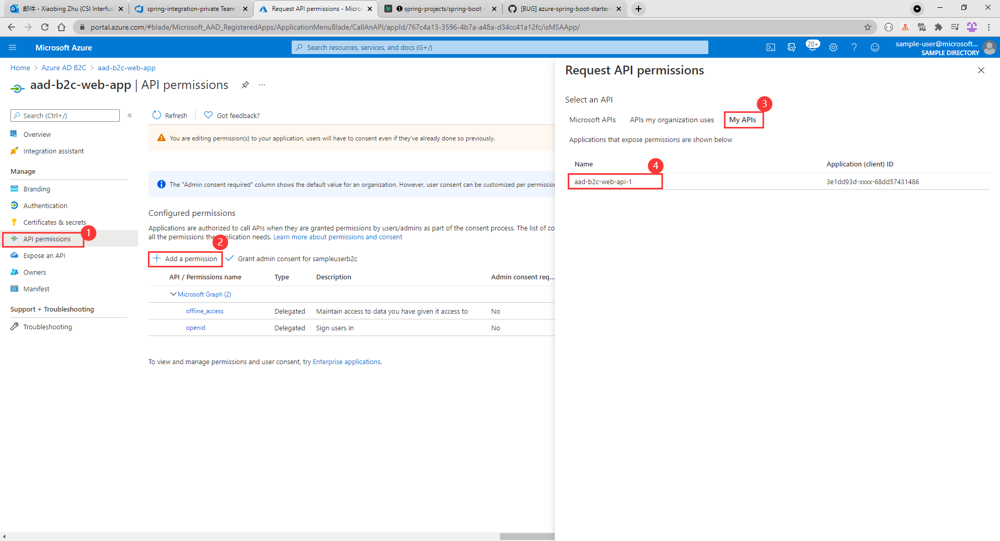
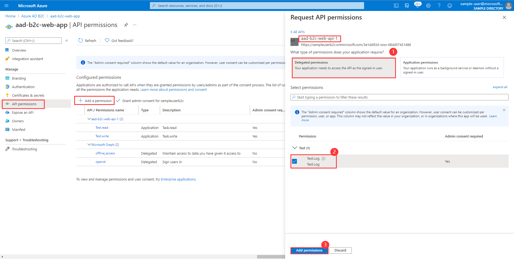
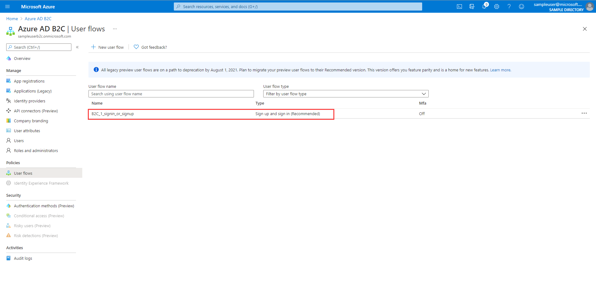

# Developing REST API Application Developed by Spring Boot and Protected by Azure Active Directory B2C

## Key concepts
This sample illustrates how to use `spring-cloud-azure-starter-active-directory-b2c` package to work in a resource server and validate tokens. 

1. Constructs trusted iss by configuring tenant id.
2. Obtain the access token from the HTTP request header.
3. Analyze access token to `iss` and construct `JwtDecoder` by `AadIssuerJWSKeySelector`.
4. Use `JwtDecoder` to parse the access token into `Jwt`.
5. Verify `aud`, `iss`, `nbf`, `exp` claims in access token.

## Getting started


### Create and consent Application and Delegated permissions 
1. On the **Azure AD B2C** Portal, select the application that requires roles to be added, select **Manifest**.
2. Find the `appRoles` configuration item, and add the following configuration, then click the **Save** button.
```json
  {
    "allowedMemberTypes": [
      "Application"
    ],
    "description": "Task.read",
    "displayName": "Task.read",
    "id": "d2bec026-b75f-418d-9493-8462f54f25d9",
    "isEnabled": true, 
    "value": "Test.read"
  },
  {
    "allowedMemberTypes": [
      "Application"
    ],
    "description": "Task.write",
    "displayName": "Task.write",
    "id": "1ab4eeda-d07e-4bce-8f77-b0a84c97c34f",
    "isEnabled": true,
    "value": "Test.write"
  }
```


3. Find the application permissions need to use.




4. Expose an api.


5. Add the delegated permissions.



6. Consent Application permissions.


7. In the end, configuration is as follows.
   


### Create User Flow
1. Add user flow on the portal.

   
2. Select a user flow type.


3. Setting Relevant Content.

   
4. Finally, configuration is as follows.

   
## Examples
### Configure the sample
#### application.yml

```yaml
# In v2.0 tokens, `aud` is always the client ID of the API, while in v1.0 tokens it can be the app id uri.
spring:
  cloud:
    azure:
      active-directory:
        b2c:
          enabled: true
          profile:
            tenant-id: ${AZURE_TENANT_ID}
          credential:
            client-id: ${AZURE_CLIENT_ID}           # If you are using v2.0 token, please configure client-id for `aud` verification
          app-id-uri: ${APP_ID_URI}         # If you are using v1.0 token, please configure app-id-uri for `aud` verification
          base-uri: ${AZURE_AD_BASE_URI}             # Such as: https://xxxxb2c.b2clogin.com
          user-flows:
            sign-up-or-sign-in: ${SIGN_UP_OR_SIGN_IN_USER_FLOW_NAME}
```

### Run with Maven
```
cd azure-spring-boot-samples/aad/spring-cloud-azure-starter-active-directory-b2c/aad-b2c-resource-server
mvn spring-boot:run
```

### Access the Web API
- Write response.

1. Get access-token:
```shell script
curl -H "Content-Type: application/x-www-form-urlencoded" -d 'grant_type=client_credentials&client_id=<aad-b2c-web-app-client-id>&scope=<app-id-uri>/.default&client_secret=<aad-b2c-web-app-client-secret>' 'https://login.microsoftonline.com/<tenant-id>/oauth2/v2.0/token'
```
2. Access endpoint by access-token:
```shell script
curl localhost:8080/write -H "Authorization: Bearer <access_token>"
```
3. Verify response:
```text
Write success.
```

- Read response.

1. Get access-token:
```shell script
curl -H "Content-Type: application/x-www-form-urlencoded" -d 'grant_type=client_credentials&client_id=<aad-b2c-web-app-client-id>&scope=<app-id-uri>/.default&client_secret=<aad-b2c-web-app-client-secret>' 'https://login.microsoftonline.com/<tenant-id>/oauth2/v2.0/token'
```
2. Access endpoint by access-token:
```shell script
curl localhost:8080/read -H "Authorization: Bearer <access_token>"
```
3. Verify response:
```text
Read success.
```

- Log response.

1. Get access-token:
```shell script
curl -H "Content-Type: application/x-www-form-urlencoded" -d 'grant_type=client_credentials&client_id=<aad-b2c-web-app-client-id>&scope=<app-id-uri>/.default&client_secret=<aad-b2c-web-app-client-secret>' 'https://login.microsoftonline.com/<tenant-id>/oauth2/v2.0/token'
```
2. Access endpoint by access-token:
```shell script
curl localhost:8080/log -H "Authorization: Bearer <access_token>" -I
```
3. Verify response:
```text
error:403.
```

## Troubleshooting
- `WWW-Authenticate: Bearer error="invalid_token", error_description="An error occurred while attempting to decode the Jwt: Couldn't retrieve remote JWK set: Read timed out",`
  
    While running sample, if error occurs with logs above:
    - `azure-activedirectory-b2c:jwt-read-timeout` to set longer read time in `application.yml`.
    
### FAQ
#### How do I delete or modify Application Permissions in Portal?
You can set `isEnabled` to `false` in the manifest's JSON configuration.Then delete or modify it.

## Next steps
## Contributing
<!-- LINKS -->
