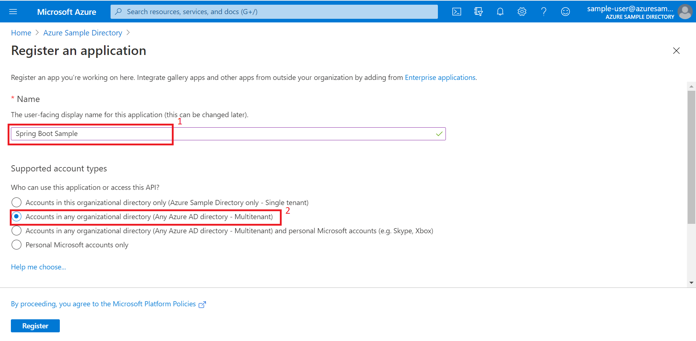
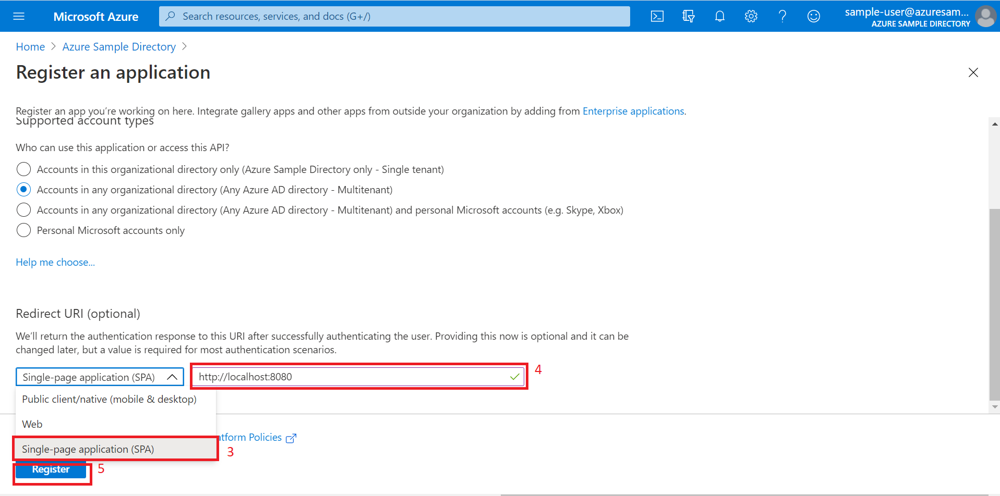
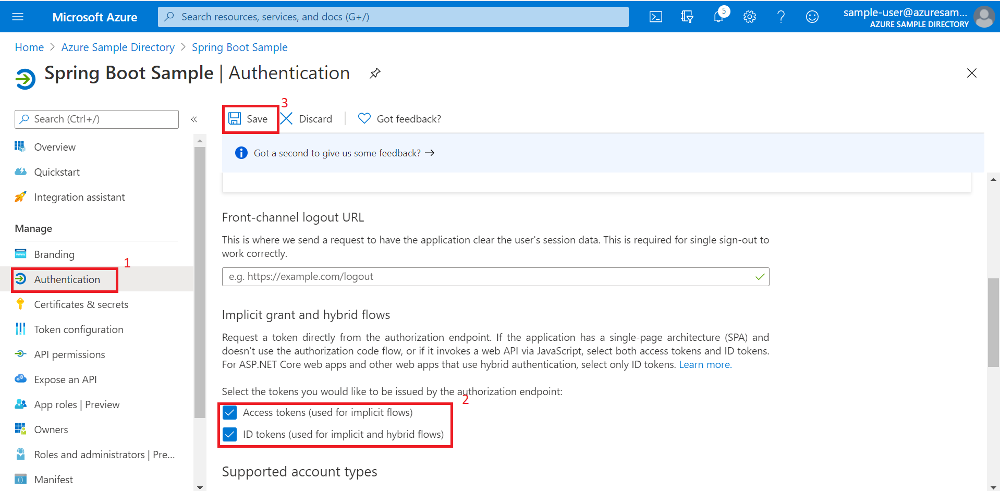
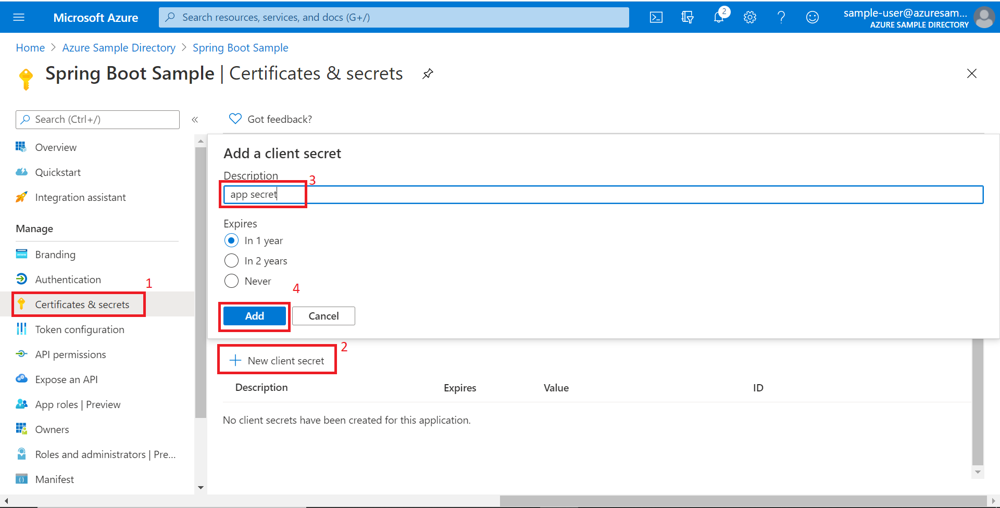
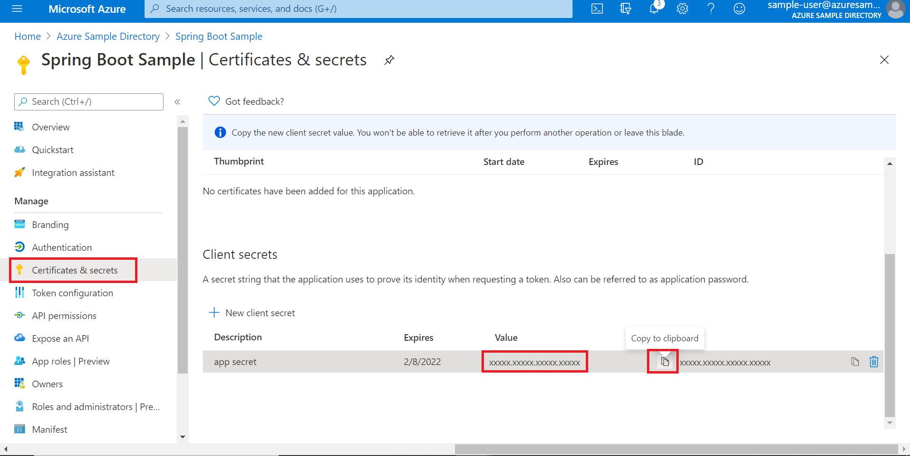
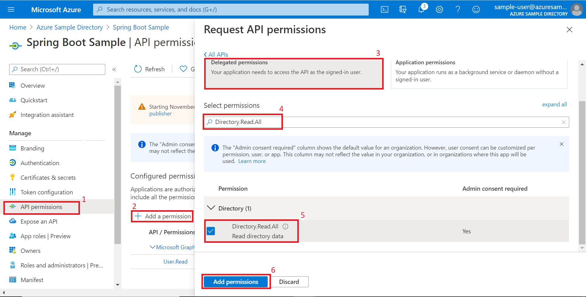
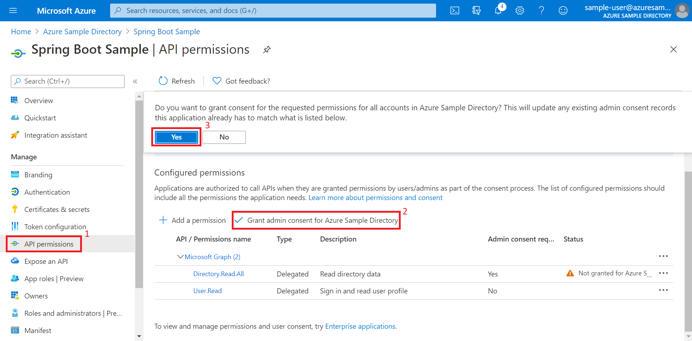

# Authentication filter sample for Azure AD Spring Boot Starter

## Key concepts
This sample illustrates how to use `spring-cloud-azure-starter-active-directory` package to plugin JWT token filter into Spring Security filter chain. The filter injects `UserPrincipal` object that is associated with the thread of the current user request. User's AAD membership info, along with token claimsset, JWS object etc. are accessible from the object which can be used for role based authorization. Methods like `isMemberOf` is also supported.

## Getting started
The sample is composed of two layers: Angular JS client and Spring Boot RESTful Web Service. You need to make some changes to get it working with your Azure AD tenant on both sides.

To run this sample, you'll need:
- An Azure Active Directory (Azure AD) tenant. For more information on how to get an Azure AD tenant, see [How to get an Azure AD tenant](https://docs.microsoft.com/azure/active-directory/fundamentals/active-directory-how-to-find-tenant).
- A user account in your Azure AD tenant. This sample will not work with a Personal Microsoft account (formerly Windows Live account). Therefore, if you signed in to the [Azure portal](https://portal.azure.com) with a Microsoft account and have never created a user account in your directory before, you need to do that now.
- A [client secret](https://docs.microsoft.com/azure/active-directory/develop/howto-create-service-principal-portal#create-a-new-application-secret) for the registered application.
- Configure groups in your Azure AD tenant with your users in that groups, see [how to create groups](https://docs.microsoft.com/azure/active-directory/fundamentals/active-directory-groups-create-azure-portal).
- The sample retrieves user's group membership using Azure AD graph API which requires the registered app to have `Directory.Read.All` "Access the directory as the signed-in user" under `Delegated Permissions`. You need AAD admin privilege to be able to grant the permission in API ACCESS -> Required permission.


#### Note
- If you are not the admin, you need consent from your admin for the the `Directory.Read.All` permission. For details see [Directory Permissions](https://docs.microsoft.com/graph/permissions-reference#directory-permissions)

## Running Sample With Terraform
Please refer to [README.md](terraform/README.md) if you want to start the sample with Terraform in just a few steps.

## Running Sample Step by Step

### Step 1:  Clone or download this repository

From your command line:

```command line
git clone https://github.com/Azure/azure-sdk-for-java.git
```
or download and extract the repository .zip file, and navigate to `spring-cloud-azure-sample-active-directory-resource-server-by-filter` from the list of samples.

---
### Step 2:  Register the sample with your Azure Active Directory tenant

To register it follow the steps below or follow the guide [here](https://docs.microsoft.com/azure/active-directory/develop/quickstart-register-app).

#### Choose the Azure AD tenant where you want to create your applications

As a first step you'll need to:

1. Sign in to the [Azure portal](https://portal.azure.com) using either a work or school account.
1. If your account is present in more than one Azure AD tenant, select `your account name` at the top right corner in the menu on top of the page, and switch your portal session to the desired Azure AD tenant.   
1. In the left-hand navigation pane, select the **Azure Active Directory** service, and then select **App registrations**

#### Register the client app

1. Navigate to the Microsoft identity platform for developers [App registrations](https://go.microsoft.com/fwlink/?linkid=2083908) page.
1. Select **New registration**.
   - In the **Name** section, enter a meaningful application name that will be displayed to users of the app, for example `Spring Boot Sample`.
   - In the **Supported account types** section, select **Accounts in any organizational directory**.
   - Choose **Single-page application(SPA)** as application type.
   - Add `http://localhost:8080/` as the `Reply URL` under Redirect URI.
   - Select **Register** to create the application. 
   - After creating the application, on the application **Overview** page, click the **Redirect URIs** to edit, select the **Access tokens** and **ID tokens**, and click **Save**. 
1. On the app **Overview** page, find the **Application (client) ID** value and record it for later. You'll need it to configure the application.properties file for this project.
1. On selecting your application from the the registered applcations you can see **Certificates & secrets** in left navigation pane, go to that page and in the **Client secrets** section, choose **New client secret**:

   - Type a key description (of instance `app secret`),
 
   - When you press the **Add** button, the key value will be displayed, copy, and save the value in a safe location. 
   - You'll need this key later to configure the project. This key value will not be displayed again, nor retrievable by any other means,
   so record it as soon as it is visible from the Azure portal.   
   
1. In the list of pages for the app, select **API permissions**
   - Click the **Add a permission** button and then,
   - Ensure that the **Microsoft APIs** tab is selected
   - In the *Commonly used Microsoft APIs* section, click on **Microsoft Graph**
   - In the **Delegated permissions** section, ensure that the right permissions are checked: **Directory.Read.All**
   - Select the **Add permissions** button 
   
1. At this stage permissions are assigned correctly but the client app does not allow interaction. 
   Therefore no consent can be presented via a UI and accepted to use the service app. 
   Click the **Grant/revoke admin consent for {tenant}** button, and then select **Yes** when you are asked if you want to grant consent for the
   requested permissions for all account in the tenant. 
   You need to be an Azure AD tenant admin to do this.

1. Then back to **Azure Active Directory**, in the left-hand navigation pane, select **Groups**, and then set `user` as member of `group1`.

---
### Step 3:  Configure the sample to use your Azure AD tenant

In the steps below, "client-id" is the same as "Application ID" or "AppId".

Open application.yml in your project to configure:

```yml
spring:
  cloud:
    azure:
      active-directory:
        enabled: true
        credential:
          client-id: ${AZURE_CLIENT_ID}
          client-secret: ${AZURE_CLIENT_SECRET}
        profile:
          tenant-id: ${AZURE_TENANT_ID}
        user-group:
          allowed-group-names: group1,group2
        redirect-uri-template: http://localhost:8080/
        jwt-connect-timeout: 5000
```

1. Put Application ID and client-secret in `client-id` and `client-secret` respectively e.g.
```properties
tenant-id: xxxxxx-your-client-id-xxxxxx
client-id: xxxxxx-your-client-secret-xxxxxx
```

2. List all the AAD groups `ActiveDirectoryGroups` that you want to have a Spring Security role object mapping to it. The role objects can then be used to manage access to resources that is behind Spring Security. e.g.
```properties
# groups that you created in your Azure AD tenant
allowed-group-names: group1,group2
```

3. (Optional) If you want to configure oauth2 redirect uri, please configure by :
```properties
redirectUriTemplate: xxxxxx-your-redirect-uri-xxxxxx
```

---
 ### Step 4: Change Role_group1 to your group
1. You can use `@PreAuthorize` annotation or `UserPrincipal` to manage access to web API based on user's group membership. You will need to change `ROLE_group1` to groups you want to allow to access the API in `TodoListController.java` or you will get "Access is denied".
   
---

### Step 5: Give it a run

* Run with Maven 
 ```
 cd azure-spring-boot-samples/aad/spring-cloud-azure-starter-active-directory/aad-resource-server-by-filter
 mvn spring-boot:run
 ```

* If running locally, browse to `http://localhost:8080` and click `Login` or `Todo List`, your browser will be redirected to `https://login.microsoftonline.com/` for authentication.
* Upon successful login, `Todo List` will give you a default item and you can perform add, update or delete operation. The backend RESTful API will accept or deny your request based on authenticated user roles.

## Troubleshooting
## Next steps
## Contributing

<!-- LINKS -->


[azure-china]: https://docs.microsoft.com/azure/china/china-welcome
