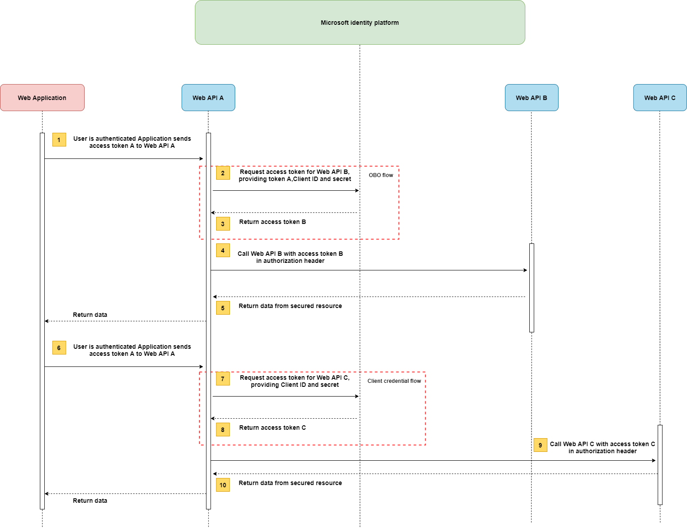
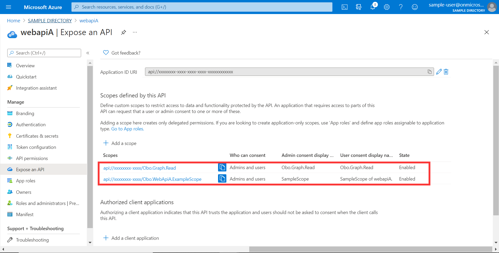
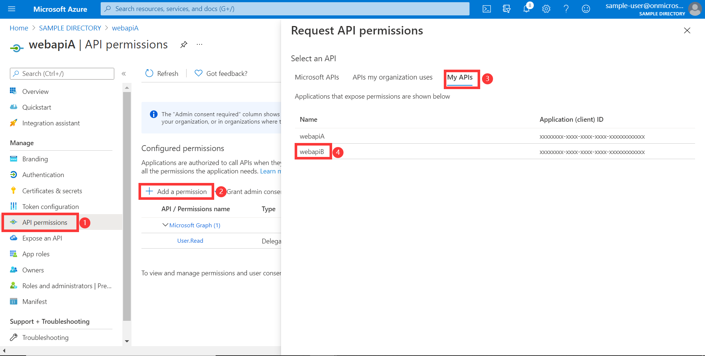
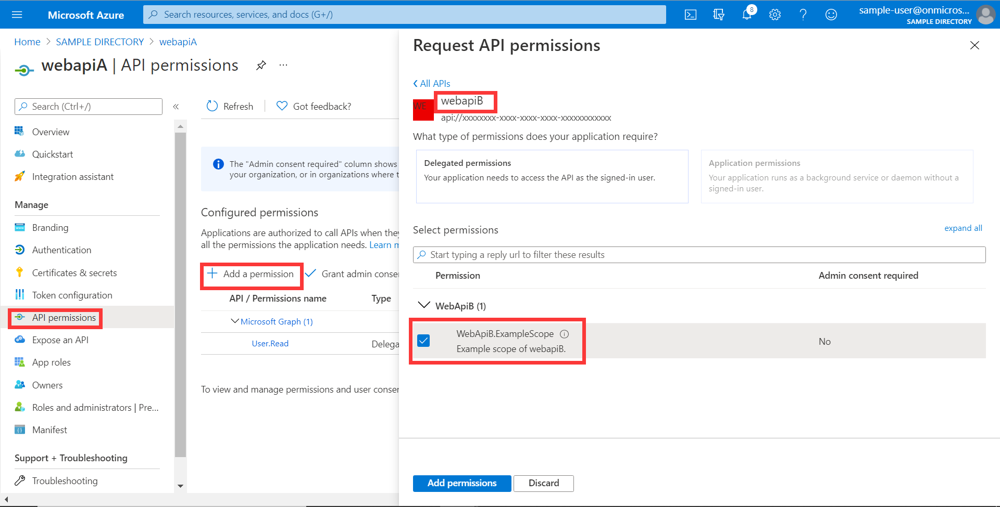
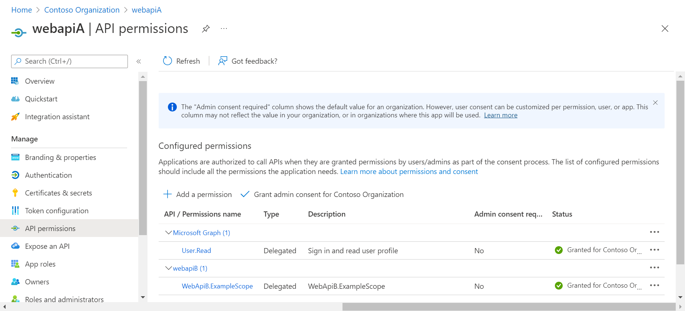

# Azure OAuth 2.0 Sample for Azure AD Spring Boot Starter Resource Server Obo

## Key concepts
[Resource server access other resources usage] is an extension scenario of the *aad-resource-server* sample. Similarly, this sample illustrates how to protect a Java web API by restricting access to its resources to authorized accounts, and the restricted resource will access other restricted resource, such as Graph API and Custom API.

### Protocol diagram
Assume that the user has been authenticated on an application using the OAuth 2.0 authorization code grant flow or another login flow. At this point, the application has an access token for API A (token A) with the user's claims and consent to access the middle-tier web API (API A). Now, API A needs to make an authenticated request to the downstream web API B(API B).
The following steps constitute the OBO process and the client credential process, as shown in the following figure.


1. The client application makes a request to API A with token A (with an aud claim of API A).
2. API A authenticates to the Microsoft identity platform token issuance endpoint and requests a token to access API B.
4. The Microsoft identity platform token issuance endpoint validates API A's credentials along with token A and issues the access token for API B (token B) to API A.
4. Token B is set by API A in the authorization header of the request to API B.
5. Data from the secured resource is returned by API B to API A, and from there to the client.

## Getting started
We will prepare two applications to demonstrate the dependent calls of resources.


- Configure `Web API B` Resource Server: [aad-resource-server]

### Configure your middle-tier Web API A
1. Expose two scopes for ***Web API A***, `Obo.Graph.Read` and `Obo.WebApiA.ExampleScope`. The **Application ID URI** is generated by default.  

2. Select **API permissions** > **Add a permission** > **My APIs**, select ***Web API B*** application name. 
3. **Delegated permissions** is selected by default, Select **WebApiB.ExampleScope** permission, select **Add permission** to complete the process.
4. Grant admin consent for ***Web API B*** permissions and **Microsoft Graph** permissions.

See [OAuth 2.0 On-Behalf-Of flow] for more information about OBO.

## Examples
### Configure application.yml
```yaml
spring:
  cloud:
    azure:
      active-directory:
        enabled: true
        credential:
          client-id: ${AZURE_CLIENT_ID}
          client-secret: ${AZURE_CLIENT_SECRET}
        profile:
          tenant-id: ${AZURE_TENANT_ID}
        app-id-uri: ${WEB_API_A_APP_ID_URL}
        authorization-clients:
          graph:
            scopes:
              - https://graph.microsoft.com/User.Read
          webapiB:         # When authorization-grant-type is null, on behalf of flow is used by default
            authorization-grant-type: on_behalf_of
            scopes:
              - ${WEB_API_B_APP_ID_URL}/WebApiB.ExampleScope
```

### Run with Maven
```shell
cd azure-spring-boot-samples/aad/spring-cloud-azure-starter-active-directory/web-client-access-resource-server/aad-resource-server-obo
mvn spring-boot:run
```

### Access the Web API A
- Web API A will call Graph resource. 

1. Get access-token:
```shell script
curl -H "Content-Type: application/x-www-form-urlencoded" -d 'grant_type=password&client_id=<web-apiA-client-id>&scope=<app-id-uri>/Obo.Graph.Read&client_secret=<web-apiA-client-secret>&username=<username>&password=<password>' 'https://login.microsoftonline.com/organizations/oauth2/v2.0/token'
```
2. Access endpoint by access-token:
```shell script
curl localhost:8081/call-graph -H "Authorization: Bearer <access-token>"
```
3. Verify response:
```text
Graph response success.
```

- Web API A will call Graph resource through `OAuth2AuthorizedClientManager`. 

1. Get access-token:
```shell script
curl -H "Content-Type: application/x-www-form-urlencoded" -d 'grant_type=password&client_id=<web-apiA-client-id>&scope=<app-id-uri>/Obo.Graph.Read&client_secret=<web-apiA-client-secret>&username=<username>&password=<password>' 'https://login.microsoftonline.com/organizations/oauth2/v2.0/token'
```
2. Access endpoint by access-token:
```shell script
curl localhost:8081/call-graph-with-authorized-client-manager -H "Authorization: Bearer <access-token>"
```
3. Verify response:
```text
Graph response success.
```

- Web API A will call Custom(Web API B) resources. 

1. Get access-token:
```shell script
curl -H "Content-Type: application/x-www-form-urlencoded" -d 'grant_type=password&client_id=<web-apiA-client-id>&scope=<app-id-uri>/Obo.WebApiA.ExampleScope&client_secret=<web-apiA-client-secret>&username=<username>&password=<password>' 'https://login.microsoftonline.com/organizations/oauth2/v2.0/token'
```
2. Access endpoint by access-token:
```shell script
curl localhost:8081/webapiA/webapiB -H "Authorization: Bearer <access-token>"
```
3. Verify response:
```text
webapiB response success.
```

## Troubleshooting

## Next steps
## Contributing

<!-- LINKS -->
[Azure portal]: https://portal.azure.com/

[Resource server access other resources usage]: https://github.com/Azure-Samples/azure-spring-boot-samples/tree/spring-cloud-azure_v4.3.0/aad/spring-cloud-azure-starter-active-directory/web-client-access-resource-server/aad-resource-server-obo
[aad-resource-server]: ../aad-resource-server
[OAuth 2.0 On-Behalf-Of flow]: https://docs.microsoft.com/azure/active-directory/develop/v2-oauth2-on-behalf-of-flow
