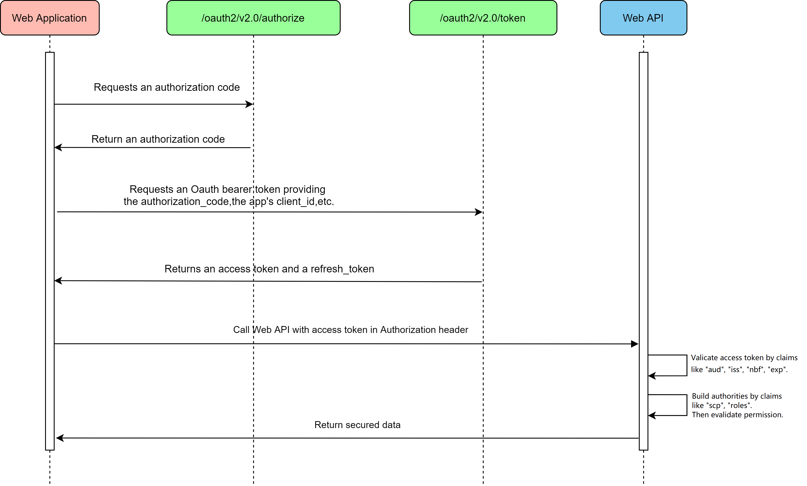
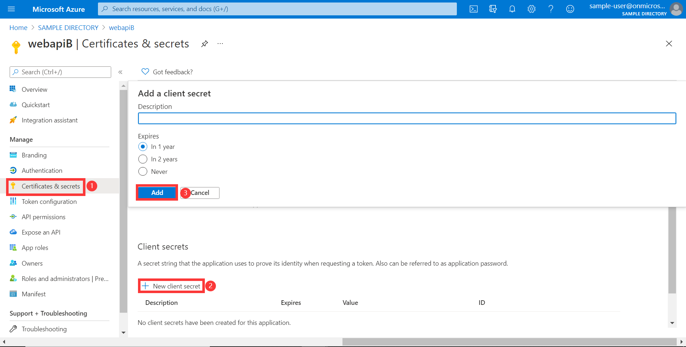
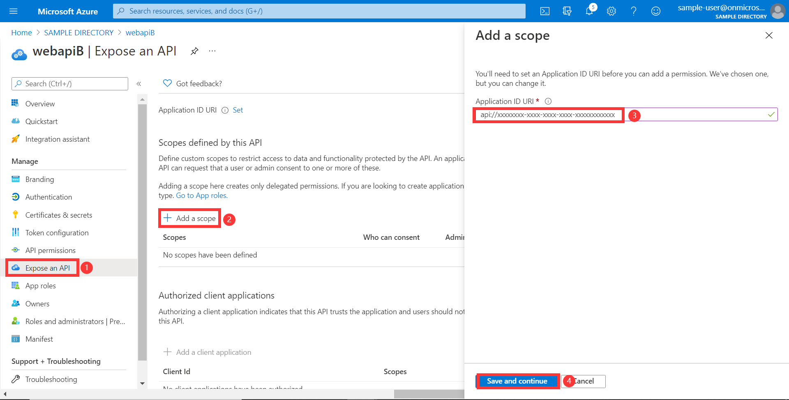
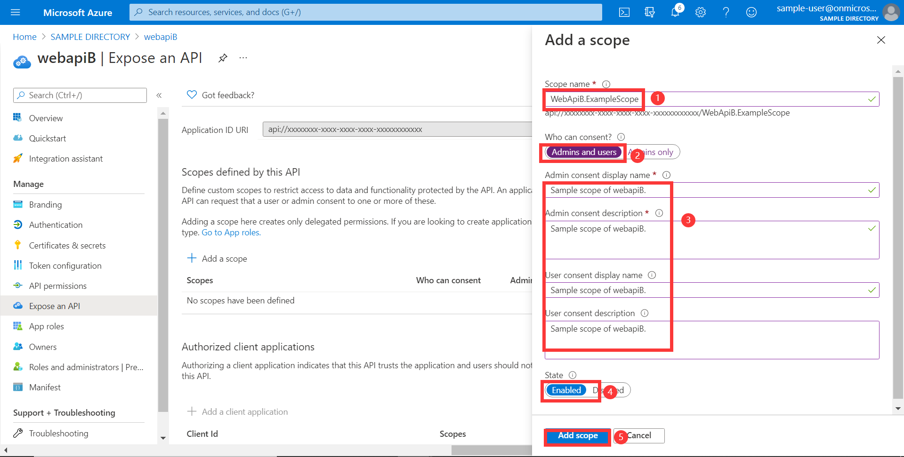

# Azure OAuth 2.0 Sample for Azure AD Spring Boot Starter Resource Server

## Key concepts
This sample illustrates how to protect a Java web API by restricting access to its resources to authorized accounts only.

1. Obtain the access token from the HTTP request header.
2. Use `JwtDecoder` to parse the access token into `Jwt`.
3. Verify `aud`, `iss`, `nbf`, `exp` claims in access token.
4. Extract information from JWT in `AadOAuth2AuthenticatedPrincipal` object after a successful verification.
5. Save the `AADOAuth2AuthenticatedPrincipal` into SecurityContext.

### Protocol diagram


## Getting started

### Configure Web API
1. In this section, you register your web API in App registrations in the Azure portal.
1. Search for and select your tenant in **Azure Active Directory**.
1. Under **Manage** In the same tenant, select **App registrations** -> **New registration**.
1. The registered application name is filled into `webapiB`(For better distinguish between [Resource Server] and [Resource Server Obo], this application is named **webapiB**), select **Accounts in this organizational directory only**, click the **register** button.
1. Under **webapiB** application, select **Certificates & secrets** -> **new client secret**, expires select **Never**, click the **add** button, remember to save the secrets here and use them later.
1. Under **webapiB** application, select **API permissions** -> **Grant admin consent for ...**, then choose **Yes** for save.
1. Under **webapiB** application, select **Expose an API** -> **Add a scope**, Use the default Application ID URI, click **Save and continue** button.
1. Wait the page refresh finished. Then set the **Scope name** to `WebApiB.ExampleScope`.
1. Finally, the api exposed in `webapiB`.
1. Expose an API by adding `appRoles` , See [Example: Application app role] for more information about app roles setting.

    ```json
    {
        "allowedMemberTypes": [
          "Application"
        ],
        "description": "WebApiB ClientCredential Example Scope",
        "displayName": "WebApiB ClientCredential Example Scope",
        "id": "d2bec026-b75f-418d-9493-8462f54f25d9",
        "isEnabled": true, 
        "value": "WebApiB.ClientCredential.ExampleScope"
    }
    ```
   
See [Expose scoped permission to web api] for more information about web api.

## Examples
### Configure application.yml
```yaml
# If we configure the spring.cloud.azure.active-directory.credential.client-id or spring.cloud.azure.active-directory.app-id-uri, then will check the audience.
# In v2.0 tokens, this is always the client ID of the API, while in v1.0 tokens it can be the client ID or the resource URI used in the request.
# If you are using v1.0 tokens, configure both to properly complete the audience validation.

spring:
  cloud:
    azure:
      active-directory:
        enabled: true
        credential:
          client-id: ${AZURE_CLIENT_ID}
        app-id-uri: ${APP_ID_URI}
```

### Run with Maven
```shell
# Under sdk/spring project root directory
cd azure-spring-boot-samples/aad/spring-cloud-azure-starter-active-directory/web-client-access-resource-server/aad-resource-server
mvn spring-boot:run
```

### Access the Web API
We could use Postman to simulate a Web APP to send a request to a Web API.

### Check the authentication and authorization
- Web API B response successfully.

1. Get access-token:
```shell script
curl -H "Content-Type: application/x-www-form-urlencoded" -d 'grant_type=password&client_id=<web-apiB-client-id>&scope=<app-id-uri>/Obo.WebApiB.ExampleScope&client_secret=<web-apiB-client-secret>&username=<username>&password=<password>' 'https://login.microsoftonline.com/organizations/oauth2/v2.0/token'
```
2. Access endpoint by access-token:
```shell script
curl localhost:8082/webapiB -H "Authorization: Bearer <access-token>"
```
3. Verify response:
```text
Response from webApiB.
```

- Web API B response failed.

1. Get access-token:
```shell script
curl -H "Content-Type: application/x-www-form-urlencoded" -d 'grant_type=password&client_id=<web-apiB-client-id>&scope=User.Read&client_secret=<web-apiB-client-secret>&username=<username>&password=<password>' 'https://login.microsoftonline.com/organizations/oauth2/v2.0/token'
```
2. Access endpoint by access-token:
```shell script
curl localhost:8082/user -H "Authorization: Bearer <access-token>" -I
```
3. Verify response:
```text
error:401
```

## Troubleshooting

## Next steps
## Contributing
<!-- LINKS -->

[Expose scoped permission to web api]: https://docs.microsoft.com/azure/active-directory/develop/quickstart-configure-app-expose-web-apis
[Resource Server]: ../aad-resource-server
[Resource Server Obo]: ../aad-resource-server-obo
[resource server password credentials]: https://docs.microsoft.com/azure/active-directory/develop/v2-oauth-ropc
[Example: Application app role]: https://docs.microsoft.com/azure/active-directory/develop/howto-add-app-roles-in-azure-ad-apps#example-application-app-role
