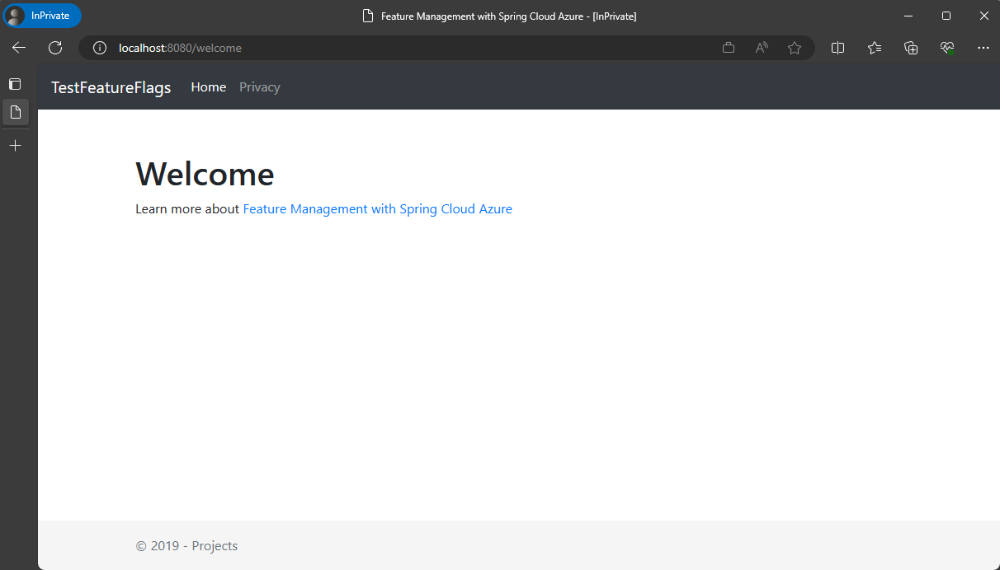
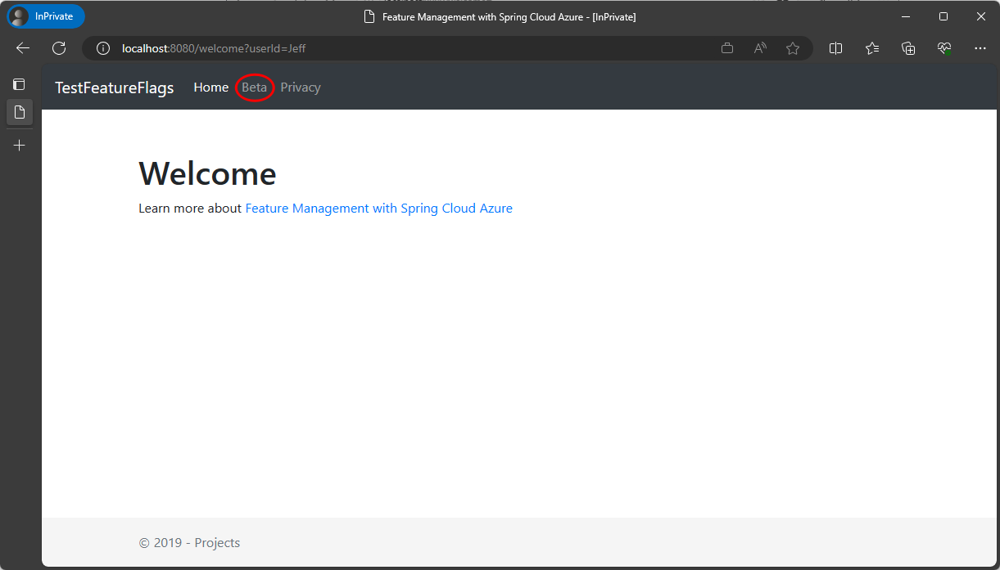

# Manage features with targeting filter and get configurations from App configuration in Spring Boot web application

This sample describes how to use [spring-cloud-azure-feature-management](https://github.com/Azure/azure-sdk-for-java/blob/main/sdk/spring/spring-cloud-azure-feature-management/README.md) to manage features with targeting filter.

## Key concepts
## Getting started


### How to run without App configuration service
Start the application and check the resulting tab in a browser window.

1. Load features from application.yml
```
mvn spring-boot:run
```

2. Open a browser window, and go to the URL: http://localhost:8080/welcome
   

3. Set parameter: http://localhost:8080/welcome?userId=Jeff and refresh the browser page to see the new configuration settings


### How to run with App configuration service

#### Prepare data

1. Create a Configuration Store if not exist.

2. Import the data file src/main/resources/data/sample-data.yml into the App configuration store created above. Under `For language` select `Other`. Under `File type` select `Yaml`.

#### Configure the bootstrap.yaml

Change the connection-string value with the Access Key value of the App configuration store created above.

#### Run the application
Start the application and access http://localhost:8080/welcome with different parameters to check the returned tab. Different commands for different scenarios are listed below.

1. Load properties similar with from application.properties, i.e., keys starting with /application/
```
mvn spring-boot:run
```

2. Load properties similar with from application_dev.properties, i.e., keys starting with /application_dev
```
mvn -Dspring.profiles.active=dev spring-boot:run
```

3. Load properties similar with from foo.properties, i.e., keys starting with /foo/
```
mvn -Dspring.application.name=foo spring-boot:run
```

4. Load properties similar with from foo_dev.properties, i.e., keys starting with /foo_dev/
```
mvn -Dspring.application.name=foo -Dspring.profiles.active=dev spring-boot:run
```

### More details

Please refer to this [README](https://github.com/Azure/azure-sdk-for-java/blob/main/sdk/spring/spring-cloud-azure-starter-appconfiguration-config/README.md) about more usage details. 

## Deploy to Azure Spring Apps

Now that you have the Spring Boot application running locally, it's time to move it to production. [Azure Spring Apps](https://learn.microsoft.com/azure/spring-apps/overview) makes it easy to deploy Spring Boot applications to Azure without any code changes. The service manages the infrastructure of Spring applications so developers can focus on their code. Azure Spring Apps provides lifecycle management using comprehensive monitoring and diagnostics, configuration management, service discovery, CI/CD integration, blue-green deployments, and more. To deploy your application to Azure Spring Apps, see [Deploy your first application to Azure Spring Apps](https://learn.microsoft.com/azure/spring-apps/quickstart?tabs=Azure-CLI).

## Examples
## Troubleshooting
## Next steps
## Contributing

<!-- LINKS -->

