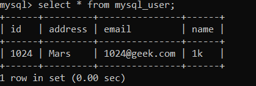
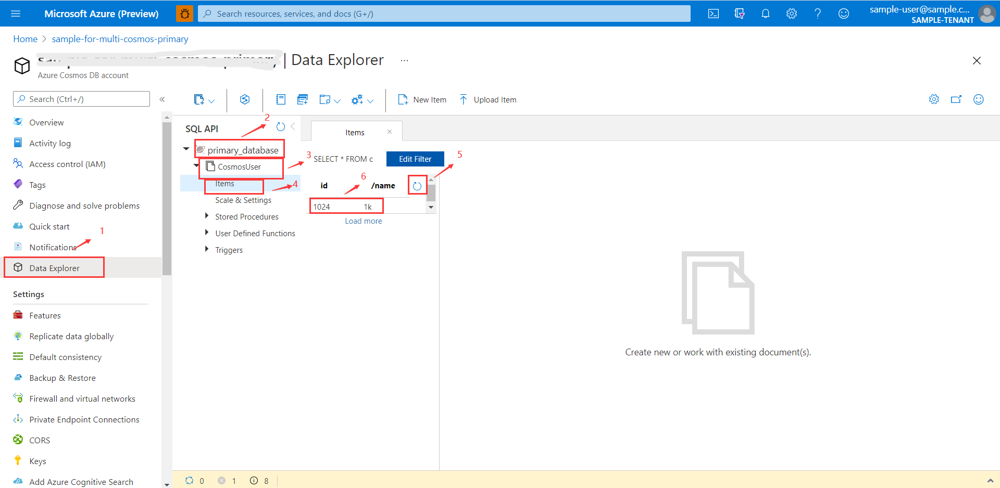
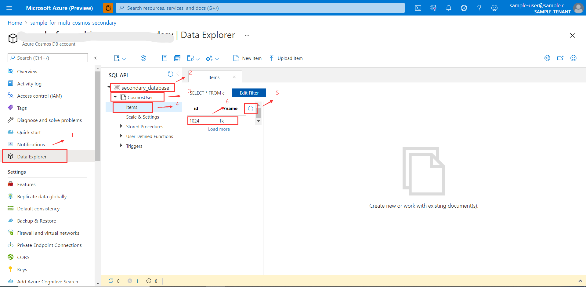

# Using Azure Cosmos DB by Spring Data in Spring Boot Application - Multi Database and Multi Account

This guide demonstrates how to use Azure Cosmos DB via `azure-spring-data-cosmos` to store data in and retrieve data from your Azure Cosmos DB.

## What You Will Build
You will build an application to write data to and query data from Azure Cosmos DB via `azure-spring-data-cosmos`.

## What You Need

- [An Azure subscription](https://azure.microsoft.com/free/)
- [Terraform](https://www.terraform.io/)
- [Azure CLI](https://docs.microsoft.com/cli/azure/install-azure-cli)
- [JDK8](https://www.oracle.com/java/technologies/downloads/) or later
- Maven
- You can also import the code straight into your IDE:
    - [IntelliJ IDEA](https://www.jetbrains.com/idea/download)

## Provision Azure Resources Required to Run This Sample

### Authenticate Using the Azure CLI
Terraform must authenticate to Azure to create infrastructure.

In your terminal, use the Azure CLI tool to setup your account permissions locally.

```shell
az login
```

Your browser window will open and you will be prompted to enter your Azure login credentials. After successful authentication, your terminal will display your subscription information. You do not need to save this output as it is saved in your system for Terraform to use.

```shell
You have logged in. Now let us find all the subscriptions to which you have access...

[
  {
    "cloudName": "AzureCloud",
    "homeTenantId": "home-Tenant-Id",
    "id": "subscription-id",
    "isDefault": true,
    "managedByTenants": [],
    "name": "Subscription-Name",
    "state": "Enabled",
    "tenantId": "0envbwi39-TenantId",
    "user": {
      "name": "your-username@domain.com",
      "type": "user"
    }
  }
]
```

If you have more than one subscription, specify the subscription-id you want to use with command below:
```shell
az account set --subscription <your-subscription-id>
```

### Provision the Resources

After login Azure CLI with your account, now you can use the terraform script to create Azure Resources.

#### Run with Bash

```shell
# In the root directory of the sample
# Initialize your Terraform configuration
terraform -chdir=./terraform init

# Apply your Terraform Configuration
terraform -chdir=./terraform apply -auto-approve

```

#### Run with Powershell

```shell
# In the root directory of the sample
# Initialize your Terraform configuration
terraform -chdir=terraform init

# Apply your Terraform Configuration
terraform -chdir=terraform apply -auto-approve

```

It may take a few minutes to run the script. After successful running, you will see prompt information like below:

```shell

random_password.mysql_login_password: Creating...
azurecaf_name.mysql_login_name: Creating...
azurecaf_name.cosmos_01: Creating...
azurecaf_name.mysql: Creating...
azurecaf_name.cosmos_02: Creating...
azurecaf_name.resource_group: Creating...
...
azurerm_cosmosdb_account.application_01: Creating...
azurerm_cosmosdb_account.application_02: Creating...
...
azurerm_cosmosdb_sql_database.db_01: Creating...
...
...
Apply complete! Resources: 14 added, 0 changed, 0 destroyed.

```

You can go to [Azure portal](https://ms.portal.azure.com/) in your web browser to check the resources you created.

### Export Output to Your Local Environment
Running the command below to export environment values:

#### Run with Bash

```shell
source ./terraform/setup_env.sh
```

#### Run with Powershell

```shell
terraform\setup_env.ps1
```

If you want to run the sample in debug mode, you can save the output value.

```shell
AZURE_COSMOS_URI_1=...
AZURE_COSMOS_KEY_1=...
AZURE_COSMOS_SECONDARY_KEY_1=...
AZURE_COSMOS_DATABASE_1=...
AZURE_COSMOS_URI_2=...
AZURE_COSMOS_KEY_2=...
AZURE_COSMOS_SECONDARY_KEY_2=...
AZURE_COSMOS_DATABASE_2=...
AZURE_MYSQL_USERNAME=...
AZURE_MYSQL_PASSWORD=...
AZURE_MYSQL_HOST=...
```

## Run Locally

### Run the sample with Maven

In your terminal, run `mvn clean spring-boot:run`.

```shell
mvn clean spring-boot:run
```

### Run the sample in IDEs

You can debug your sample by adding the saved output values to the tool's environment variables or the sample's `application.yaml` file.

* If your tool is `IDEA`, please refer to [Debug your first Java application](https://www.jetbrains.com/help/idea/debugging-your-first-java-application.html) and [add environment variables](https://www.jetbrains.com/help/objc/add-environment-variables-and-program-arguments.html#add-environment-variables).

* If your tool is `ECLIPSE`, please refer to [Debugging the Eclipse IDE for Java Developers](https://www.eclipse.org/community/eclipse_newsletter/2017/june/article1.php) and [Eclipse Environment Variable Setup](https://examples.javacodegeeks.com/desktop-java/ide/eclipse/eclipse-environment-variable-setup-example/).

## Verify This Sample

Verify in your app’s logs that similar messages were posted:
```shell
...
Data added successfully .........
...
Get secondaryCosmosUser 1024: 1024@geek.com 1k Mars .........
```

Verify Result:
The corresponding data is added to the mysql database and cosmos database  
    
    
    

## Clean Up Resources
After running the sample, if you don't want to run the sample, remember to destroy the Azure resources you created to avoid unnecessary billing.

The terraform destroy command terminates resources managed by your Terraform project.   
To destroy the resources you created.

#### Run with Bash

```shell
terraform -chdir=./terraform destroy -auto-approve
```

#### Run with Powershell

```shell
terraform -chdir=terraform destroy -auto-approve
```
