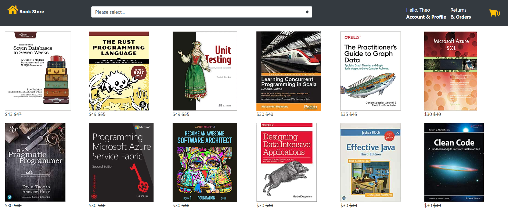

# Using Azure Cosmos DB in Spring Boot (MVC On Servlet) Application
 This sample demonstrates how to use [Spring Data Cosmos Client Library](https://github.com/Azure/azure-sdk-for-java/tree/main/sdk/cosmos/azure-spring-data-cosmos) for [Azure Cosmos DB SQL API](https://learn.microsoft.com/azure/cosmos-db/introduction) in Spring Boot (MVC on servlet stack) application.



## Features

- @Query annotation for finder method
- Collection configuration with annotations(Indexing, [RUs](https://learn.microsoft.com/azure/cosmos-db/request-units)).
- Multiple database and collections accessed from single application.
- Auto generating UUID based IDs.
- Spring Data Repository pattern.
- Enabling cosmos request diagnostics
- Directly using CosmosAsynClient from a spring application.
- Infinite scroll with JQuery.
- Filter by category.

## Getting started

### Pre-requisites

- `Java Development Kit 8`. 
- An active Azure account. If you don't have one, you can sign up for a [free account](https://azure.microsoft.com/free/). Alternatively, you can use the [Azure Cosmos DB Emulator](https://docs.microsoft.com/en-us/azure/cosmos-db/local-emulator) for development and testing. As emulator https certificate is self-signed, you need to import its certificate to java trusted cert store, [explained here](https://docs.microsoft.com/en-us/azure/cosmos-db/local-emulator-export-ssl-certificates).
- Maven.
- (Optional) SLF4J is a logging facade.
- (Optional) [SLF4J binding](http://www.slf4j.org/manual.html) is used to associate a specific logging framework with SLF4J.

### Installation

1. Clone this repo and change working directory:
    ```bash
    git clone https://github.com/Azure-Samples/azure-spring-boot-samples.git
    cd cosmos/azure-spring-data-cosmos/cosmos-mvc-sample
    ```
1. Add the `azure.cosmos.bookstore.uri` and `azure.cosmos.bookstore.key` in application.yaml.
1. Compile and run:
    ```bash
    mvn spring-boot:run
    ```
1. On startup the application creates 2 databases, with 3 collections in the "store" database, and one collection in the "security" database.
1. Access the WebApp at http://localhost:81/ebooks/index
1. You will have to create user account to access the application functionality. The registration process asks for email ID, which will be used as the login ID. Any email address is fine as long as it has a valid format.