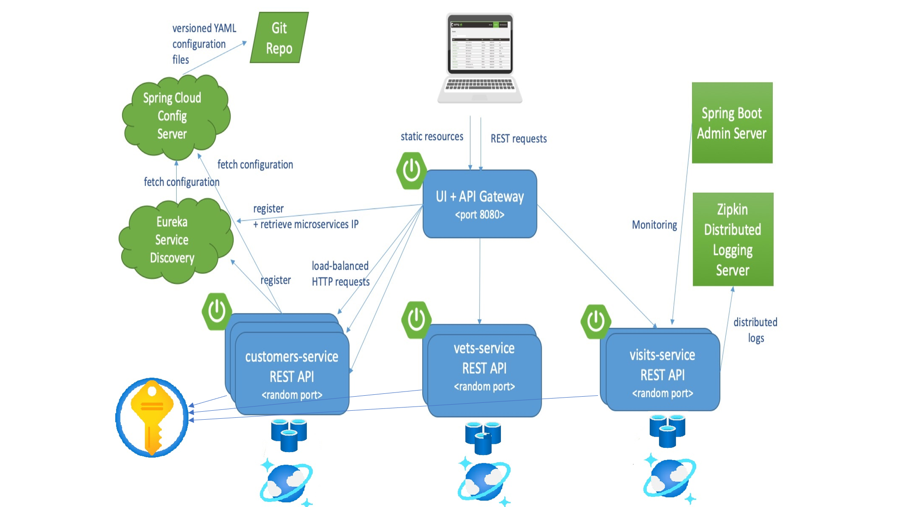
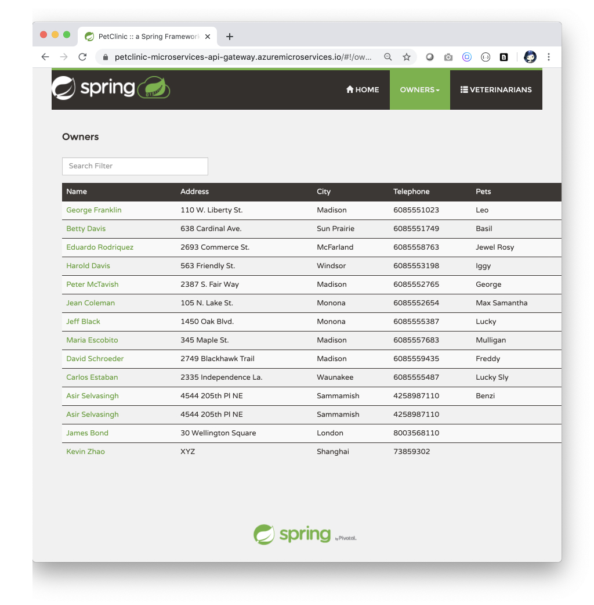

# Deploy Spring Microservices using Azure Spring starters for Cosmos DB, Redis, Key Vault

Azure Spring Cloud enables you to easily run a Spring Boot based microservices application on Azure.

This quickstart shows you how to deploy an existing Java Spring Cloud application to Azure. When
you're finished, you can continue to manage the application via the Azure CLI or switch to using the
Azure portal.

## What will you experience

You will:

- Build existing Spring microservices applications
- Provision azure resources required for the application
- Run the application locally with Cosmos DB backend, Azure Redis Cache and using Key Vault for
  storing secrets
- Open the application

## What you will need

- [An Azure subscription](https://azure.microsoft.com/free/)
- [Terraform](https://www.terraform.io/)
- [JDK8](https://www.oracle.com/java/technologies/downloads/) or later
- [MySQL CLI](https://dev.mysql.com/downloads/shell/)
- [Git](https://git-scm.com/)
- [Jq](https://stedolan.github.io/jq/)
- [Docker](https://www.docker.com/)
- [Maven](https://maven.apache.org/download.cgi)
- You can also import the code straight into your IDE:
    - [IntelliJ IDEA](https://www.jetbrains.com/idea/download)
    
## Clone and build the repo

### Clone the sample app repository 

```bash
git clone https://github.com/Azure-Samples/azure-spring-boot-samples
```

### Change directory and build the project

```bash
cd azure-spring-boot-samples/spring-petclinic-microservices
mvn clean package -DskipTests
```

This will take a few minutes.

## Provision Azure Resources Required to Run This Sample

### Authenticate Using the Azure CLI
Terraform must authenticate to Azure to create infrastructure.

In your terminal, use the Azure CLI tool to setup your account permissions locally.

```shell
az login
```

Your browser window will open and you will be prompted to enter your Azure login credentials. After successful authentication, your terminal will display your subscription information. You do not need to save this output as it is saved in your system for Terraform to use.

```shell
You have logged in. Now let us find all the subscriptions to which you have access...

[
  {
    "cloudName": "AzureCloud",
    "homeTenantId": "home-Tenant-Id",
    "id": "subscription-id",
    "isDefault": true,
    "managedByTenants": [],
    "name": "Subscription-Name",
    "state": "Enabled",
    "tenantId": "0envbwi39-TenantId",
    "user": {
      "name": "your-username@domain.com",
      "type": "user"
    }
  }
]
```

If you have more than one subscription, specify the subscription-id you want to use with command below:
```shell
az account set --subscription <your-subscription-id>
```

### Provision the Resources

After login Azure CLI with your account, now you can use the terraform script to create Azure Resources.

#### Run with Bash

```shell
# In the root directory of the sample
# Initialize your Terraform configuration
terraform -chdir=./terraform init

# Apply your Terraform Configuration
terraform -chdir=./terraform apply -auto-approve

```

#### Run with Powershell

```shell
# In the root directory of the sample
# Initialize your Terraform configuration
terraform -chdir=terraform init

# Apply your Terraform Configuration
terraform -chdir=terraform apply -auto-approve

```

It may take a few minutes to run the script. After successful running, you will see prompt information like below:

```shell
azurerm_resource_group.main: Creating...
azurerm_key_vault.kv_account: Creating...
azurerm_redis_cache.redis: Creating...
azurerm_cosmosdb_account.application: Creating...
azurerm_redis_cache.redis: Still creating... 
azurerm_key_vault.kv_account: Still creating... 
azurerm_cosmosdb_account.application: Still creating... 
...
azurerm_cosmosdb_account.application: Still creating...
azurerm_redis_cache.redis: Still creating...
azurerm_key_vault.kv_account: Still creating...
azurerm_key_vault.kv_account: Still creating...
azurerm_redis_cache.redis: Still creating... 
...

Apply complete! Resources: 8 added, 0 changed, 0 destroyed.

Outputs:
...

```

You can go to [Azure portal](https://ms.portal.azure.com/) in your web browser to check the resources you created.

### Export Output to Your Local Environment

#### Run with Bash

Running the command below to export environment values:

```shell
source ./terraform/setup_env.sh
```

#### Run with Powershell

Running the command below to export environment values:

```shell
terraform\setup_env.ps1
```

make sure keyvault.env file is created at the root of the repo.

## Starting services locally with docker-compose

In order to start entire infrastructure using Docker, you have to build images by
executing command below from a project root:

```shell
mvn clean install -P buildDocker -DskipTests
```


Once images are ready, you can start them with a single command.


```shell
docker-compose up
```

Containers startup order is coordinated with [`dockerize` script](https://github.com/jwilder/dockerize). After starting services it takes a while for API Gateway to be in sync with service registry, so don't be scared of initial Spring
Cloud Gateway timeouts.   
You can track services availability using Eureka dashboard available by default at `http://localhost:8761`.

## Clean Up Resources
After running the sample, if you don't want to run the sample, remember to destroy the Azure resources you created to avoid unnecessary billing.

The terraform destroy command terminates resources managed by your Terraform project.   
To destroy the resources you created.

### Run with Bash

```shell
az group delete --name $(terraform -chdir=./terraform output -raw resource_group_name) --yes
```

### Run with Powershell

```shell
az group delete --name $(terraform -chdir=terraform output -raw resource_group_name) --yes
```

## Understanding the Spring Petclinic application

[See the presentation of the Spring Petclinic Framework version](http://fr.slideshare.net/AntoineRey/spring-framework-petclinic-sample-application)

[A blog bost introducing the Spring Petclinic Microsevices](http://javaetmoi.com/2018/10/architecture-microservices-avec-spring-cloud/) (
french language)

You can then access petclinic here: http://localhost:8080/


**Architecture diagram of the Spring Petclinic Microservices with Cosmos DB**



## Navigate to the application

The application could be reached at http://localhost:8080


## Enabling Spring boot starter for Azure Active directory (Optional)

To secure the Java applications in this sample please follow
the [Spring Security Azure Active Directory tutorial](https://docs.microsoft.com/en-us/azure/developer/java/spring-framework/configure-spring-boot-starter-java-app-with-azure-active-directory)
. After setting your Active directory you can enable security on Customers service by uncommenting
the relevant AAD sample code.

## Next Steps

In this quickstart, you've deployed an existing Spring microservices app using Azure CLI. To learn
more about Spring on Azure, go to:

- [Spring on Azure](https://docs.microsoft.com/en-us/azure/developer/java/spring-framework/)
- [Azure for Java Cloud Developers](https://docs.microsoft.com/en-us/azure/java/)

## Credits

This Spring microservices sample is forked from
[spring-petclinic/spring-petclinic-microservices](https://github.com/spring-petclinic/spring-petclinic-microservices)

## Contributing

This project welcomes contributions and suggestions. Most contributions require you to agree to a
Contributor License Agreement (CLA) declaring that you have the right to, and actually do, grant us
the rights to use your contribution. For details, visit https://cla.opensource.microsoft.com.

When you submit a pull request, a CLA bot will automatically determine whether you need to provide a
CLA and decorate the PR appropriately (e.g., status check, comment). Simply follow the instructions
provided by the bot. You will only need to do this once across all repos using our CLA.

This project has adopted
the [Microsoft Open Source Code of Conduct](https://opensource.microsoft.com/codeofconduct/). For
more information see the [Code of Conduct FAQ](https://opensource.microsoft.com/codeofconduct/faq/)
or contact [opencode@microsoft.com](mailto:opencode@microsoft.com) with any additional questions or
comments.
